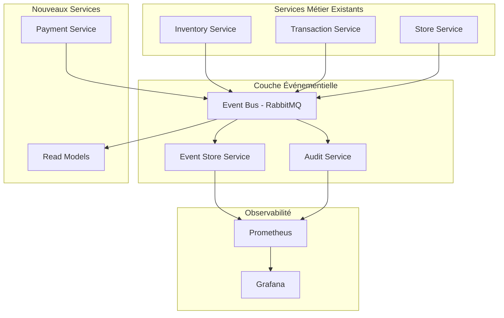
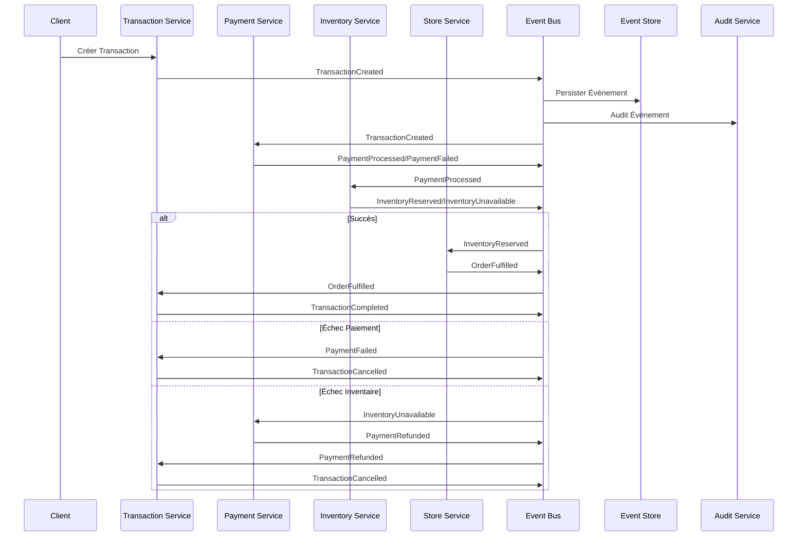

# ADR 012 – Évolution vers une Architecture Événementielle et Sagas Chorégraphiées

## Status

Accepted

## Context

Suite à l'implémentation des sagas orchestrées au Lab6, nous avons identifié plusieurs limitations et opportunités d'amélioration dans notre architecture microservices :

### Limitations de l'approche orchestrée

1. **Point de défaillance unique** : L'orchestrateur centralisé représente un point critique
2. **Couplage fort** : Les services métier sont étroitement couplés à l'orchestrateur
3. **Scalabilité limitée** : L'orchestrateur devient un goulot d'étranglement
4. **Complexité croissante** : Logique métier distribuée entre les services et l'orchestrateur
5. **Observabilité insuffisante** : Manque de traçabilité des événements métier
6. **Compliance** : Absence d'audit trail complet pour les exigences réglementaires

### Besoins identifiés

- **Découplage** : Réduire les dépendances directes entre services
- **Traçabilité** : Historique complet des événements métier
- **Observabilité** : Monitoring avancé des flux événementiels
- **Résilience** : Capacité de récupération et de replay
- **Compliance** : Audit trail pour les exigences réglementaires
- **Évolutivité** : Architecture extensible pour de nouveaux patterns

## Decision

Implémentation d'une **architecture événementielle complète** combinant :

1. **Event Sourcing** : Persistance de tous les événements métier
2. **CQRS** : Séparation des opérations de lecture et d'écriture
3. **Pub/Sub Messaging** : Communication asynchrone via RabbitMQ
4. **Sagas Chorégraphiées** : Coordination distribuée sans orchestrateur central
5. **Event Store** : Stockage et replay des événements
6. **Services d'Audit** : Compliance et traçabilité complètes

### Architecture Événementielle



### Flux de Saga Chorégraphiée



## Rationale

### Avantages de l'Architecture Événementielle

1. **Découplage total** : Services communiquent uniquement via événements
2. **Résilience** : Aucun point de défaillance unique
3. **Observabilité** : Traçabilité complète des événements
4. **Compliance** : Audit trail automatique
5. **Évolutivité** : Ajout facile de nouveaux services consommateurs
6. **Récupération** : Replay d'événements pour reconstruction d'état

### Pattern CQRS

- **Commands** : Opérations d'écriture via les services métier
- **Queries** : Lectures optimisées via des projections
- **Événements** : Synchronisation des modèles de lecture

### Event Sourcing

- **Persistance** : Tous les événements sont stockés de façon immuable
- **Replay** : Reconstruction d'état à partir des événements
- **Audit** : Historique complet des changements métier

## Architecture Technique

### Nouvelles Composantes

#### Event Store Service (Port 8087)

- **Responsabilité** : Persistance et replay des événements
- **Technologies** : Spring Boot, PostgreSQL
- **APIs** : Sauvegarde, récupération, replay d'événements
- **Fonctionnalités** :
  - Contrôle de concurrence optimiste
  - Replay par agrégat ou type d'événement
  - Reconstruction d'état

#### Payment Service (Port 8084)

- **Responsabilité** : Traitement des paiements
- **Événements Publiés** : PaymentProcessed, PaymentFailed, PaymentRefunded
- **Événements Consommés** : TransactionCreated, InventoryUnavailable
- **Compensation** : Remboursement automatique

#### Audit Service (Port 8088)

- **Responsabilité** : Compliance et audit trail
- **Consommation** : Tous les événements métier
- **Fonctionnalités** :
  - Tags de compliance (PCI_DSS, GDPR)
  - Logs structurés
  - Rapports de conformité

### Services Étendus

#### Transaction Service

- **Nouvelles capacités** : Publication d'événements, gestion de compensation
- **Événements** : TransactionCreated, TransactionCompleted, TransactionCancelled
- **CQRS** : Séparation des opérations de lecture/écriture

#### Inventory Service

- **Événements** : InventoryReserved, InventoryUnavailable, InventoryReleased
- **Saga** : Logique de réservation et compensation
- **Read Models** : Projections optimisées pour les requêtes

#### Store Service

- **Événements** : OrderFulfilled, OrderDelivered
- **Intégration** : Consommation d'événements d'inventaire

### Infrastructure Événementielle

#### RabbitMQ Configuration

- **Exchange** : `business.events` (topic exchange)
- **Queues** : Spécialisées par service et type d'événement
- **Routing Keys** : Convention `service.eventType`
- **Dead Letter Queues** : Gestion des échecs

#### Event Schema

```json
{
  "eventId": "uuid",
  "eventType": "string",
  "aggregateId": "string",
  "aggregateType": "string",
  "timestamp": "ISO-8601",
  "version": "integer",
  "correlationId": "uuid",
  "causationId": "uuid",
  "payload": {}
}
```

## Implementation Strategy

### Phase 1 : Infrastructure Événementielle

- Configuration RabbitMQ
- Interfaces événementielles de base
- Event Store Service
- Audit Service

### Phase 2 : Services Métier

- Payment Service
- Extension des services existants
- Publication d'événements
- Consommation d'événements

### Phase 3 : Sagas Chorégraphiées

- Logique de compensation
- Gestion des états de saga
- Coordination distribuée

### Phase 4 : Observabilité

- Métriques événementielles
- Dashboards Grafana
- Tracing distribué

## Monitoring et Observabilité

### Métriques Événementielles

- Événements publiés/consommés par service
- Latence de traitement des événements
- Taux d'erreur des sagas
- Performance des replays

### Dashboards Grafana

- Vue d'ensemble des flux événementiels
- Monitoring des sagas
- Santé du système événementiel
- Alertes en temps réel

### Audit et Compliance

- Traçabilité complète des transactions
- Logs structurés JSON
- Rétention configurable
- Rapports de conformité

## Testing Strategy

### Tests Unitaires

- Handlers d'événements
- Logique de saga
- Sérialisation d'événements

### Tests d'Intégration

- Flux événementiels complets
- Scénarios de compensation
- Replay d'événements

### Tests de Résilience

- Simulation de pannes
- Récupération automatique
- Cohérence éventuelle

## Consequences

### Avantages

- **Découplage maximal** des services
- **Résilience** accrue du système
- **Observabilité** complète
- **Compliance** automatique
- **Évolutivité** architecture

### Défis

- **Complexité** conceptuelle accrue
- **Cohérence éventuelle** à gérer
- **Debugging** distribué plus complexe
- **Formation** équipe requise

### Migration

- Migration progressive des services existants
- Coexistence temporaire avec l'approche orchestrée
- Formation de l'équipe aux patterns événementiels

## Status

**Accepted** - Implémentation complète réalisée

L'architecture événementielle avec sagas chorégraphiées apporte une scalabilité, résilience et observabilité supérieures tout en préservant la cohérence métier et en répondant aux exigences de compliance.
