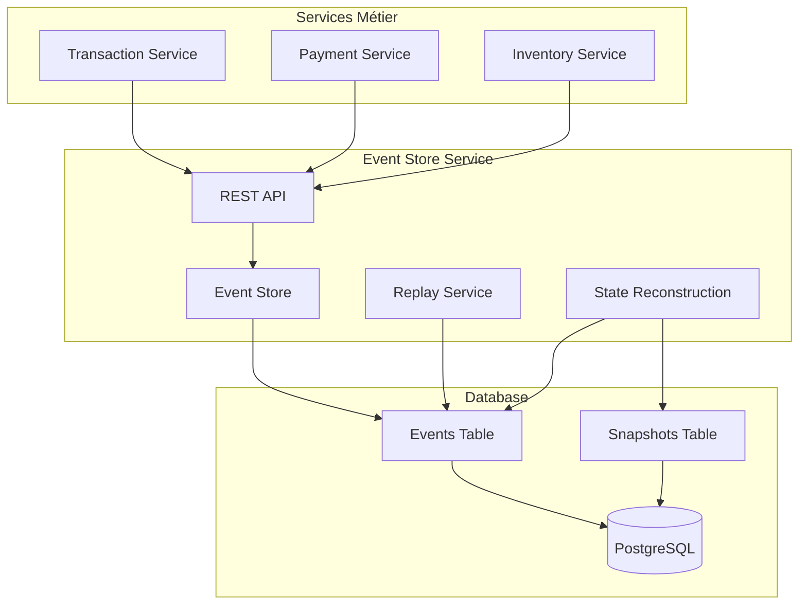
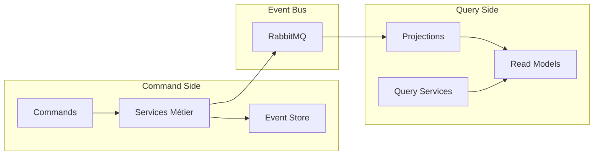

# ADR 013 – Implémentation Event Sourcing et CQRS

## Status

Accepted

## Context

Dans le cadre de l'évolution vers une architecture événementielle, nous devons implémenter des patterns avancés pour gérer la persistance des données et l'optimisation des requêtes dans un environnement microservices distribué.

### Problèmes à résoudre

1. **Persistance des états** : Comment maintenir un historique complet des changements métier
2. **Performance des requêtes** : Optimisation des lectures dans un contexte distribué
3. **Reconstruction d'état** : Capacité à reconstruire l'état d'un agrégat à tout moment
4. **Audit et compliance** : Traçabilité complète des modifications
5. **Cohérence des données** : Maintien de la cohérence dans un système distribué

### Besoins métier identifiés

- **Audit trail immuable** : Historique complet pour compliance
- **Replay d'événements** : Reconstruction d'état et debugging
- **Performance des lectures** : Requêtes optimisées pour l'UI
- **Analyse métier** : Exploitation des données événementielles
- **Récupération** : Capacité de restauration après incident

## Decision

Implémentation combinée d'**Event Sourcing** et **CQRS** (Command Query Responsibility Segregation) avec les composants suivants :

### 1. Event Sourcing

Persistance de tous les événements métier dans un **Event Store** dédié avec :

- **Immutabilité** : Les événements ne sont jamais modifiés
- **Séquentialité** : Ordre strict des événements par agrégat
- **Versionning** : Contrôle de concurrence optimiste
- **Replay** : Reconstruction d'état à partir des événements

### 2. CQRS

Séparation stricte entre :

- **Commands** : Opérations d'écriture via les services métier
- **Queries** : Lectures via des modèles de données optimisés
- **Projections** : Synchronisation asynchrone via événements

## Architecture

### Event Store Service



### CQRS Implementation



## Event Store Implementation

### Schema de Base de Données

```sql
-- Table principale des événements
CREATE TABLE events (
    event_id UUID PRIMARY KEY,
    event_type VARCHAR(100) NOT NULL,
    aggregate_id VARCHAR(100) NOT NULL,
    aggregate_type VARCHAR(50) NOT NULL,
    event_version INTEGER NOT NULL,
    event_data JSONB NOT NULL,
    metadata JSONB,
    timestamp TIMESTAMP WITH TIME ZONE DEFAULT NOW(),
    correlation_id UUID,
    causation_id UUID,
    UNIQUE(aggregate_id, event_version)
);

-- Index pour les requêtes de replay
CREATE INDEX idx_events_aggregate ON events(aggregate_id);
CREATE INDEX idx_events_type ON events(event_type);
CREATE INDEX idx_events_timestamp ON events(timestamp);
CREATE INDEX idx_events_replay ON events(aggregate_id, event_version, timestamp);

-- Table des snapshots pour optimisation
CREATE TABLE snapshots (
    aggregate_id VARCHAR(100) PRIMARY KEY,
    aggregate_type VARCHAR(50) NOT NULL,
    version INTEGER NOT NULL,
    data JSONB NOT NULL,
    created_at TIMESTAMP WITH TIME ZONE DEFAULT NOW()
);
```

### APIs Event Store

#### Sauvegarde d'Événements

```java
@PostMapping("/events")
public ResponseEntity<Event> saveEvent(@RequestBody Event event) {
    // Validation et contrôle de concurrence
    validateEventVersion(event);
    
    // Persistance atomique
    Event savedEvent = eventStore.saveEvent(event);
    
    // Publication asynchrone
    eventProducer.publishEvent(savedEvent);
    
    return ResponseEntity.ok(savedEvent);
}
```

#### Replay d'Événements

```java
@PostMapping("/replay/aggregate/{aggregateId}")
public ResponseEntity<ReplayResult> replayAggregate(
    @PathVariable String aggregateId) {
    
    List<Event> events = eventStore.getEvents(aggregateId);
    ReplayResult result = replayService.replay(events);
    
    return ResponseEntity.ok(result);
}
```

### Contrôle de Concurrence

```java
private void validateEventVersion(Event event) {
    int currentVersion = getLatestVersion(event.getAggregateId());
    int expectedVersion = event.getEventVersion();
    
    if (currentVersion > 0 && expectedVersion != currentVersion + 1) {
        throw new OptimisticLockingException(
            event.getAggregateId(), currentVersion + 1, expectedVersion);
    }
}
```

## CQRS Implementation

### Command Side - Services Métier

```java
@Service
@Transactional
public class TransactionCommandService {
    
    public Transaction createTransaction(CreateTransactionCommand command) {
        // Logique métier
        Transaction transaction = new Transaction(command);
        
        // Sauvegarde en base
        Transaction saved = repository.save(transaction);
        
        // Publication d'événement
        TransactionCreated event = new TransactionCreated(saved);
        eventProducer.publishEvent(event);
        
        return saved;
    }
}
```

### Query Side - Projections

```java
@Component
public class TransactionProjectionHandler {
    
    @EventHandler
    public void handle(TransactionCreated event) {
        // Mise à jour du modèle de lecture optimisé
        TransactionReadModel readModel = new TransactionReadModel(event);
        readModelRepository.save(readModel);
    }
    
    @EventHandler
    public void handle(PaymentProcessed event) {
        // Mise à jour du statut de paiement
        readModelRepository.updatePaymentStatus(
            event.getTransactionId(), PaymentStatus.PROCESSED);
    }
}
```

### Read Models Optimisés

```sql
-- Modèle de lecture pour les transactions
CREATE TABLE transaction_read_model (
    transaction_id UUID PRIMARY KEY,
    customer_id UUID NOT NULL,
    status VARCHAR(50) NOT NULL,
    total_amount DECIMAL(10,2),
    payment_status VARCHAR(50),
    inventory_status VARCHAR(50),
    created_at TIMESTAMP,
    updated_at TIMESTAMP
);

-- Index pour requêtes fréquentes
CREATE INDEX idx_transaction_customer ON transaction_read_model(customer_id);
CREATE INDEX idx_transaction_status ON transaction_read_model(status);
CREATE INDEX idx_transaction_date ON transaction_read_model(created_at);
```

## Service Extensions

### Transaction Service - CQRS

**Command Side** :

- `TransactionCommandService` : Opérations d'écriture
- Publication d'événements : `TransactionCreated`, `TransactionCompleted`, `TransactionCancelled`

**Query Side** :

- `TransactionQueryService` : Requêtes optimisées
- `TransactionReadModel` : Modèle dénormalisé
- Projections événementielles

### Inventory Service - Event Sourcing

**Événements** :

- `InventoryReserved` : Réservation de stock
- `InventoryUnavailable` : Stock insuffisant
- `InventoryReleased` : Libération de réservation

**Reconstruction d'État** :

```java
public InventoryAggregate rebuildFromEvents(String inventoryId) {
    List<Event> events = eventStore.getEvents(inventoryId);
    InventoryAggregate aggregate = new InventoryAggregate();
    
    for (Event event : events) {
        aggregate.apply(event);
    }
    
    return aggregate;
}
```

## Observabilité et Monitoring

### Métriques Event Store

- **Performance** : Latence de sauvegarde/lecture
- **Volume** : Nombre d'événements par type/service
- **Replay** : Fréquence et performance des replays
- **Stockage** : Croissance de la base d'événements

### Monitoring CQRS

- **Command latency** : Temps de traitement des commandes
- **Projection lag** : Retard des projections
- **Read model freshness** : Fraîcheur des données de lecture
- **Query performance** : Performance des requêtes optimisées

### Dashboards Grafana

1. **Event Store Health** : Métriques système
2. **CQRS Performance** : Latences command/query
3. **Event Flow** : Flux événementiels en temps réel
4. **Business Metrics** : Indicateurs métier

## Testing Strategy

### Event Store Tests

```java
@Test
void shouldSaveAndRetrieveEvents() {
    // Given
    Event event = createTestEvent();
    
    // When
    eventStore.saveEvent(event);
    List<Event> events = eventStore.getEvents(event.getAggregateId());
    
    // Then
    assertThat(events).hasSize(1);
    assertThat(events.get(0)).isEqualTo(event);
}

@Test
void shouldEnforceOptimisticLocking() {
    // Test de contrôle de concurrence
    Event event1 = createEventWithVersion(1);
    Event event2 = createEventWithVersion(1); // Même version
    
    eventStore.saveEvent(event1);
    
    assertThrows(OptimisticLockingException.class, 
        () -> eventStore.saveEvent(event2));
}
```

### CQRS Tests

```java
@Test
void shouldSynchronizeReadModelWithEvents() {
    // Given
    TransactionCreated event = createTransactionEvent();
    
    // When
    projectionHandler.handle(event);
    
    // Then
    TransactionReadModel readModel = 
        readModelRepository.findById(event.getTransactionId());
    assertThat(readModel.getStatus()).isEqualTo("CREATED");
}
```

### Replay Tests

```java
@Test
void shouldReplayEventsCorrectly() {
    // Given
    List<Event> events = createEventSequence();
    events.forEach(eventStore::saveEvent);
    
    // When
    ReplayResult result = replayService.replayAggregate("test-aggregate");
    
    // Then
    assertThat(result.isSuccess()).isTrue();
    assertThat(result.getProcessedCount()).isEqualTo(events.size());
}
```

## Migration Strategy

### Phase 1 : Event Store Setup

1. Déploiement du Event Store Service
2. Configuration de la base de données
3. Tests de persistance de base

### Phase 2 : Service Integration

1. Extension des services existants
2. Publication d'événements
3. Migration progressive des données

### Phase 3 : CQRS Implementation

1. Création des read models
2. Implémentation des projections
3. Migration des requêtes

### Phase 4 : Optimization

1. Snapshots pour performance
2. Archivage des anciens événements
3. Optimisation des index

## Benefits

### Event Sourcing

- **Audit trail complet** : Historique immuable
- **Debugging avancé** : Replay pour investigation
- **Analyse temporelle** : Reconstruction d'état à tout instant
- **Compliance** : Traçabilité réglementaire

### CQRS

- **Performance** : Requêtes optimisées
- **Scalabilité** : Séparation des charges lecture/écriture
- **Flexibilité** : Modèles de données spécialisés
- **Évolutivité** : Ajout facile de nouvelles projections

## Challenges

### Complexité

- **Courbe d'apprentissage** : Patterns avancés
- **Debugging** : Systèmes distribués
- **Cohérence éventuelle** : Gestion de la latence

### Opérationnel

- **Stockage** : Croissance des données événementielles
- **Performance** : Optimisation des requêtes de replay
- **Monitoring** : Surveillance des projections

## Status

**Accepted** - Implémentation complète avec Event Store Service et extensions CQRS des services métier.

Cette architecture offre une base solide pour l'observabilité, la compliance et la performance dans un environnement microservices distribué.
