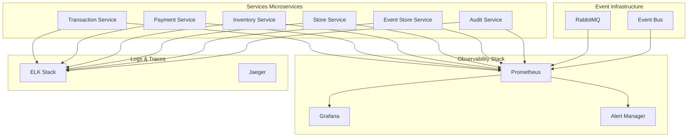

# ADR 014 – Observabilité et Monitoring d'une Architecture Événementielle

## Status

Accepted

## Context

L'implémentation d'une architecture événementielle avec sagas chorégraphiées introduit une complexité significative en termes d'observabilité. Contrairement aux architectures monolithiques ou même aux microservices avec communication synchrone, les flux événementiels distribués nécessitent des stratégies de monitoring spécialisées.

### Défis d'Observabilité

1. **Traçabilité distribuée** : Suivi des événements à travers multiple services
2. **Latence asymétrique** : Temps de traitement variables des événements  
3. **États de saga** : Monitoring des transactions distribuées
4. **Détection de pannes** : Identification des échecs dans les flux asynchrones
5. **Performance système** : Impact des événements sur les ressources
6. **Debugging complexe** : Investigation des problèmes dans un contexte distribué

### Exigences Métier

- **Visibilité complète** des flux de transactions distribuées
- **Alerting proactif** sur les anomalies système
- **SLA monitoring** pour les processus métier critiques
- **Capacity planning** basé sur les métriques événementielles
- **Root cause analysis** pour les incidents

## Decision

Implémentation d'une **stack d'observabilité complète** combinant :

1. **Métriques applicatives** : Prometheus pour les métriques métier et techniques
2. **Dashboards avancés** : Grafana avec visualisations spécialisées
3. **Tracing distribué** : Correlation IDs pour le suivi end-to-end
4. **Alerting intelligent** : Règles proactives et escalation
5. **Logs structurés** : JSON logging pour corrélation et analyse
6. **Business metrics** : Indicateurs métier en temps réel

## Architecture de Monitoring



## Métriques Applicatives

### Event-Driven Metrics

#### Publication d'Événements

```java
@Component
public class EventMetrics {
    
    private final Counter eventsPublished = Counter.builder("events_published_total")
        .description("Total events published by service")
        .tag("service", serviceName)
        .tag("event_type", "")
        .register(Metrics.globalRegistry);
    
    private final Timer eventPublishLatency = Timer.builder("event_publish_duration")
        .description("Event publishing latency")
        .register(Metrics.globalRegistry);
    
    public void recordEventPublished(String eventType) {
        eventsPublished.increment(
            Tags.of("service", serviceName, "event_type", eventType));
    }
    
    public void recordPublishLatency(Duration duration, String eventType) {
        eventPublishLatency.record(duration, 
            Tags.of("event_type", eventType));
    }
}
```

#### Consommation d'Événements

```java
@Component  
public class EventConsumerMetrics {
    
    private final Counter eventsConsumed = Counter.builder("events_consumed_total")
        .description("Total events consumed by service")
        .tag("service", serviceName)
        .tag("event_type", "")
        .tag("status", "") // success, error, retry
        .register(Metrics.globalRegistry);
    
    private final Timer eventProcessingLatency = Timer.builder("event_processing_duration")
        .description("Event processing latency")
        .register(Metrics.globalRegistry);
    
    private final Gauge eventQueueDepth = Gauge.builder("event_queue_depth")
        .description("Current event queue depth")
        .register(Metrics.globalRegistry, this, EventConsumerMetrics::getQueueDepth);
}
```

### Saga Metrics

#### États de Saga

```java
@Component
public class SagaMetrics {
    
    private final Counter sagasStarted = Counter.builder("sagas_started_total")
        .description("Total sagas started")
        .tag("saga_type", "")
        .register(Metrics.globalRegistry);
    
    private final Counter sagasCompleted = Counter.builder("sagas_completed_total")
        .description("Total sagas completed successfully") 
        .tag("saga_type", "")
        .register(Metrics.globalRegistry);
    
    private final Counter sagasFailed = Counter.builder("sagas_failed_total")
        .description("Total sagas failed")
        .tag("saga_type", "")
        .tag("failure_reason", "")
        .register(Metrics.globalRegistry);
    
    private final Timer sagaDuration = Timer.builder("saga_duration")
        .description("Saga execution duration")
        .tag("saga_type", "")
        .register(Metrics.globalRegistry);
    
    private final Gauge activeSagas = Gauge.builder("active_sagas")
        .description("Currently active sagas")
        .tag("saga_type", "")
        .register(Metrics.globalRegistry, this, SagaMetrics::getActiveSagaCount);
}
```

### Business Metrics

#### Transactions Métier

```java
@Component
public class BusinessMetrics {
    
    private final Counter transactionsTotal = Counter.builder("business_transactions_total")
        .description("Total business transactions")
        .tag("type", "") // sale, return, exchange
        .tag("status", "") // completed, cancelled, failed
        .register(Metrics.globalRegistry);
    
    private final DistributionSummary transactionValue = DistributionSummary.builder("transaction_value")
        .description("Transaction monetary value")
        .baseUnit("CAD")
        .register(Metrics.globalRegistry);
    
    private final Timer transactionProcessingTime = Timer.builder("transaction_processing_duration")
        .description("End-to-end transaction processing time")
        .register(Metrics.globalRegistry);
}
```

## Dashboards Grafana

### 1. Event Flow Overview

```json
{
  "dashboard": {
    "title": "Event-Driven Architecture Overview",
    "panels": [
      {
        "title": "Events Published/Consumed Rate",
        "type": "graph",
        "targets": [
          {
            "expr": "rate(events_published_total[5m])",
            "legendFormat": "Published - {{service}}"
          },
          {
            "expr": "rate(events_consumed_total[5m])", 
            "legendFormat": "Consumed - {{service}}"
          }
        ]
      },
      {
        "title": "Event Processing Latency",
        "type": "heatmap",
        "targets": [
          {
            "expr": "histogram_quantile(0.95, rate(event_processing_duration_bucket[5m]))",
            "legendFormat": "95th percentile"
          }
        ]
      }
    ]
  }
}
```

### 2. Saga Monitoring Dashboard

```json
{
  "dashboard": {
    "title": "Choreographed Sagas Monitoring",
    "panels": [
      {
        "title": "Saga Success Rate",
        "type": "stat",
        "targets": [
          {
            "expr": "rate(sagas_completed_total[5m]) / rate(sagas_started_total[5m]) * 100",
            "legendFormat": "Success Rate %"
          }
        ]
      },
      {
        "title": "Active Sagas by Type",
        "type": "graph",
        "targets": [
          {
            "expr": "active_sagas",
            "legendFormat": "{{saga_type}}"
          }
        ]
      },
      {
        "title": "Saga Duration Distribution",
        "type": "histogram",
        "targets": [
          {
            "expr": "histogram_quantile(0.50, rate(saga_duration_bucket[5m]))",
            "legendFormat": "50th percentile"
          },
          {
            "expr": "histogram_quantile(0.95, rate(saga_duration_bucket[5m]))",
            "legendFormat": "95th percentile"
          }
        ]
      }
    ]
  }
}
```

### 3. Business Metrics Dashboard

```json
{
  "dashboard": {
    "title": "Business KPIs",
    "panels": [
      {
        "title": "Transaction Volume",
        "type": "graph",
        "targets": [
          {
            "expr": "rate(business_transactions_total[1h])",
            "legendFormat": "Transactions/hour"
          }
        ]
      },
      {
        "title": "Revenue Flow",
        "type": "graph",
        "targets": [
          {
            "expr": "rate(transaction_value_sum[1h])",
            "legendFormat": "Revenue/hour (CAD)"
          }
        ]
      }
    ]
  }
}
```

## Tracing Distribué

### Correlation ID Strategy

```java
@Component
public class CorrelationIdFilter implements Filter {
    
    private static final String CORRELATION_ID_HEADER = "X-Correlation-ID";
    
    @Override
    public void doFilter(ServletRequest request, ServletResponse response, 
                        FilterChain chain) throws IOException, ServletException {
        
        HttpServletRequest httpRequest = (HttpServletRequest) request;
        String correlationId = httpRequest.getHeader(CORRELATION_ID_HEADER);
        
        if (correlationId == null) {
            correlationId = UUID.randomUUID().toString();
        }
        
        // Set in MDC for logging
        MDC.put("correlationId", correlationId);
        
        // Set in response header
        HttpServletResponse httpResponse = (HttpServletResponse) response;
        httpResponse.setHeader(CORRELATION_ID_HEADER, correlationId);
        
        try {
            chain.doFilter(request, response);
        } finally {
            MDC.clear();
        }
    }
}
```

### Event Correlation

```java
public abstract class DomainEvent {
    
    private final String eventId;
    private final String correlationId;
    private final String causationId; // ID de l'événement qui a causé celui-ci
    
    protected DomainEvent(String eventType, String aggregateId, 
                         String correlationId, String causationId) {
        this.eventId = UUID.randomUUID().toString();
        this.correlationId = correlationId != null ? correlationId : UUID.randomUUID().toString();
        this.causationId = causationId;
        // ... autres champs
    }
    
    public String createCausationId() {
        return this.eventId; // L'ID de cet événement devient le causationId du suivant
    }
}
```

### Structured Logging

```java
@Component
public class EventAuditLogger {
    
    private static final Logger auditLogger = LoggerFactory.getLogger("AUDIT");
    
    public static void auditBusinessEvent(DomainEvent event, String action, 
                                        String serviceName, String userId) {
        
        Map<String, Object> auditData = new HashMap<>();
        auditData.put("timestamp", Instant.now().toString());
        auditData.put("eventType", event.getEventType());
        auditData.put("eventId", event.getEventId());
        auditData.put("aggregateId", event.getAggregateId());
        auditData.put("correlationId", event.getCorrelationId());
        auditData.put("causationId", event.getCausationId());
        auditData.put("action", action);
        auditData.put("serviceName", serviceName);
        auditData.put("userId", userId);
        
        try {
            String auditJson = objectMapper.writeValueAsString(auditData);
            auditLogger.info("Business event audit: {}", auditJson);
        } catch (Exception e) {
            auditLogger.error("Failed to serialize audit data", e);
        }
    }
}
```

## Alerting Rules

### Prometheus Alert Rules

```yaml
# alert_rules.yml
groups:
  - name: event_driven_alerts
    rules:
      - alert: HighEventProcessingLatency
        expr: histogram_quantile(0.95, rate(event_processing_duration_bucket[5m])) > 2
        for: 2m
        labels:
          severity: warning
        annotations:
          summary: "High event processing latency detected"
          description: "95th percentile latency is {{ $value }}s for service {{ $labels.service }}"
      
      - alert: EventQueueBacklog
        expr: event_queue_depth > 1000
        for: 1m
        labels:
          severity: critical
        annotations:
          summary: "Event queue backlog detected"
          description: "Queue depth is {{ $value }} for service {{ $labels.service }}"
      
      - alert: SagaFailureRateHigh
        expr: rate(sagas_failed_total[5m]) / rate(sagas_started_total[5m]) > 0.1
        for: 3m
        labels:
          severity: critical
        annotations:
          summary: "High saga failure rate"
          description: "Saga failure rate is {{ $value | humanizePercentage }} for type {{ $labels.saga_type }}"
      
      - alert: EventStoreDown
        expr: up{job="event-store-service"} == 0
        for: 30s
        labels:
          severity: critical
        annotations:
          summary: "Event Store Service is down"
          description: "Event Store Service has been down for more than 30 seconds"

  - name: business_alerts
    rules:
      - alert: TransactionVolumeDropped
        expr: rate(business_transactions_total[1h]) < 10
        for: 5m
        labels:
          severity: warning
        annotations:
          summary: "Transaction volume below threshold"
          description: "Transaction rate is {{ $value }}/hour, below expected minimum"
      
      - alert: PaymentFailureSpike
        expr: rate(sagas_failed_total{saga_type="payment"}[5m]) > 5
        for: 2m
        labels:
          severity: critical
        annotations:
          summary: "Payment failure spike detected"
          description: "Payment failure rate is {{ $value }}/min"
```

## Event Store Monitoring

### Performance Metrics

```java
@Component
public class EventStoreMetrics {
    
    private final Timer eventSaveLatency = Timer.builder("event_store_save_duration")
        .description("Event persistence latency")
        .register(Metrics.globalRegistry);
    
    private final Timer eventRetrievalLatency = Timer.builder("event_store_retrieval_duration")
        .description("Event retrieval latency")
        .register(Metrics.globalRegistry);
    
    private final Timer replayLatency = Timer.builder("event_store_replay_duration")
        .description("Event replay latency")
        .tag("aggregate_type", "")
        .register(Metrics.globalRegistry);
    
    private final Counter concurrencyConflicts = Counter.builder("event_store_concurrency_conflicts_total")
        .description("Optimistic locking conflicts")
        .register(Metrics.globalRegistry);
    
    private final Gauge eventStoreSize = Gauge.builder("event_store_total_events")
        .description("Total events in store")
        .register(Metrics.globalRegistry, this, EventStoreMetrics::getTotalEventCount);
}
```

### Storage Growth Monitoring

```sql
-- Requête Prometheus via postgres_exporter
SELECT 
    schemaname,
    tablename,
    pg_total_relation_size(schemaname||'.'||tablename) as size_bytes,
    pg_relation_size(schemaname||'.'||tablename) as table_size_bytes
FROM pg_tables 
WHERE tablename = 'events';
```

## RabbitMQ Monitoring

### Queue Metrics

```yaml
# Configuration pour prometheus-rabbitmq-exporter
rabbitmq_prometheus:
  tcp.port: 15692
  return_per_object_metrics: true
  
  metrics:
    - name: rabbitmq_queue_messages
      help: "Total messages in queue"
      labels:
        - queue
        - vhost
    
    - name: rabbitmq_queue_consumers
      help: "Number of consumers"
      labels:
        - queue
        - vhost
    
    - name: rabbitmq_queue_message_publish_rate
      help: "Message publish rate"
      labels:
        - queue
        - vhost
```

### Exchange Monitoring

```yaml
# Alertes spécifiques RabbitMQ
groups:
  - name: rabbitmq_alerts
    rules:
      - alert: RabbitMQQueueFull
        expr: rabbitmq_queue_messages{queue!~".*dlq.*"} > 10000
        for: 1m
        labels:
          severity: warning
        annotations:
          summary: "RabbitMQ queue accumulating messages"
          description: "Queue {{ $labels.queue }} has {{ $value }} messages"
      
      - alert: RabbitMQNoConsumers
        expr: rabbitmq_queue_consumers == 0 and rabbitmq_queue_messages > 0
        for: 2m
        labels:
          severity: critical
        annotations:
          summary: "RabbitMQ queue has no consumers"
          description: "Queue {{ $labels.queue }} has messages but no consumers"
```

## Incident Response

### Playbooks

#### 1. High Event Processing Latency

```markdown
## Event Processing Latency Incident

### Investigation Steps:
1. Check Grafana "Event Flow Overview" dashboard
2. Identify which service has high latency
3. Check resource utilization (CPU, Memory, DB connections)
4. Verify RabbitMQ queue depths
5. Check for database performance issues

### Mitigation:
1. Scale affected service horizontally
2. Increase database connection pool
3. Add RabbitMQ consumers if queue depth is high
4. Consider circuit breaker activation
```

#### 2. Saga Failure Rate High

```markdown
## Saga Failure Investigation

### Investigation Steps:
1. Check saga failure dashboard in Grafana
2. Correlate with application logs using correlation IDs
3. Identify failure patterns (specific steps, timing)
4. Check external service dependencies
5. Review recent deployments

### Mitigation:
1. Enable manual saga compensation if needed
2. Rollback recent changes if correlated
3. Implement circuit breaker for failing external calls
4. Scale dependent services
```

## Performance Tuning

### Event Store Optimization

```sql
-- Optimisation des index pour les requêtes fréquentes
CREATE INDEX CONCURRENTLY idx_events_correlation 
ON events(correlation_id) 
WHERE correlation_id IS NOT NULL;

-- Partitioning par date pour la scalabilité
CREATE TABLE events_y2024m01 PARTITION OF events
FOR VALUES FROM ('2024-01-01') TO ('2024-02-01');

-- Archivage des anciens événements
DELETE FROM events 
WHERE timestamp < NOW() - INTERVAL '2 years'
AND event_type NOT IN ('PaymentProcessed', 'TransactionCompleted');
```

### RabbitMQ Tuning

```yaml
# rabbitmq.conf
management.rates_mode = basic
collect_statistics_interval = 10000
disk_free_limit.absolute = 2GB
vm_memory_high_watermark.absolute = 1GB

# Queue configuration
queue_master_locator = min-masters
ha_policy = all
ha_sync_mode = automatic
```

## Testing Observability

### Load Testing avec Métriques

```java
@Test
void loadTestWithMetrics() {
    // Scenario de charge
    int totalTransactions = 1000;
    CountDownLatch latch = new CountDownLatch(totalTransactions);
    
    // Métriques de test
    Timer.Sample sample = Timer.start(meterRegistry);
    
    for (int i = 0; i < totalTransactions; i++) {
        CompletableFuture.runAsync(() -> {
            try {
                // Simuler une transaction
                processTransaction();
            } finally {
                latch.countDown();
            }
        });
    }
    
    // Attendre completion
    latch.await(30, TimeUnit.SECONDS);
    sample.stop(Timer.builder("load_test_duration").register(meterRegistry));
    
    // Vérifier les métriques
    assertThat(meterRegistry.get("sagas_completed_total").counter().count())
        .isGreaterThan(totalTransactions * 0.95); // 95% success rate
}
```

### Chaos Engineering

```java
@Component
public class ChaosMonkey {
    
    @EventListener
    @ConditionalOnProperty("chaos.events.enabled")
    public void introduceEventChaos(DomainEvent event) {
        if (ThreadLocalRandom.current().nextDouble() < 0.01) { // 1% chaos
            // Introduire de la latence
            try {
                Thread.sleep(ThreadLocalRandom.current().nextInt(1000, 5000));
            } catch (InterruptedException e) {
                Thread.currentThread().interrupt();
            }
        }
    }
}
```

## Security Monitoring

### Audit Trail Monitoring

```yaml
# Alertes de sécurité
groups:
  - name: security_alerts
    rules:
      - alert: SuspiciousEventVolume
        expr: rate(events_published_total[5m]) > 1000
        for: 1m
        labels:
          severity: warning
        annotations:
          summary: "Unusual event publishing volume"
          description: "Service {{ $labels.service }} is publishing {{ $value }} events/sec"
      
      - alert: UnauthorizedEventAccess
        expr: increase(audit_unauthorized_access_total[5m]) > 5
        for: 0s
        labels:
          severity: critical
        annotations:
          summary: "Multiple unauthorized access attempts"
          description: "{{ $value }} unauthorized access attempts in last 5 minutes"
```

## Status

**Accepted** - Stack d'observabilité complète implémentée avec Prometheus, Grafana, alerting et tracing distribué.

Cette infrastructure d'observabilité offre une visibilité complète sur l'architecture événementielle, permettant une détection proactive des problèmes et une analyse approfondie des performances métier et techniques.
