# 00. Table of Contents

1. [Introduction and Goals](01_Introduction_and_Goals.md)  
2. [Architecture Constraints](02_Architecture_Constraints.md)  
3. [Context and Scope](03_Context_and_Scope.md)  
4. [Solution Strategy](04_Solution_Strategy.md)  
5. [Building Block View](05_Building_Block_View.md)  
6. [Runtime View](06_Runtime_View.md)  
7. [Deployment View](07_Deployment_View.md)  
8. [Crosscutting Concepts](08_Crosscutting_Concepts.md)  
9. [Architecture Decisions](09_Architecture_Decisions.md)  
10. [Quality Requirements](10_Quality_Requirements.md)  
11. [Risks and Technical Debt](11_Risks_and_Technical_Debt.md)  
12. [Glossary](12_Glossary.md)
# 1. Introduction et Objectifs

Ce document décrit les exigences et les objectifs qui guident le développement du système de caisse (POS) réalisé dans le cadre des laboratoires 0, 1 et 2 du cours LOG430.

## 1.1. Vue d’ensemble des laboratoires précédents
### Laboratoire 0 – Infrastructure

Le laboratoire 0 a permis de poser les bases techniques du projet. Les objectifs atteints incluent :

- Création d’un dépôt Git structuré et versionné  
- Mise en place d’un environnement de conteneurisation avec **Docker** et **Docker Compose**  
- Intégration d’une pipeline CI/CD via **GitHub Actions**, comprenant :
  - Lint automatique
  - Exécution des tests unitaires (JUnit)
  - Build de l’image Docker
  - Publication de l’image sur **Docker Hub**
- Développement d’un projet minimal (`Hello World`) en CLI ou Web
- Écriture de premiers tests unitaires avec JUnit
- Validation de l’exécution en environnement virtuel


Ce socle assure une exécution reproductible, automatisée et fiable pour les étapes suivantes du projet.

### Laboratoire 1 – Architecture 2-Tiers POS

Dans ce laboratoire, une application 2-tier a été développée :

- **Client** : une application console Java interactive (CLI)  
- **Base de données** : PostgreSQL via **Hibernate ORM** 

Fonctionnalités couvertes :

- Recherche de produits (par ID, nom ou catégorie)  
- Enregistrement de ventes  
- Gestion des retours partiels ou complets  
- Consultation du stock 

L’architecture est structurée selon un **modèle MVC** clair (Console – Controller – DAO) avec une bonne séparation des responsabilités.  
Des **tests JUnit** ont été développés et intégrés à la pipeline. Une **documentation complète en Arc42** a été produite, accompagnée de diagrammes **UML 4+1** et de **4 ADRs** justifiant les décisions techniques majeures.

## 1.2. Transition vers le Laboratoire 2 – Evolution d’Architecture

Le Laboratoire 2 marque un tournant : il introduit une **dimension multi-sites** et **centralisée**, visant à répondre aux besoins d'une entreprise disposant de :

- Plusieurs **magasins** répartis dans différents quartiers  
- Un **centre logistique** gérant le stock global  
- Une **maison mère** assurant la supervision, les décisions stratégiques et les rapports consolidés  

Les nouvelles exigences incluent :

- Synchronisation fiable des données entre les entités  
- Consultation centralisée des ventes et du stock  
- Production de rapports consolidés  
- Ouverture vers une interface **Web ou mobile**

Les **limites** de l’architecture 2-tier deviennent claires :

-  Couplage fort entre client et base de données  
-  Données cloisonnées et non synchronisées  
-  Impossible d’avoir une vue consolidée sans une architecture centralisée

Face à cela, le Lab 2 propose une **nouvelle architecture distribuée et évolutive**, inspirée des principes du **Domain-Driven Design (DDD)**.  
Dans mon cas, cette évolution s’est traduite par une refonte de l’application vers une **interface web** construite avec **Spring Boot MVC** et **Thymeleaf**.

## 1.3. Objectifs de qualité

1. **Simple** : l'aplication ne doit pas être complexe. 
2. **Robuste** : l'application doit fonctionner de façon stable même en cas de problèmes.
3. **Autonome** : le système doit fonctionner localement sans dépendre d'un réseau.

## 1.4. Parties prenantes

| Rôle                  | Nom               | Intérêt                                                              |
|-----------------------|-------------------|----------------------------------------------------------------------|
| Étudiant  | Vu Minh Vu-Le     | Conçoit, implémente et documente l’architecture du système          |
| Enseignant            | Fabio Petrillo    | Évalue la rigueur de l’architecture et de la documentation produite |
| Chargé de laboratoire | Hakim Ghlissi     | Fournit un encadrement technique et un accompagnement pédagogique   |

## 1.5. Éléments à conserver, modifier ou refactorer

Le tableau suivant synthétise les décisions relatives aux composants existants dans les laboratoires 0 et 1, en vue de leur réutilisation ou évolution dans le cadre du laboratoire 2. Cette transformation répond aux besoins d’une architecture distribuée, évolutive, orientée DDD et prête pour une interface Web.

| Élément                          | Action         | Justification                                                                 |
|----------------------------------|----------------|-------------------------------------------------------------------------------|
| Modèle MVC (Console/Controller)  | ✅ Conserver    | Structure claire, facilement migrée vers le Web (Spring MVC)                 |
| Couche DAO / ORM Hibernate       | ✅ Conserver    | Permet l’abstraction de la persistance, réutilisable avec JPA                |
| Interface Console (CLI)          | ❌ Remplacer    | Remplacée par une interface Web moderne (Spring Boot MVC + Thymeleaf)        |
| Application Java monolithique    | 🔄 Modifier     | Migrée vers un projet Spring Boot modulaire avec contrôleurs et services     |
| SQLite                           | 🔄 Modifier     | Remplacée par PostgreSQL pour supporter la centralisation et le multi-site   |
| Gestion simple du stock          | 🔄 Refactorer   | Introduction des entités Magasin, Stock central, Logistique séparée          |
| Domaines métier non structurés   | 🔄 Refactorer   | Application des principes DDD : séparation en sous-domaines fonctionnels     |
| Diagrammes UML / documentation   | ✅ Conserver    | Le format Arc42 est maintenu et enrichi avec les vues distribuées du Lab 2   |
| Pipeline CI/CD                   | ✅ Conserver    | Reprise des tests, lint, build, publication Docker, avec ajustement si besoin|

> Application du Domain-Driven Design (DDD) :  
> Le système est désormais structuré autour de trois sous-domaines stratégiques :
> - **Ventes en magasin** : opérations locales de caisse, panier et validation  
> - **Logistique** : gestion des stocks au centre logistique, réapprovisionnement  
> - **Supervision (Maison Mère)** : tableaux de bord, rapports consolidés, indicateurs clés

# 2. Contraintes architecturales
- Le système doit être développé en **Java**.
- Il doit fonctionner selon une architecture **client/serveur à deux niveaux (2-tier)**.
- La base de données doit être **locale**, sans serveur distant (exigence : **SQLite**).
- La couche de persistance doit être abstraite via un **ORM** (exigence : **Hibernate avec JPA**).
- L’interface utilisateur doit être en **ligne de commande en console(CLI)**.
- Le système doit être déployé dans une **machine virtuel**.
# 3. Contexte du système

La portée et le contexte du système, comme leur nom l'indique, délimitent votre système (c'est-à-dire votre portée) de tous ses partenaires de communication (systèmes voisins et utilisateurs, c'est-à-dire le contexte de votre système). Ils précisent ainsi les interfaces externes.

Si nécessaire, différenciez le contexte métier (entrées et sorties spécifiques au domaine) du contexte technique (canaux, protocoles, matériel).

## 3.1. Contexte métier

Notre application est un système de caisse pour un petit magasin de quartier. Il permet à un employé d'effectuer les opérations suivantes :

- de rechercher un produit (par identifiant, nom ou catégorie),
- d’enregistrer une vente (sélection des produits et calcul du total),
- de gérer les retours (annuler une vente),
- de consulter l’état du stock des produits.

Les utilisateurs utilisent un CLI pour intéragir avec l'application. 

## 3.2. Contexte technique

L’application s’exécute dans un environnement local, à l’intérieur d’une machine virtuelle. Elle suit une architecture client/serveur à deux niveaux (2-tier) :

- Le **client** est une application Java console.
- Le **serveur** est représenté par une base de données locale PostgreSQL, accédée directement via Hibernate.

La communication se fait entièrement en mémoire locale. Hibernate est l'ORM utilisé pour mapper les entités métiers vers ma base de données relationnelle (PostgreSQL).

# 4. Stratégie de solution

Résumé des décisions clés qui structurent l’architecture du système.

## 4.1. Choix technologiques

- Java comme langage principal
- SQLite comme base de données locale
- Hibernate (JPA) pour l’abstraction de la persistance
- Maven pour le build
- JUnit pour les tests unitaires
- GitHub Actions pour le CI/CD
- Docker + Docker Compose pour le déploiement local

## 4.2. Architecture globale

- Pattern MVC (Model-View-Controller)
- Architecture 2-tier : console Java ↔ base de données SQLite
- DAO encapsulé dans le modèle, utilisant Hibernate

## 4.3. Objectifs de qualité visés

- Simple : l'aplication ne doit pas être complexe. 
- Robuste : l'application doit fonctionner de façon stable même en cas de problèmes.
- Autonome : le système doit fonctionner localement sans dépendre d'un réseau.

## 4.4. Organisation

- Documentation basée sur arc42
- Décisions techniques tracées via ADR
- Projet réalisé tout seul

## 4.5. Vue des cas d’utilisation

Acteur principal : Employé 

Cas d’usage principaux :
* Rechercher un produit
* Enregistrer une vente
* Gérer un retour
* Consulter l’état du stock

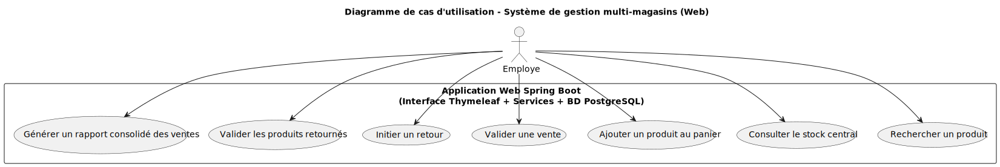

# 5. Vue des blocs de construction

## 5.1. Boîte blanche – Vue d’ensemble du système

### Diagramme
### 2.1. Vue logique
#### Diagramme de classe représentant les entités et composants principaux du système :
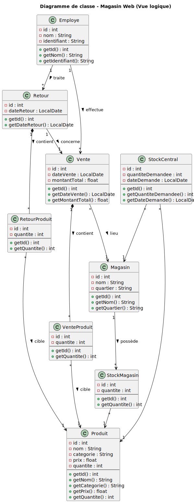  

###  Modèle de domaine – *Magasin Web (Spring Boot)*

| Classe             | Attributs clés                                                                                   | Description                                                                                     |
|--------------------|--------------------------------------------------------------------------------------------------|-------------------------------------------------------------------------------------------------|
| `Employe`          | `id: int`, `nom: String`, `identifiant: String`                                                  | Représente un employé pouvant effectuer des ventes et des retours.                             |
| `Produit`          | `id: int`, `nom: String`, `categorie: String`, `prix: float`, `quantite: int`                    | Article disponible en stock, vendable ou retournable.                                          |
| `Vente`            | `id: int`, `dateVente: LocalDate`, `montantTotal: double`, `employe`, `magasin`, `venteProduits`| Vente complète validée par un employé, contenant plusieurs produits.                           |
| `Retour`           | `id: int`, `dateRetour: LocalDate`, `vente`, `employe`, `retourProduits`                         | Retour effectué après une vente existante, validé par un employé.                              |
| `VenteProduit`     | `id: int`, `vente`, `produit`, `quantite: int`                                                   | Ligne de vente d’un produit avec quantité.                                                     |
| `RetourProduit`    | `id: int`, `retour`, `produit`, `quantite: int`                                                  | Ligne de retour d’un produit avec quantité.                                                    |
| `Magasin`          | `id: int`, `nom: String`, `quartier: String`, `ventes`                                           | Point de vente physique, associé aux stocks et aux ventes.                                     |
| `StockMagasin`     | `id: int`, `produit`, `magasin`, `quantite: int`                                                 | Stock local d’un produit dans un magasin donné.                                                |
| `StockCentral`     | `id: int`, `produit`, `magasin`, `quantiteDemandee: int`, `dateDemande: LocalDate`              | Demande de réapprovisionnement effectuée par un magasin.                                       |

---

### Architecture Web MVC – *Spring Boot*

| Composant                  | Rôle                                                                                     |
|----------------------------|------------------------------------------------------------------------------------------|
| `VenteController`          | Gère le panier, les ajouts/retraits de produits, la validation de vente (via AJAX).     |
| `RetourController`         | Permet de sélectionner une vente passée et de retourner un ou plusieurs produits.       |
| `ProduitController`        | Gère l’affichage, l’ajout, la suppression, la modification et la recherche de produits. |
| `DashboardController`      | Affiche les indicateurs (ruptures, surstocks, CA, tendances hebdomadaires).             |
| `RapportController`        | Génère les rapports consolidés : par magasin, par produit, stock global.                |
| `StockCentralController`   | Permet de consulter le stock central et d’envoyer des demandes de réapprovisionnement.  |

| Service                    | Rôle                                                                                     |
|----------------------------|------------------------------------------------------------------------------------------|
| `RapportService`           | Calcule les ventes par magasin, identifie les produits les plus vendus, retourne le stock actuel. |
| `StockCentralService`      | Gère les demandes de réapprovisionnement, filtre les doublons, affiche l’historique.    |

| Repository                 | Rôle                                                                                     |
|----------------------------|------------------------------------------------------------------------------------------|
| `ProduitRepository`        | Accès aux produits, requêtes de filtrage par nom/catégorie, stock critique.             |
| `VenteRepository`          | Accès aux ventes, calculs de chiffre d’affaires, produits les plus vendus.              |
| `RetourRepository`         | Accès aux retours, quantités déjà retournées par vente/produit.                         |
| `EmployeRepository`        | Accès aux employés.                                                                      |
| `MagasinRepository`        | Accès aux magasins.                                                                      |
| `StockMagasinRepository`   | Accès aux stocks locaux, recherche par magasin et produit.                              |
| `StockCentralRepository`   | Accès aux demandes de réapprovisionnement central.   

### Motivation
J'ai pris l'architecture MVC, car je suis familier avec. Aussi elle offre une séparation claire entre l’interface utilisateur, la logique métier et la gestion des interactions utilisateurs.

### Blocs principaux (black box)

| Bloc         | Rôle                                              |
|--------------|---------------------------------------------------|
| View         | Affichage console et saisie utilisateur (CLI)     |
| Controller   | Gère les actions de l’utilisateur et appelle les services/DAO |
| Model/DAO    | Contient les entités JPA et l’accès aux données via Hibernate |
| PostgreSQL       | Base de données locale relationnelle              |

## 5.2. Niveau 2

| Sous-bloc     | Description                                      |
|---------------|--------------------------------------------------|
| EmployeDAO    | L'employer qui fait les ventes, retours et consulation du stock        |
| ProduitDAO    | Accès aux produits : recherche, liste, stock     |
| VenteDAO      | Enregistrement d’une vente                       |
| RetourDAO     | Gestion des retours et ajustement du stock       |
| HibernateUtil | Initialise les sessions Hibernate                |

### Vue d’implémentation – Organisation des modules (Spring Boot Web)
L’application suit une architecture **MVC enrichie**, avec une séparation claire des responsabilités :

- **Contrôleurs (`controller`)** : Gèrent les interactions utilisateur (formulaires, AJAX, vues Thymeleaf).
- **Services (`service`)** : Appliquent les règles d’affaires (calculs, regroupements, filtrage, validations métier).
- **Repositories (`repository`)** : Abstraction de la base de données via Spring Data JPA (équivalent DAO).
- **Modèles (`model`)** : Entités JPA mappées aux tables de la base de données (`Produit`, `Vente`, `Retour`, etc.).
- **Vues (`.html`)** : Templates Thymeleaf côté client (non inclus dans ce diagramme technique mais couplés aux contrôleurs).

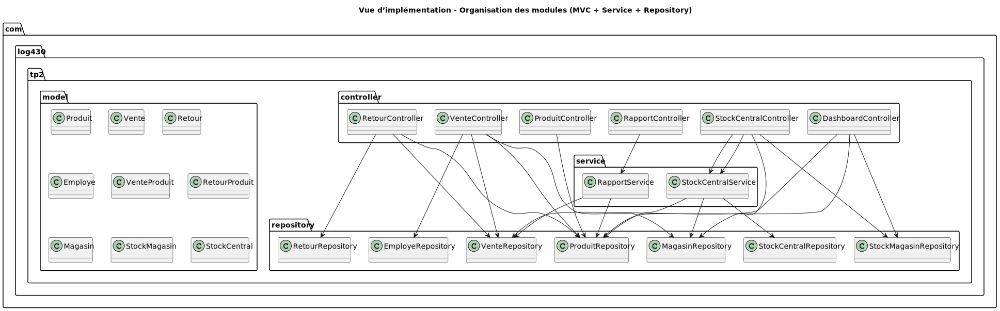

## 5.3. Niveau 3

Ce niveau de détail n’est pas nécessaire dans notre contexte. Notre application repose sur une architecture à deux couches (client-console et base de données). Aucun sous-bloc supplémentaire n’est requis à ce stade.
# 6. Vue d’exécution

## 6.1. Scénario : Rechercher un produit

### Description
L’employé accède à la page “Rechercher un produit” via l’interface web. 
Il saisit un critère de recherche (ex. identifiant, nom, ou catégorie) dans un champ de formulaire. 

Le contrôleur `ProduitController` reçoit la requête HTTP avec le paramètre de recherche, 
et appelle le `ProduitRepository`, qui exécute une requête JPA personnalisée 
sur la base de données PostgreSQL. Les produits correspondants sont récupérés 
et envoyés à la vue `home.html`, où ils sont affichés sous forme de tableau. 

Cela permet à l’employé de consulter facilement les détails des produits 
et de filtrer selon les besoins du client.

### Diagramme de séquence
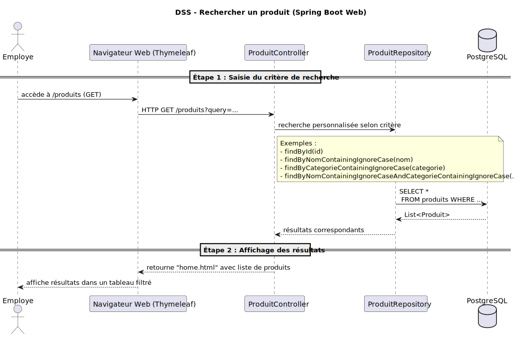  

## 6.2. Scénario : Enregistrer une vente

### Description
L’employé accède à la page de vente via l’interface web et ajoute des produits au panier 
à l’aide d’actions AJAX. À chaque ajout, le `VenteController` délègue au `VenteService` 
la validation de la quantité disponible via le `ProduitRepository`.

Si le stock est suffisant, le produit est ajouté à la vente en cours (stock décrémenté). 
Une fois tous les articles sélectionnés, l’employé valide la vente. Le contrôleur 
enregistre alors l’entité `Vente` dans la base de données via `VenteRepository`, 
avec ses lignes `VenteProduit`.

Une fois la transaction confirmée, un reçu de vente est affiché dynamiquement à l’écran 
dans la vue `facture.html`.

### Diagramme de séquence
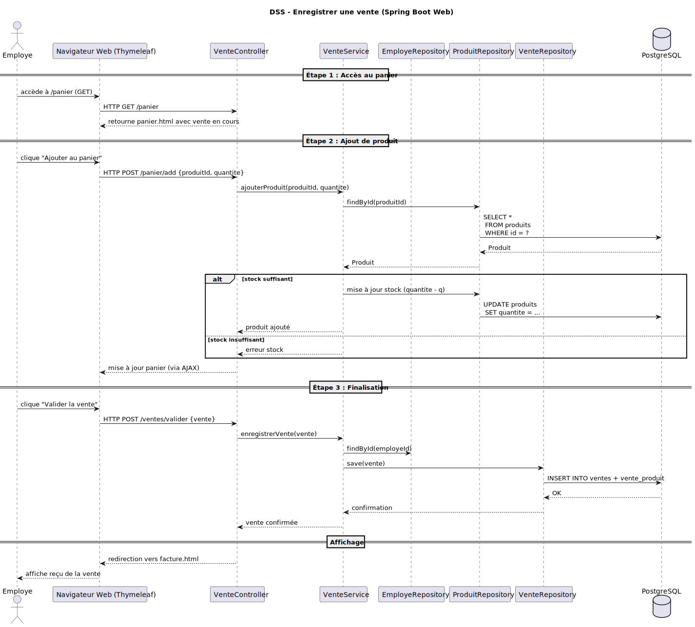 

## 6.3. Scénario : Gérer un retour

### Description
L’employé accède à la page “Retourner un produit” via l’interface web. 
Il saisit l’identifiant d’une vente existante pour visualiser les produits achetés. 

Le contrôleur `RetourController` utilise `VenteRepository` pour retrouver la vente 
et affiche dynamiquement les lignes concernées. L’employé sélectionne les produits à retourner 
et saisit les quantités via un formulaire.

À la soumission, le contrôleur délègue au `RetourService` la validation des données, 
la mise à jour des stocks via `ProduitRepository` et l’enregistrement du retour dans 
`RetourRepository`. Une fois le traitement complété, un reçu de retour est affiché 
à l’employé via la vue Thymeleaf.

### Diagramme de séquence
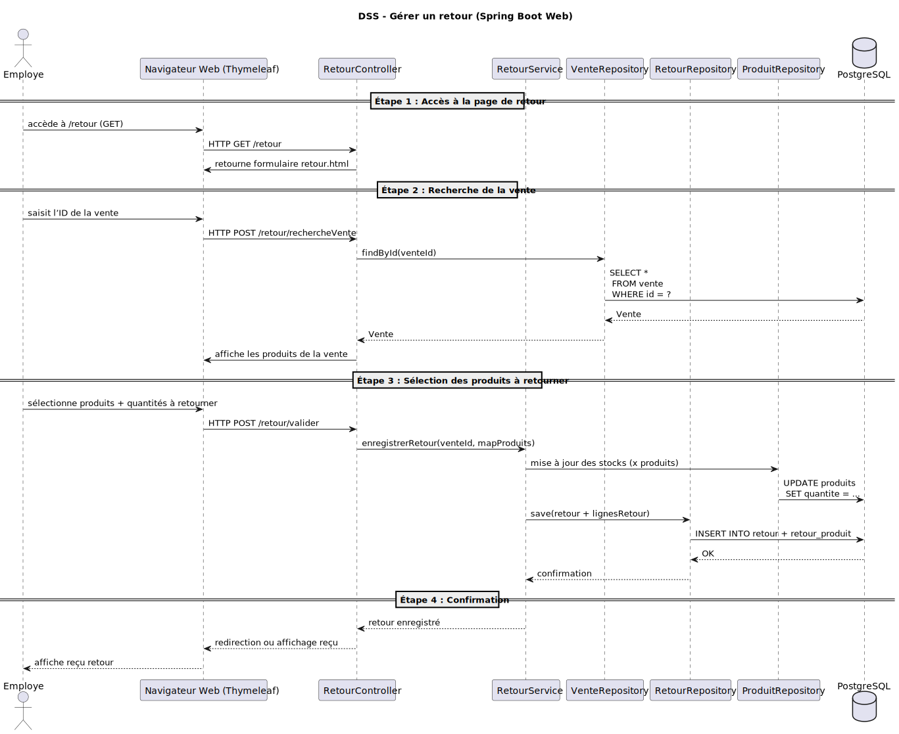  

## 6.4. Scénario : Consulter le stock central (UC2)

### Description
L’employé accède à la page “Stock central” via l’interface web (navigateur). 
Le contrôleur `StockCentralController` traite la requête HTTP `GET /stock` 
et délègue au service `StockCentralService` la récupération des produits disponibles. 

Ce service interroge le `ProduitRepository`, qui exécute une requête JPA 
sur la base de données PostgreSQL pour obtenir la quantité actuelle des produits. 

Le contrôleur retourne ensuite la vue Thymeleaf `stock.html`, 
qui affiche dynamiquement la liste des produits. 
Si un magasin est sélectionné, l’historique des demandes de réapprovisionnement 
est également récupéré et affiché.

### Diagramme de séquence
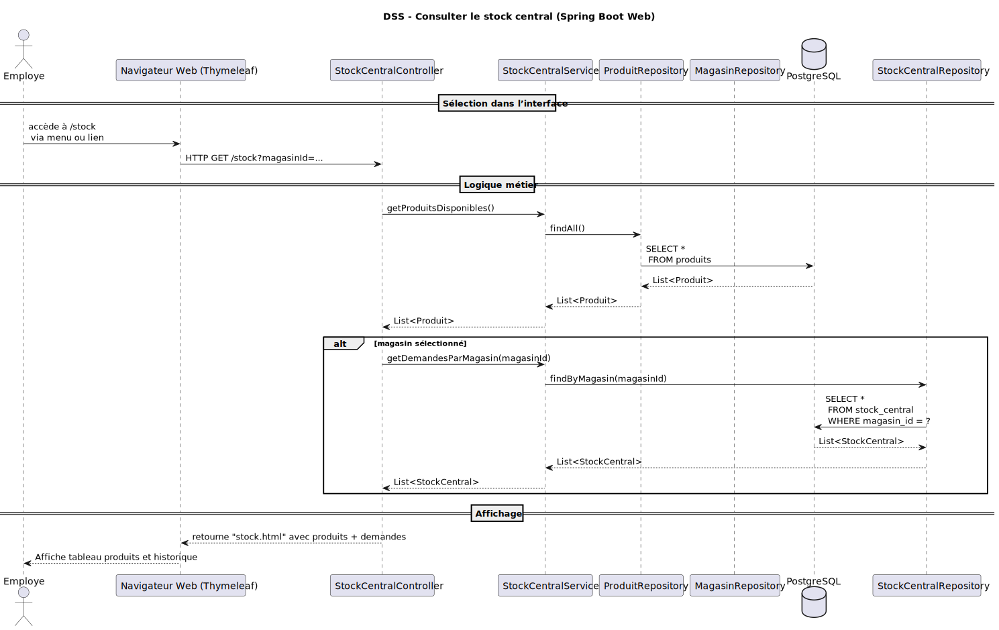  

## 6.5. Scénario : Générer un rapport consolidé des ventes (UC1)

### Description
Le gestionnaire accède à la page “Rapport” via l’interface web. Le contrôleur `RapportController` traite la requête `GET /rapport` et délègue à `RapportService` la génération d’un rapport détaillé.  

Ce service regroupe les ventes par magasin via `VenteRepository`, identifie les produits les plus vendus, puis consulte le stock actuel à l’aide de `ProduitRepository`.  

Les données combinées sont retournées sous forme d’un objet rapport consolidé, ensuite injecté dans la vue `rapport.html`. L’interface affiche un tableau récapitulatif par magasin avec des sous-sections sur les ventes, les stocks, et les tendances.

### Diagramme de séquence  
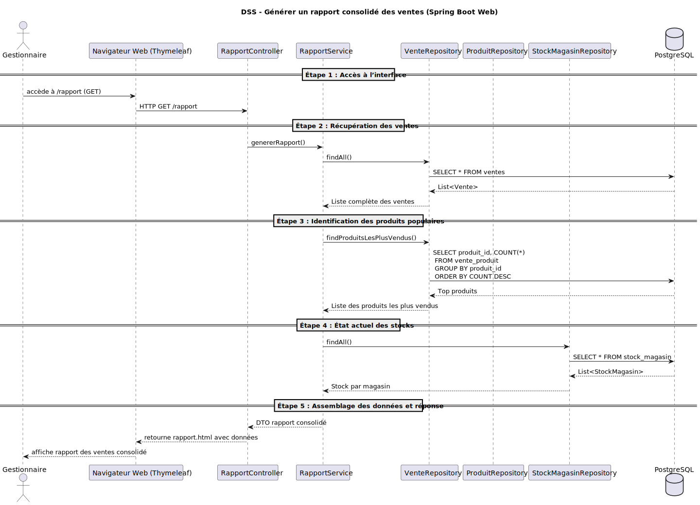 

## 6.6. Scénario : Visualiser les performances des magasins (UC3)

### Description
Un gestionnaire accède à la page du tableau de bord via l’interface web. Le contrôleur `DashboardController` traite la requête `GET /dashboard` et interroge le service `RapportService` pour récupérer les indicateurs de performance : chiffre d’affaires par magasin, alertes de rupture de stock, produits en surstock et tendances récentes.

Les données sont agrégées à partir des `VenteRepository`, `ProduitRepository` et `StockMagasinRepository`, puis structurées sous forme d’un objet DTO envoyé à la vue `dashboard.html`. L’interface affiche des graphiques interactifs, des alertes visuelles, et un résumé global des performances de chaque point de vente.

### Diagramme de séquence  
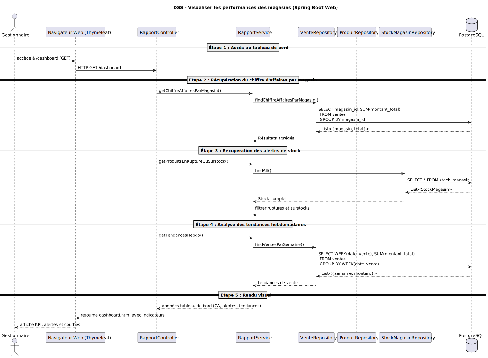

# 7. Vue de déploiement

Cette section décrit l’infrastructure technique nécessaire à l’exécution du système, ainsi que la répartition des composants logiciels sur cette infrastructure.

Le système étant exécuté dans un environnement local (machine virtuelle), l’architecture suit un modèle simple à deux niveaux (2-tier), sans distribution réseau.

## 7.1. Infrastructure – Niveau 1
Le système repose sur une architecture 2-tier, où la couche cliente (console Java) et la base de données PostgreSQL résident dans la même machine (ou VM).
La communication entre les deux couches se fait via Hibernate (ORM).

### Schéma de déploiement (niveau 1)
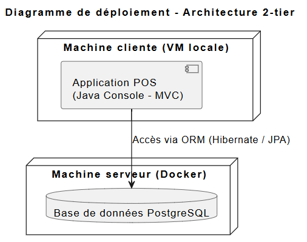

## 7.2. Infrastructure – Niveau 2
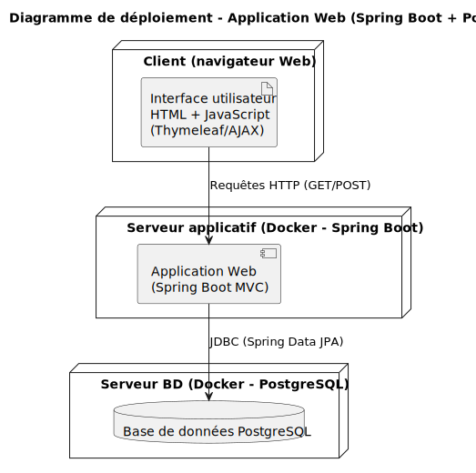

### Schéma de déploiement (texte ou diagramme)
# 8. Concepts transversaux

Cette section présente les principes techniques et conceptuels appliqués globalement dans le système. Ces concepts touchent plusieurs parties de l’architecture et garantissent la cohérence du développement.

## 8.1. Modèle architectural

- Utilisation du **pattern MVC** pour séparer présentation, logique métier et persistance.
- Couche de persistance isolée via Repostory, manipulant des entités JPA.

## 8.2. ORM et persistance

- Utilisation de **Hibernate avec JPA** pour abstraire l’accès aux données SQLite.
- Les entités sont annotées (`@Entity`, `@Id`, etc.) et gérées via des Repostory.

## 8.3. Transactions

- Chaque opération de vente ou retour est encapsulée dans une transaction Hibernate.
- Les mises à jour de stock et les insertions sont atomiques pour garantir la cohérence.

## 8.4. Intégration continue

- Utilisation de **GitHub Actions** pour automatiser les vérifications de code, tests et build Docker.

## 8.5. Conteneurisation

- Déploiement local réalisé via **Docker** et orchestration possible avec Docker Compose.
- L’ensemble de l’application (console + SQLite) tourne dans un conteneur unique.

# 9. Décisions d’architecture

Cette section référence les principales décisions architecturales prises lors du développement du système. Chaque décision est documentée sous forme d’ADR (Architecture Decision Record), selon le format de Michael Nygard.

## Liste des ADR

| ID    | Titre                                                  | Fichier                                               |
|-------|--------------------------------------------------------|--------------------------------------------------------|
| ADR 001 | Choix de la plateforme                                | `docs/adr/001-choix-plateforme.md`                    |
| ADR 002 | Séparation des responsabilités (MVC)                  | `docs/adr/002-separation-responsabilites.md`          |
| ADR 003 | Stratégie de persistance                              | `docs/adr/003-strategie-persistance.md`               |
| ADR 004 | Choix du mécanisme de base de données (SQL, local)    | `docs/adr/004-choix-bd.md`                            |

## Format utilisé

Les ADR sont rédigées selon le modèle de Michael Nygard. Chaque fiche inclut :

- **Statut** (Accepted, Rejected, etc.)
- **Contexte** : la situation ou les contraintes ayant mené à la décision
- **Décision** : le choix retenu
- **Conséquences** : les effets positifs et négatifs du choix

🔗 [Modèle officiel ADR – Michael Nygard (GitHub)](https://github.com/joelparkerhenderson/architecture-decision-record/tree/main/locales/en/templates/decision-record-template-by-michael-nygard)
# 10. Exigences de qualité

Cette section complète les objectifs de qualité mentionnés en section 1.2, en les organisant sous forme d’arbre de qualité et en les illustrant avec des scénarios concrets.

## 10.1. Arbre de qualité
```
Qualité
├── Robustesse
│   └── Le système ne doit pas corrompre les données même en cas d'échec d'une opération.
├── Performance
│   └── Les opérations (vente, retour, consultation) doivent répondre en moins de 1 seconde.
├── Portabilité
│   └── L’application doit fonctionner sur n’importe quelle VM sans configuration externe.
├── Maintenabilité
│   └── Le code doit permettre l’ajout futur de fonctionnalités (ex. : interface Web).
└── Testabilité
    └── Chaque composant métier doit pouvoir être testé de manière unitaire.
```

## 10.2. Scénarios de qualité

### Scénarios d’utilisation (runtime)

- **Performance** : Lorsqu’un employé consulte le stock d’un produit, le système doit afficher la quantité en moins de 1 seconde.
- **Robustesse** : Si une transaction de vente échoue (ex. : erreur de stock), aucune donnée ne doit être enregistrée partiellement.

### Scénarios de changement (évolution)

- **Portabilité** : Le système doit pouvoir être déplacé d'une VM locale à une autre sans adaptation du code.
- **Extensibilité** : Il doit être possible d’ajouter une interface Web ou GUI sans réécrire la logique métier ou DAO.
- **Maintenabilité** : Une modification dans le modèle de données (ex. : ajout d’un champ `remise` dans `Vente`) doit être localisée au niveau du modèle sans impact sur la vue.

## 11. Risques techniques

* Gestion de la concurrence entre caisses
* Transactions mal fermées pouvant corrompre le stock## 12. Glossaire

| Terme | Définition                        |
| ----- | --------------------------------- |
| POS   | Point Of Sale : système de caisse |
| MVC   | Model-View-Controller             |
| ORM   | Object-Relational Mapping         |
| JPA   | Jakarta Persistence API           |
| ADR   | Architectural Decision Records    |
| DAO   | Data Access Object    |
## 13. Références

* [https://arc42.org](https://arc42.org)
* Format Arc42 basé sur Arner :[https://github.com/arner/arc42-template/tree/master/docs](https://github.com/arner/arc42-template/tree/master/docs)
* [https://hibernate.org](https://hibernate.org)
* [https://github.com/xerial/sqlite-jdbc](https://github.com/xerial/sqlite-jdbc)
* Documentation ADR :[https://github.com/joelparkerhenderson/architecture-decision-record](https://github.com/joelparkerhenderson/architecture-decision-record)
* Format ADR basé sur Michael Nygard : [https://github.com/joelparkerhenderson/architecture-decision-record/tree/main/locales/en/templates/decision-record-template-by-michael-nygard](https://github.com/joelparkerhenderson/architecture-decision-record/tree/main/locales/en/templates/decision-record-template-by-michael-nygard)