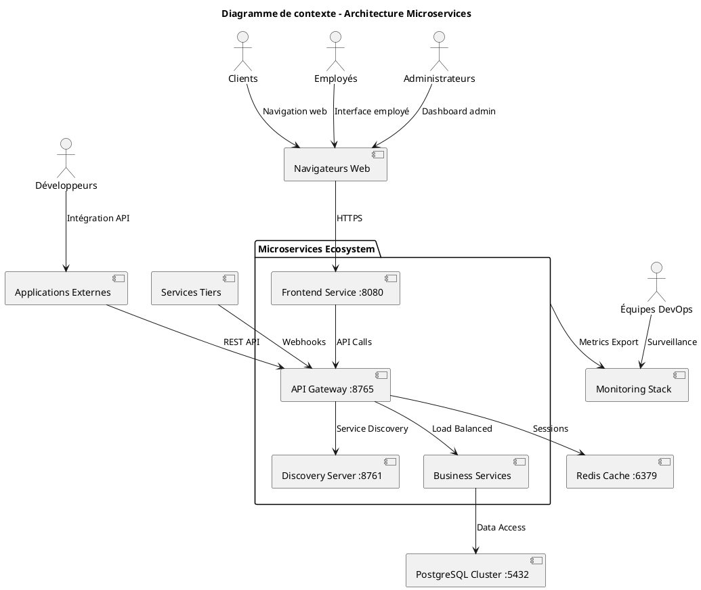

# 3. Contexte et périmètre

## 3.1. Contexte métier

Le système de gestion de magasin est une plateforme distribuée permettant la gestion complète d'une chaîne de magasins avec une architecture microservices. Il sert différents types d'utilisateurs selon leurs rôles et responsabilités :

### Clients
- Consultation du catalogue produits via l'interface web
- Recherche de produits par catégorie, nom ou description
- Visualisation des prix et disponibilités
- Accès aux informations des magasins

### Employés
- Enregistrement des ventes et traitement des transactions
- Gestion des retours et remboursements
- Consultation et mise à jour du stock local
- Accès aux outils de gestion quotidienne
- Interface dédiée pour les opérations de caisse

### Administrateurs
- Gestion complète du catalogue produits (CRUD)
- Supervision des ventes et génération de rapports
- Configuration des magasins et de leurs paramètres
- Gestion du personnel et attribution des rôles
- Monitoring et surveillance du système
- Accès aux tableaux de bord analytiques

### Développeurs et partenaires
- Intégration via les APIs REST publiques
- Accès aux données via l'API Gateway
- Développement d'applications tierces
- Automatisation des processus métier

## 3.2. Contexte technique

### Architecture distribuée

Le système utilise une architecture microservices complète déployée dans un environnement containerisé Docker. L'architecture suit le pattern de décomposition par domaine métier avec isolation complète des données.

### Communication

- **Frontend vers services** : Appels REST via l'API Gateway
- **Inter-services** : Communication REST synchrone avec découverte de service
- **Clients externes** : APIs REST standardisées avec authentification
- **Monitoring** : Collecte de métriques via Prometheus

### Sécurité

- **Authentification** : Centralisée via l'API Gateway
- **Autorisation** : Basée sur les rôles (RBAC)
- **Transport** : HTTPS/TLS pour toutes les communications externes
- **Isolation** : Réseau Docker sécurisé pour les communications internes

## 3.3. Périmètre du système

### Services inclus dans le périmètre

**Services métier :**
- **Inventory Service** : Gestion des produits, stock central, catégories
- **Transaction Service** : Ventes, retours, historique des transactions
- **Store Service** : Magasins, localisations, configurations
- **Personnel Service** : Employés, rôles, authentification

**Services d'infrastructure :**
- **Discovery Server** : Registre des services (Eureka)
- **API Gateway** : Routage, sécurité, rate limiting
- **Frontend Service** : Interface utilisateur web

**Infrastructure de support :**
- **PostgreSQL Cluster** : Stockage distribué des données
- **Redis Cache** : Cache distribué et sessions
- **Prometheus** : Collecte de métriques
- **Grafana** : Visualisation et dashboards

### Interfaces externes

**Interfaces utilisateur :**
- Interface web responsive (port 8080)
- APIs REST publiques (port 8765)
- Dashboards de monitoring (port 3000)

**Intégrations système :**
- Base de données PostgreSQL (port 5432)
- Cache Redis (port 6379)
- Métriques Prometheus (port 9090)

### Exclusions du périmètre

**Non inclus dans cette version :**
- Paiements en ligne et gateways de paiement
- Intégration avec des systèmes ERP externes
- Applications mobiles natives
- Notifications push et emails
- Gestion avancée des fournisseurs
- Intégration avec des marketplaces

## 3.4. Diagramme de contexte

## 3.5. Contraintes du contexte

### Contraintes techniques
- **Containerisation** : Déploiement exclusivement via Docker
- **Communication** : REST API uniquement pour les interfaces externes
- **Base de données** : PostgreSQL pour la persistance
- **Monitoring** : Prometheus/Grafana obligatoire
- **Service discovery** : Eureka pour la découverte automatique

### Contraintes opérationnelles
- **Disponibilité** : Services disponibles 24/7
- **Performance** : Temps de réponse < 200ms
- **Scalabilité** : Capable de gérer 1000+ utilisateurs simultanés
- **Sécurité** : Authentification requise pour toutes les opérations

### Contraintes organisationnelles
- **Équipes autonomes** : Chaque service géré par une équipe dédiée
- **Déploiement indépendant** : Chaque service déployable séparément
- **Documentation** : APIs documentées avec OpenAPI/Swagger
- **Tests** : Couverture de tests minimale de 80%

## 3.6. Risques et dépendances externes

### Dépendances critiques
- **PostgreSQL** : Base de données principale
- **Redis** : Cache et gestion des sessions
- **Docker** : Plateforme de containerisation
- **Réseau** : Communication inter-services

### Risques identifiés
- **Panne réseau** : Impact sur la communication inter-services
- **Surcharge** : Goulots d'étranglement potentiels
- **Sécurité** : Vulnérabilités dans les dépendances
- **Consistency** : Défis de cohérence des données distribuées

### Mitigations
- **Circuit breakers** : Protection contre les pannes en cascade
- **Health checks** : Surveillance proactive de la santé des services
- **Backup** : Sauvegarde automatique des données critiques
- **Monitoring** : Alertes en temps réel sur les métriques critiques
