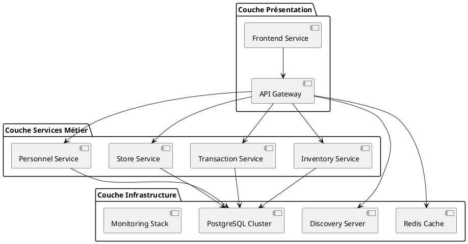
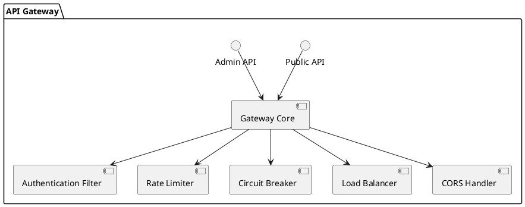
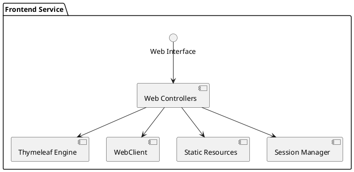
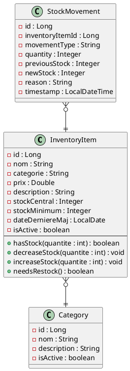
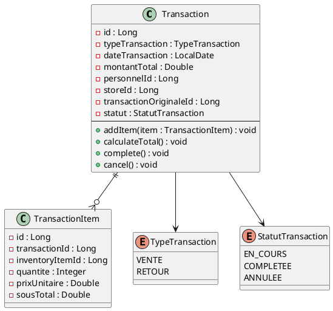
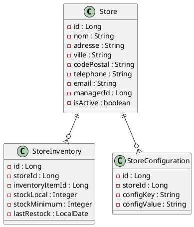
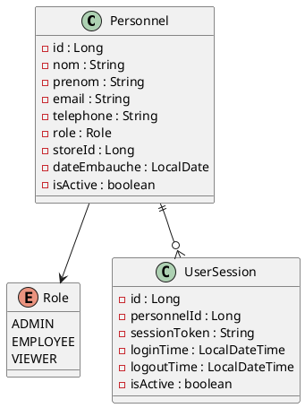
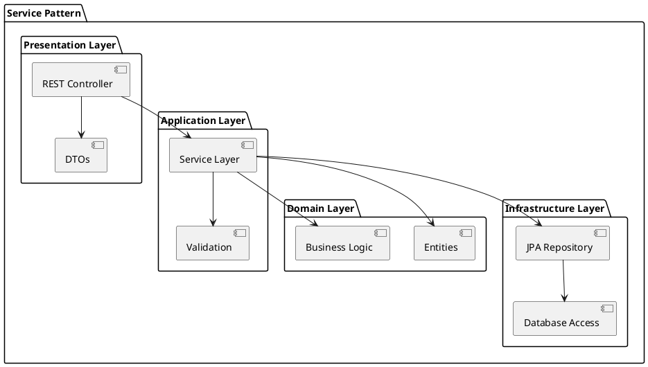
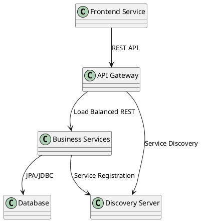
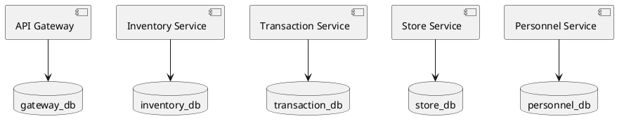

# 5. Vue des blocs de construction

## 5.1. Vue d'ensemble de l'architecture microservices

### Niveau 1 : Vue générale du système

L'architecture microservices est organisée en trois couches principales :

1. **Couche présentation** : Interface utilisateur et API Gateway
2. **Couche services** : Services métier indépendants
3. **Couche données** : Bases de données distribuées et cache

### Conteneurs principaux

| Service | Port | Responsabilité | Base de données |
|---------|------|----------------|-----------------|
| **discovery-server** | 8761 | Service de découverte (Eureka) | - |
| **api-gateway** | 8765 | Routage, sécurité, rate limiting | gateway_db |
| **frontend-service** | 8080 | Interface web utilisateur | - |
| **inventory-service** | 8081 | Gestion produits et stock | inventory_db |
| **transaction-service** | 8082 | Ventes et retours | transaction_db |
| **store-service** | 8083 | Magasins et localisations | store_db |
| **personnel-service** | 8084 | Employés et authentification | personnel_db |

## 5.2. Niveau 2 : Décomposition des services

### 5.2.1. API Gateway (Boîte blanche)

**Responsabilité** : Point d'entrée unique pour toutes les requêtes externes

**Composants internes :**

**Interfaces :**
- **Entrée** : Requêtes HTTP/HTTPS des clients
- **Sortie** : Routage vers les services métier
- **Dépendances** : Discovery Server, Redis Cache

### 5.2.2. Frontend Service (Boîte blanche)

**Responsabilité** : Interface utilisateur web avec rendu côté serveur

**Composants internes :**

**Interfaces :**
- **Entrée** : Requêtes HTTP des navigateurs
- **Sortie** : Pages HTML et appels API vers Gateway
- **Dépendances** : API Gateway

### 5.2.3. Inventory Service (Boîte blanche)

**Responsabilité** : Gestion des produits et du stock central

**Modèle de domaine :**

**Architecture en couches :**

| Couche | Composants | Responsabilité |
|--------|------------|----------------|
| **API** | `InventoryController` | Exposition des endpoints REST |
| **Application** | `InventoryService` | Logique applicative et orchestration |
| **Domain** | `InventoryItem`, `Category` | Entités métier et règles business |
| **Infrastructure** | `InventoryRepository` | Accès aux données |

### 5.2.4. Transaction Service (Boîte blanche)

**Responsabilité** : Gestion des ventes et retours

**Modèle de domaine :**

### 5.2.5. Store Service (Boîte blanche)

**Responsabilité** : Gestion des magasins et de leurs configurations

**Modèle de domaine :**

### 5.2.6. Personnel Service (Boîte blanche)

**Responsabilité** : Gestion des employés et authentification

**Modèle de domaine :**

## 5.3. Architecture technique commune

### Pattern par service

Chaque service métier suit la même architecture en couches :

### Configuration commune

**Spring Boot Starters utilisés :**
- `spring-boot-starter-web` : APIs REST
- `spring-boot-starter-data-jpa` : Persistance
- `spring-boot-starter-actuator` : Monitoring
- `spring-cloud-starter-netflix-eureka-client` : Service discovery
- `spring-boot-starter-cache` : Cache local

**Configuration Docker :**
- **Dockerfile** standardisé pour tous les services
- **Health checks** configurés
- **Variables d'environnement** pour la configuration
- **Multi-stage builds** pour optimiser la taille

## 5.4. Communication entre services

### Patterns de communication

### Contrats d'interface

**REST APIs standardisées :**
- Format JSON pour tous les échanges
- Codes de statut HTTP standards
- Documentation OpenAPI/Swagger
- Versioning par URL (`/api/v1/`)

**Service Discovery :**
- Enregistrement automatique via Eureka
- Health checks périodiques
- Load balancing côté client
- Failover automatique

## 5.5. Données et persistance

### Modèle de données distribué

Chaque service possède sa propre base de données, respectant le principe "Database per Service" :

### Stratégies de consistance

- **Eventual Consistency** : Cohérence à terme via événements
- **Saga Pattern** : Transactions distribuées (future implémentation)
- **API Calls** : Synchronisation via appels REST
- **Idempotency** : Opérations répétables sans effet de bord
