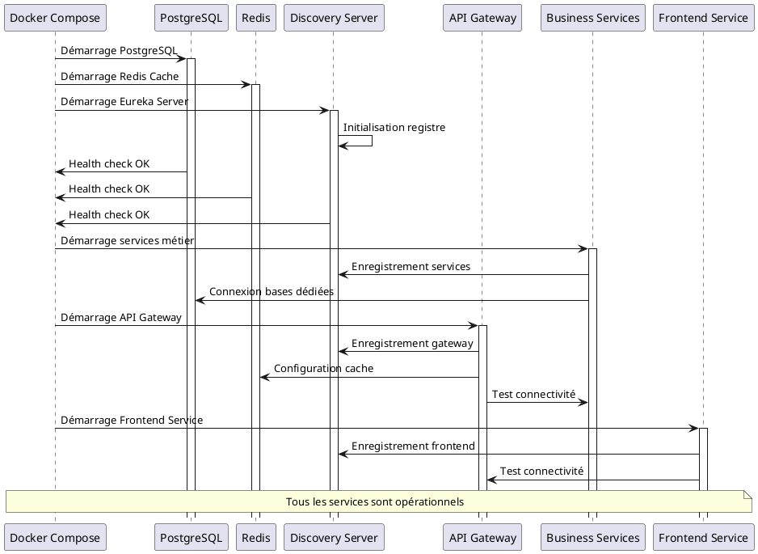
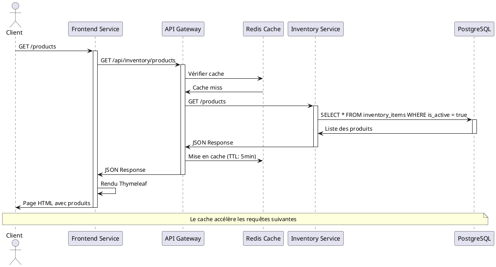
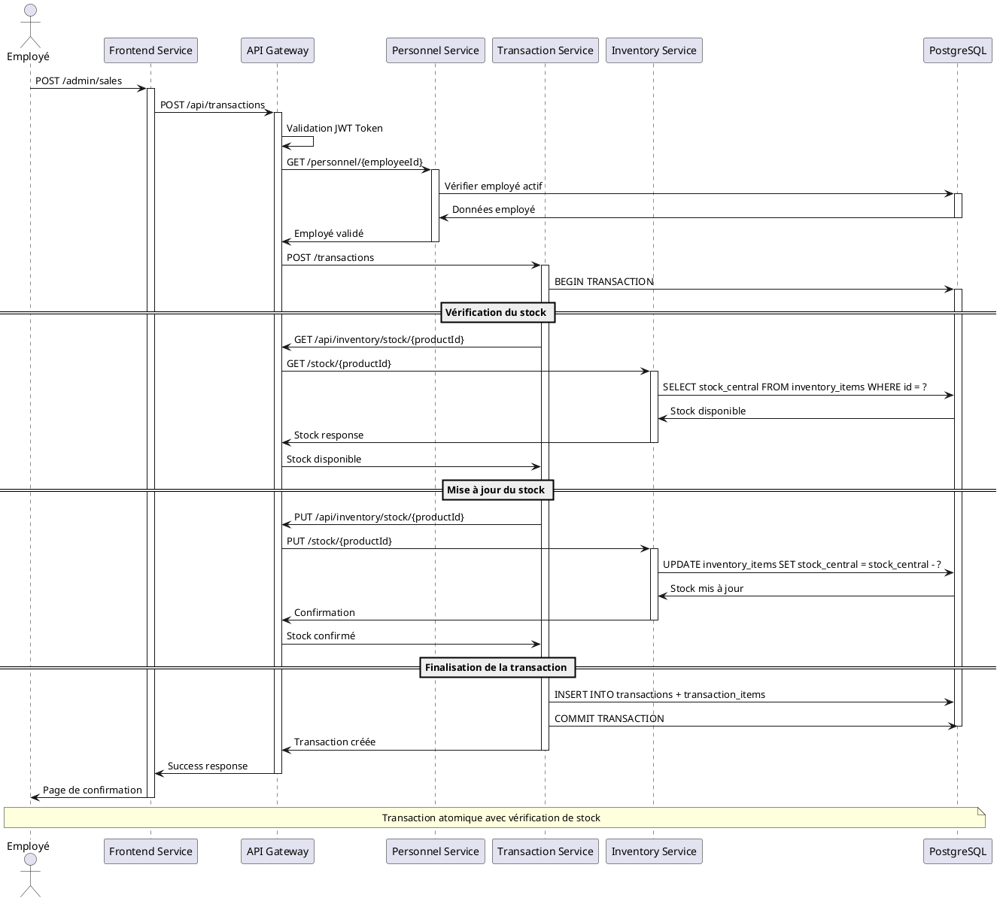
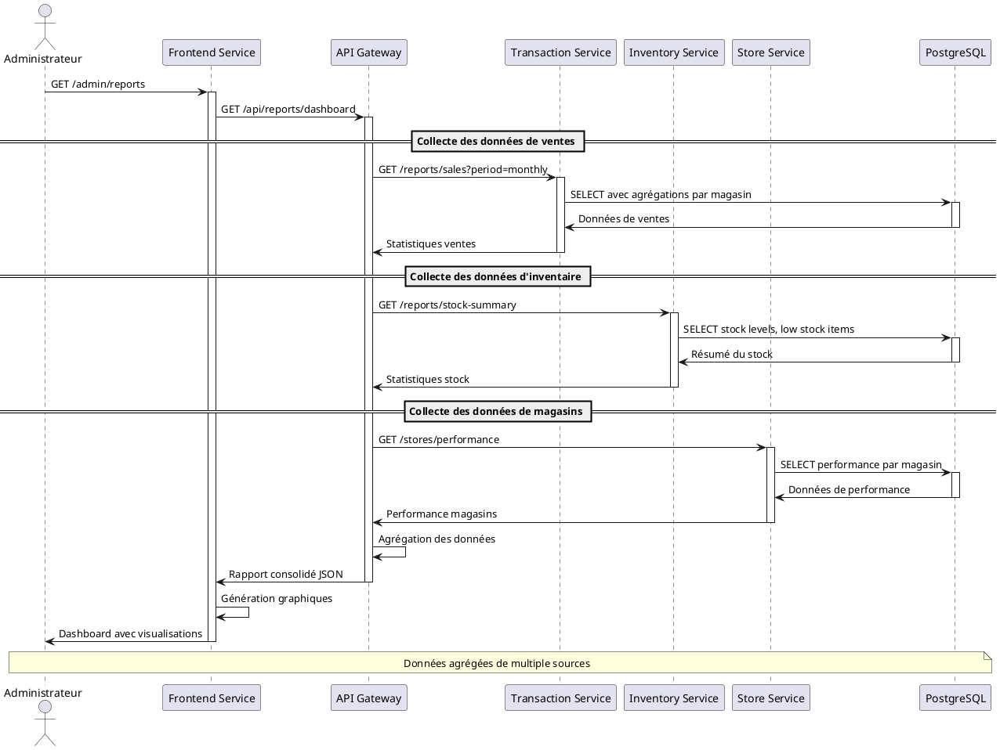
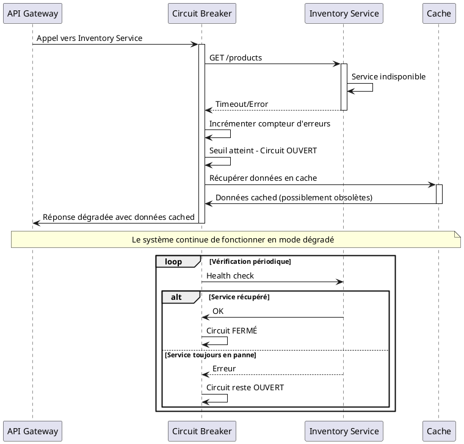
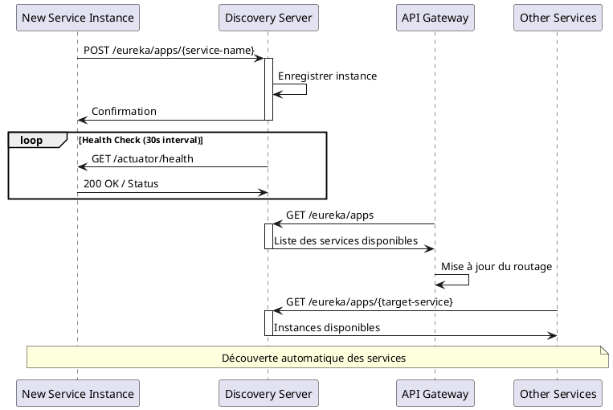
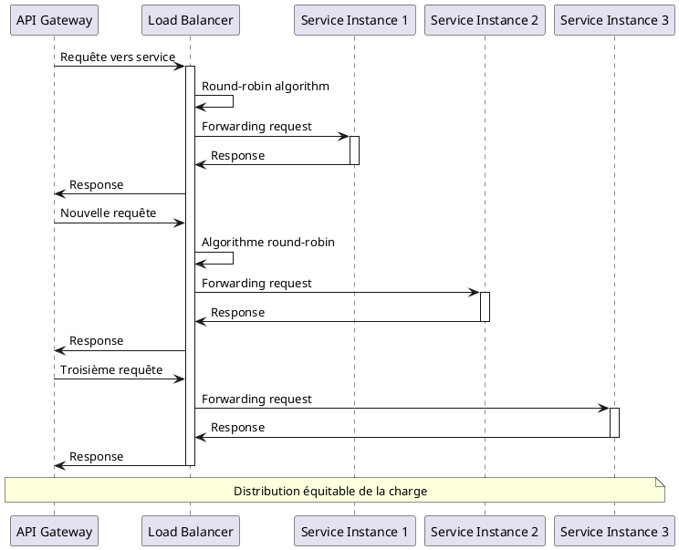
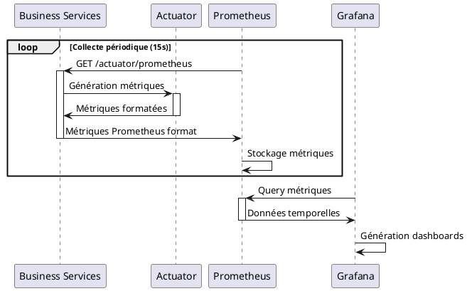

# 6. Vue d'exécution

## 6.1. Scénarios d'exécution principaux

Cette section décrit les scénarios d'exécution les plus importants de l'architecture microservices.

### 6.1.1. Démarrage du système

Le démarrage de l'architecture microservices suit un ordre précis géré par Docker Compose avec des health checks.

**Ordre de démarrage :**
1. **Infrastructure** : PostgreSQL et Redis
2. **Service Discovery** : Eureka Server
3. **Services métier** : Inventory, Transaction, Store, Personnel
4. **API Gateway** : Routage et sécurité
5. **Frontend Service** : Interface utilisateur

### 6.1.2. Consultation de produits (Client)

Scénario typique d'un client consultant le catalogue produits.

### 6.1.3. Enregistrement d'une vente (Employé)

Processus complet d'enregistrement d'une vente avec vérification du stock.

### 6.1.4. Génération de rapport (Administrateur)

Processus de génération d'un rapport consolidé multi-services.

### 6.1.5. Gestion des pannes (Circuit Breaker)

Comportement du système en cas de panne d'un service.

## 6.2. Patterns d'exécution

### 6.2.1. Service Discovery

### 6.2.2. Load Balancing

## 6.3. Monitoring et observabilité

### 6.3.1. Collecte de métriques

## 6.4. Gestion des erreurs

### Stratégies de résilience

1. **Circuit Breaker** : Protection contre les pannes en cascade
2. **Retry** : Tentatives automatiques en cas d'erreur temporaire
3. **Timeout** : Limitation du temps d'attente
4. **Fallback** : Réponses dégradées avec données cached
5. **Health Checks** : Surveillance proactive des services

### Codes d'erreur standardisés

| Code | Signification | Action |
|------|---------------|--------|
| 200 | Success | Traitement normal |
| 400 | Bad Request | Validation des données |
| 401 | Unauthorized | Redirection vers authentification |
| 403 | Forbidden | Vérification des permissions |
| 404 | Not Found | Ressource inexistante |
| 500 | Internal Error | Logging et fallback |
| 503 | Service Unavailable | Circuit breaker activé |
