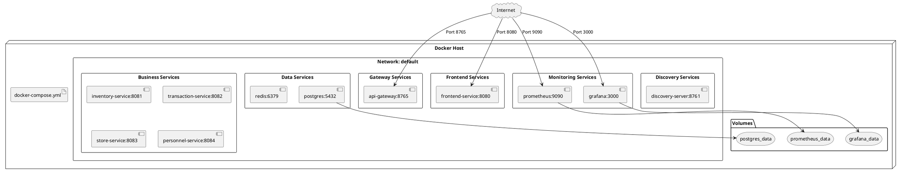
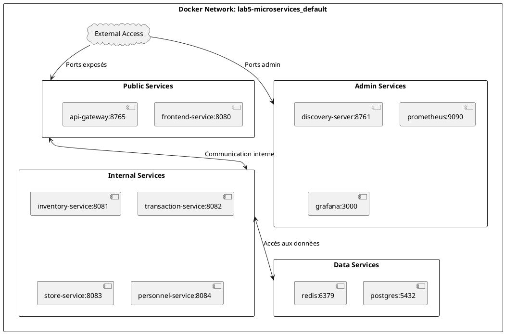
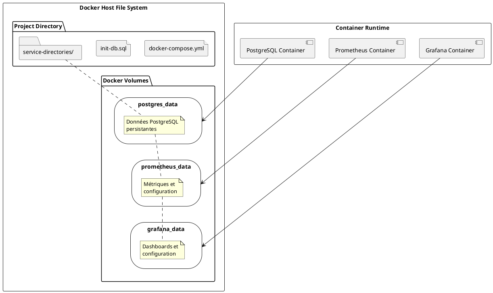
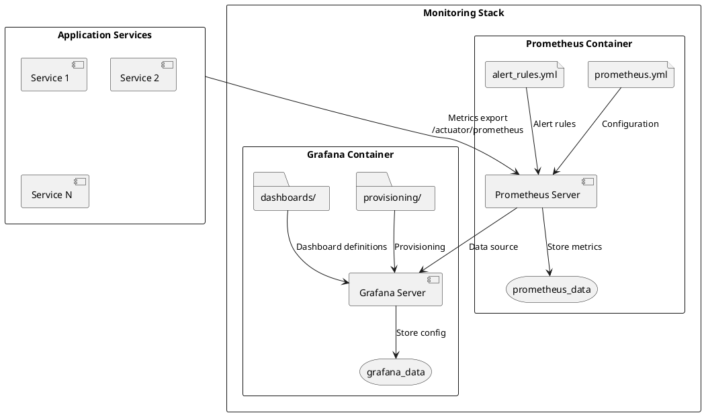

# 7. Vue de déploiement

## 7.1. Infrastructure de déploiement

L'architecture microservices est déployée dans un environnement containerisé utilisant Docker et Docker Compose pour l'orchestration.

### 7.1.1. Architecture de déploiement



### 7.1.2. Configuration Docker Compose

**Services et leurs dépendances :**

```yaml
# Structure simplifiée du docker-compose.yml
services:
  # Infrastructure services
  postgres:
    image: postgres:14
    ports: ["5432:5432"]
    volumes: 
      - postgres_data:/var/lib/postgresql/data
      - ./init-db.sql:/docker-entrypoint-initdb.d/init-db.sql
    
  redis:
    image: redis:7-alpine
    ports: ["6379:6379"]
    
  # Service discovery
  discovery-server:
    build: ./discovery-server
    ports: ["8761:8761"]
    depends_on:
      - postgres
    
  # API Gateway
  api-gateway:
    build: ./api-gateway
    ports: ["8765:8765"]
    depends_on:
      - discovery-server
      - redis
      - postgres
    
  # Business services
  inventory-service:
    build: ./inventory-service
    ports: ["8081:8081"]
    depends_on:
      - discovery-server
      - postgres
```

## 7.2. Mapping des services sur l'infrastructure

### 7.2.1. Ports et exposition

| Service | Port interne | Port exposé | Protocole | Accessibilité |
|---------|-------------|-------------|-----------|---------------|
| **frontend-service** | 8080 | 8080 | HTTP | Public |
| **api-gateway** | 8765 | 8765 | HTTP | Public |
| **discovery-server** | 8761 | 8761 | HTTP | Admin |
| **inventory-service** | 8081 | 8081 | HTTP | Interne |
| **transaction-service** | 8082 | 8082 | HTTP | Interne |
| **store-service** | 8083 | 8083 | HTTP | Interne |
| **personnel-service** | 8084 | 8084 | HTTP | Interne |
| **postgres** | 5432 | 5432 | TCP | Interne |
| **redis** | 6379 | 6379 | TCP | Interne |
| **prometheus** | 9090 | 9090 | HTTP | Admin |
| **grafana** | 3000 | 3000 | HTTP | Admin |

### 7.2.2. Réseau Docker

**Configuration réseau :**

- **Réseau par défaut** : Réseau bridge Docker automatique
- **DNS automatique** : Résolution des noms de services par Docker
- **Isolation** : Communication inter-services via le réseau interne
- **Exposition contrôlée** : Seuls les ports nécessaires sont exposés



## 7.3. Configuration des conteneurs

### 7.3.1. Images Docker

**Stratégie de build :**

```dockerfile
# Exemple de Dockerfile standard pour les services Java
FROM openjdk:21-jdk-slim AS build
WORKDIR /app
COPY pom.xml .
COPY src ./src
RUN ./mvnw clean package -DskipTests

FROM openjdk:21-jre-slim
WORKDIR /app
COPY --from=build /app/target/*.jar app.jar
EXPOSE 8080
ENTRYPOINT ["java", "-jar", "app.jar"]
```

**Optimisations :**

- **Multi-stage builds** : Réduction de la taille des images
- **Base images slim** : Images minimales pour la production
- **Layer caching** : Optimisation du build Docker
- **Security scanning** : Vérification des vulnérabilités

### 7.3.2. Variables d'environnement

**Configuration par service :**

```yaml
# Exemple pour inventory-service
environment:
  - SPRING_PROFILES_ACTIVE=docker
  - EUREKA_CLIENT_SERVICE_URL_DEFAULTZONE=http://discovery-server:8761/eureka/
  - POSTGRES_URL=jdbc:postgresql://postgres:5432/inventory_db
  - POSTGRES_USER=magasin
  - POSTGRES_PASSWORD=password
  - MANAGEMENT_ENDPOINTS_WEB_EXPOSURE_INCLUDE=health,info,prometheus
```

### 7.3.3. Health Checks

**Configuration des health checks :**

```yaml
healthcheck:
  test: ["CMD", "curl", "-f", "http://localhost:8081/actuator/health"]
  interval: 30s
  timeout: 10s
  retries: 3
  start_period: 60s
```

## 7.4. Stockage et persistance

### 7.4.1. Volumes Docker



### 7.4.2. Base de données PostgreSQL

**Configuration PostgreSQL :**

```sql
-- init-db.sql - Initialisation des bases de données
CREATE DATABASE gateway_db;
CREATE DATABASE inventory_db;
CREATE DATABASE transaction_db;
CREATE DATABASE store_db;
CREATE DATABASE personnel_db;

-- Permissions
GRANT ALL PRIVILEGES ON DATABASE gateway_db TO magasin;
GRANT ALL PRIVILEGES ON DATABASE inventory_db TO magasin;
GRANT ALL PRIVILEGES ON DATABASE transaction_db TO magasin;
GRANT ALL PRIVILEGES ON DATABASE store_db TO magasin;
GRANT ALL PRIVILEGES ON DATABASE personnel_db TO magasin;
```

**Stratégie de backup :**

- **Volume persistant** : `/var/lib/postgresql/data`
- **Scripts d'initialisation** : Montage de `init-db.sql`
- **Configuration** : Variables d'environnement Docker
- **Monitoring** : Health checks PostgreSQL

## 7.5. Monitoring et observabilité

### 7.5.1. Stack de monitoring



### 7.5.2. Configuration Prometheus

```yaml
# prometheus.yml - Configuration des targets
global:
  scrape_interval: 15s
  evaluation_interval: 15s

scrape_configs:
  - job_name: 'discovery-server'
    static_configs:
      - targets: ['discovery-server:8761']
    metrics_path: '/actuator/prometheus'
    
  - job_name: 'api-gateway'
    static_configs:
      - targets: ['api-gateway:8765']
    metrics_path: '/actuator/prometheus'
    
  # ... autres services
```

## 7.6. Sécurité du déploiement

### 7.6.1. Isolation et sécurité

**Mesures de sécurité :**

- **Réseau isolé** : Communication inter-services via réseau Docker privé
- **Exposition contrôlée** : Ports publics limités au strict nécessaire
- **Secrets** : Variables d'environnement pour les mots de passe
- **Users non-root** : Conteneurs exécutés avec utilisateurs dédiés
- **Images slim** : Surface d'attaque réduite

### 7.6.2. Configuration de sécurité

```yaml
# Exemple de configuration sécurisée
postgres:
  image: postgres:14
  environment:
    POSTGRES_DB: magasin_db
    POSTGRES_USER: magasin
    POSTGRES_PASSWORD: ${POSTGRES_PASSWORD:-password}
  networks:
    - internal
  # Pas d'exposition de port en production
```

## 7.7. Déploiement et exploitation

### 7.7.1. Scripts de déploiement

**Commandes principales :**

```bash
# Construction des images
./build-all.cmd

# Démarrage complet
docker-compose up -d

# Vérification des services
docker-compose ps
docker-compose logs -f [service]

# Arrêt propre
docker-compose down

# Nettoyage complet
./clean-all.cmd
```

### 7.7.2. Procédures opérationnelles

**Démarrage ordonné :**

1. **Infrastructure** : PostgreSQL et Redis
2. **Service Discovery** : Eureka Server
3. **Services métier** : Inventory, Transaction, Store, Personnel
4. **Gateway** : API Gateway
5. **Frontend** : Frontend Service
6. **Monitoring** : Prometheus et Grafana

**Monitoring de déploiement :**

- **Health checks** : Vérification automatique de la santé
- **Logs centralisés** : `docker-compose logs`
- **Métriques** : Dashboard Grafana temps réel
- **Alertes** : Notifications Prometheus

### 7.7.3. Évolution vers la production

**Améliorations recommandées :**

- **Kubernetes** : Migration vers orchestrateur production
- **Ingress Controller** : Gestion avancée du trafic
- **Secrets Management** : Vault ou équivalent
- **CI/CD** : Pipeline automatisé
- **Multi-environment** : Dev, Staging, Production
- **Backup automatique** : Stratégie de sauvegarde
- **High Availability** : Réplication et load balancing
