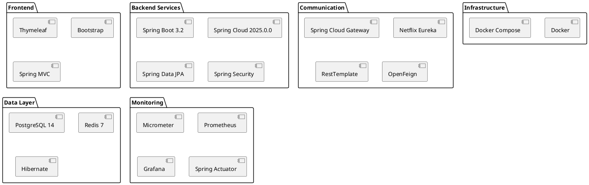
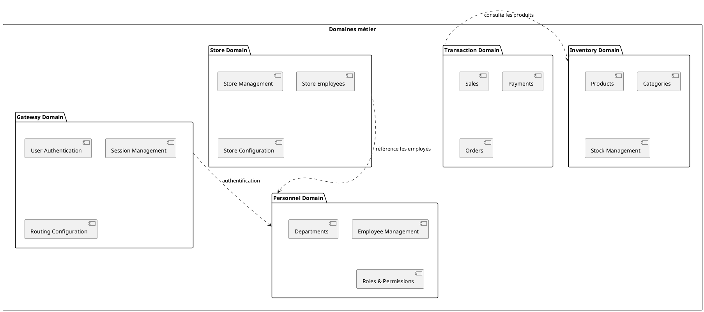
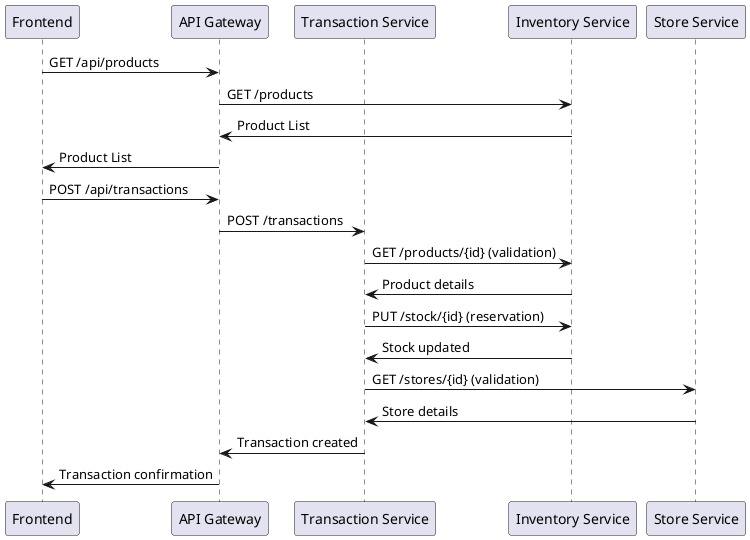
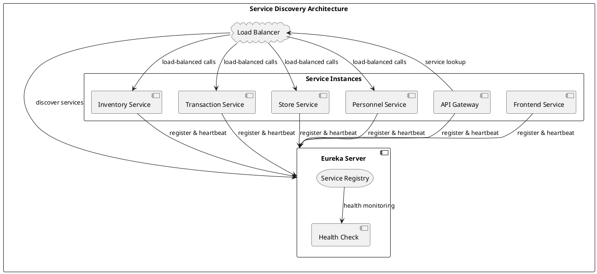
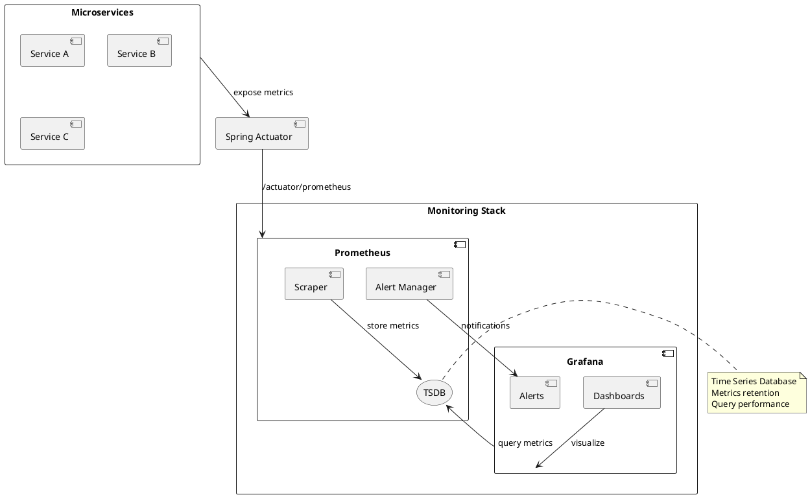
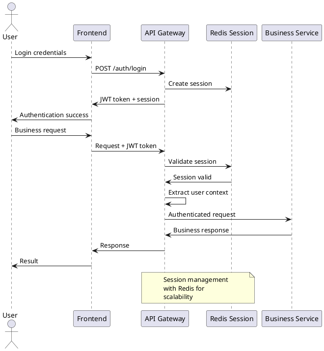
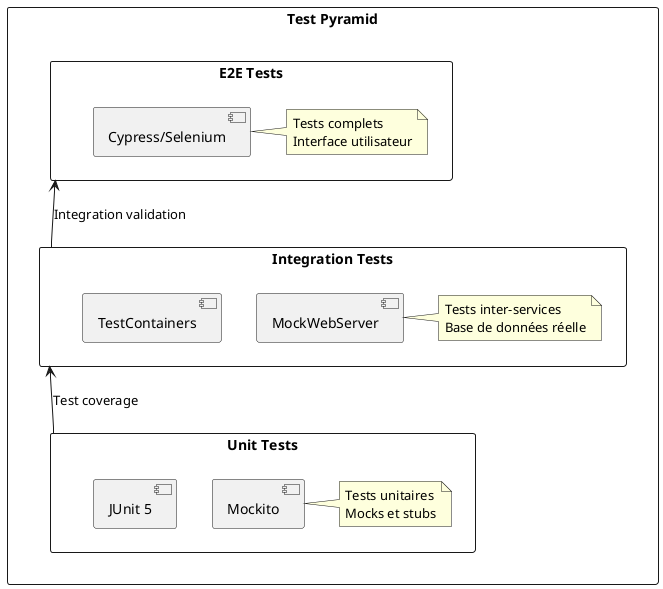
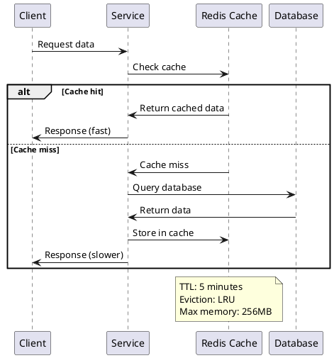
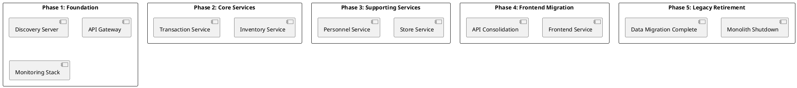

# 9. Architecture Decisions

## 9.1. Introduction

Cette section documente les principales décisions architecturales prises pour le projet de migration d'une application monolithique vers une architecture microservices. Ces décisions sont étroitement liées aux ADR (Architecture Decision Records) détaillés dans le dossier `docs/ADR-Lab5/`.

## 9.2. Décisions stratégiques

### 9.2.1. Migration vers les microservices

**Référence :** [ADR-007 : Migration vers l'architecture microservices](../ADR-Lab5/007-migration-microservices.md)

**Décision :** Migrer de l'architecture monolithique Spring Boot vers une architecture microservices.

**Contexte :**
- Application monolithique de gestion de magasin devenue complexe
- Difficultés de déploiement et de maintenance
- Besoin d'évolutivité et de résilience accrue
- Équipes multiples travaillant sur différents domaines métier

**Alternatives considérées :**

| Alternative | Avantages | Inconvénients | Décision |
|-------------|-----------|---------------|----------|
| **Monolithe modulaire** | Simplicité, cohérence | Couplage fort, déploiement unique | ❌ Rejeté |
| **Architecture microservices** | Autonomie, évolutivité, résilience | Complexité, communication réseau | ✅ **Retenu** |
| **Architecture SOA** | Réutilisabilité | Complexité ESB, couplage | ❌ Rejeté |

**Conséquences :**
- **Positives :** Évolutivité par service, déploiements indépendants, résilience
- **Négatives :** Complexité opérationnelle, communication réseau, cohérence des données

### 9.2.2. Choix de la plateforme technologique

**Référence :** [ADR-001 : Choix de la plateforme](../ADR-Lab5/001-choix-plateforme.md)

**Décision :** Spring Boot 3.2 avec Spring Cloud 2025.0.0 pour l'écosystème microservices.

**Technologies retenues :**



**Justifications :**
- **Spring Boot 3.2** : Écosystème mature, productivité élevée, support LTS
- **Spring Cloud** : Patterns microservices intégrés, service discovery natif
- **PostgreSQL** : ACID, performance, écosystème Java mature
- **Docker** : Portabilité, isolation, cohérence environnementale

## 9.3. Décisions architecturales

### 9.3.1. Découpage en domaines

**Référence :** [ADR-004 : Architecture DDD](../ADR-Lab5/004-architecture-ddd.md)

**Décision :** Découpage par domaines métier selon les principes Domain-Driven Design.

**Domaines identifiés :**



**Critères de découpage :**
- **Responsabilité unique** : Chaque service a un rôle métier clair
- **Autonomie des données** : Base de données par service
- **Faible couplage** : Interactions minimales entre services
- **Cohésion forte** : Fonctionnalités liées regroupées

### 9.3.2. Patterns de communication

**Décision :** Communication synchrone REST pour les interactions immédiates.

**Patterns appliqués :**



**Justifications :**
- **Simplicité** : Pattern request-response familier
- **Cohérence** : Transactions ACID simulées
- **Debugging** : Traces facilement suivables
- **Performance** : Latence acceptable pour le cas d'usage

### 9.3.3. Gestion des données

**Référence :** [ADR-003 : Migration PostgreSQL](../ADR-Lab5/003-migration-postgresql.md)

**Décision :** Database per Service avec PostgreSQL.

**Architecture des données :**

```plantuml
@startuml data-architecture
rectangle "PostgreSQL Cluster" {
  database "gateway_db" as GW_DB {
    table "users" as users
    table "sessions" as sessions
    table "roles" as roles
  }
  
  database "inventory_db" as INV_DB {
    table "products" as products
    table "categories" as categories
    table "stock" as stock
  }
  
  database "transaction_db" as TRANS_DB {
    table "transactions" as transactions
    table "transaction_items" as trans_items
    table "payments" as payments
  }
  
  database "store_db" as STORE_DB {
    table "stores" as stores
    table "store_employees" as store_emp
  }
  
  database "personnel_db" as PERS_DB {
    table "employees" as employees
    table "departments" as departments
    table "positions" as positions
  }
}

component "Redis Cache" as Redis {
  storage "Session Cache"
  storage "Product Cache"
  storage "Configuration Cache"
}

[API Gateway] --> GW_DB
[Inventory Service] --> INV_DB
[Transaction Service] --> TRANS_DB
[Store Service] --> STORE_DB
[Personnel Service] --> PERS_DB

[API Gateway] --> Redis
[Inventory Service] --> Redis
@enduml
```

**Avantages :**
- **Isolation** : Pas de couplage entre les schémas
- **Performance** : Optimisation par service
- **Évolutivité** : Migration de schéma indépendante
- **Résilience** : Panne isolée par service

### 9.3.4. Service Discovery

**Décision :** Netflix Eureka pour la découverte de services.

**Architecture Eureka :**



**Configuration type :**

```yaml
# Configuration Eureka client
eureka:
  client:
    service-url:
      defaultZone: http://discovery-server:8761/eureka/
    register-with-eureka: true
    fetch-registry: true
  instance:
    prefer-ip-address: true
    lease-renewal-interval-in-seconds: 30
    lease-expiration-duration-in-seconds: 90
```

## 9.4. Décisions d'infrastructure

### 9.4.1. Conteneurisation Docker

**Référence :** [ADR-008 : Infrastructure cloud-native](../ADR-Lab5/008-infrastructure-cloud-native.md)

**Décision :** Déploiement containerisé avec Docker et Docker Compose.

**Justifications :**

| Critère | Docker | Alternative | Justification |
|---------|--------|-------------|---------------|
| **Portabilité** | ✅ Excellent | VM : Lourd | Images légères, portables |
| **Isolation** | ✅ Bon | Bare metal : Faible | Namespaces et cgroups |
| **Performance** | ✅ Excellent | VM : Overhead | Partage du kernel |
| **Développement** | ✅ Productif | Configuration manuelle | Environment parity |
| **CI/CD** | ✅ Natif | Scripts custom | Integration pipeline |

**Architecture de déploiement :**

```yaml
# docker-compose.yml structure
version: '3.8'
services:
  # Infrastructure
  postgres: { image: postgres:14, ports: [5432:5432] }
  redis: { image: redis:7-alpine, ports: [6379:6379] }
  
  # Service Discovery
  discovery-server: { build: ./discovery-server, ports: [8761:8761] }
  
  # API Gateway
  api-gateway: { build: ./api-gateway, ports: [8765:8765] }
  
  # Business Services
  inventory-service: { build: ./inventory-service, ports: [8081:8081] }
  transaction-service: { build: ./transaction-service, ports: [8082:8082] }
  store-service: { build: ./store-service, ports: [8083:8083] }
  personnel-service: { build: ./personnel-service, ports: [8084:8084] }
  
  # Frontend
  frontend-service: { build: ./frontend-service, ports: [8080:8080] }
  
  # Monitoring
  prometheus: { image: prom/prometheus, ports: [9090:9090] }
  grafana: { image: grafana/grafana, ports: [3000:3000] }
```

### 9.4.2. Monitoring et observabilité

**Référence :** [ADR-006 : Monitoring et observabilité](../ADR-Lab5/006-monitoring-observabilite.md)

**Décision :** Stack Prometheus + Grafana pour le monitoring.

**Architecture de monitoring :**



**Métriques collectées :**

```yaml
# Métriques Spring Boot Actuator
management:
  endpoints:
    web:
      exposure:
        include: health,info,prometheus,metrics
  metrics:
    export:
      prometheus:
        enabled: true
    distribution:
      percentiles-histogram:
        http.server.requests: true
    tags:
      service: ${spring.application.name}
      version: @project.version@
```

**Golden Signals monitorés :**
- **Latency** : Temps de réponse des endpoints
- **Traffic** : Requêtes par seconde
- **Errors** : Taux d'erreur HTTP 4xx/5xx
- **Saturation** : CPU, mémoire, connexions DB

## 9.5. Décisions de sécurité

### 9.5.1. Authentification centralisée

**Décision :** Authentification JWT via API Gateway.

**Flow de sécurité :**



**Configuration sécuritaire :**

```java
@Configuration
@EnableWebSecurity
public class SecurityConfig {
    
    @Bean
    public SecurityFilterChain filterChain(HttpSecurity http) throws Exception {
        return http
            .csrf().disable()
            .sessionManagement().sessionCreationPolicy(SessionCreationPolicy.STATELESS)
            .authorizeHttpRequests(authz -> authz
                .requestMatchers("/auth/**", "/actuator/health").permitAll()
                .requestMatchers("/api/admin/**").hasRole("ADMIN")
                .anyRequest().authenticated()
            )
            .oauth2ResourceServer(oauth2 -> oauth2.jwt())
            .build();
    }
}
```

## 9.6. Décisions de qualité

### 9.6.1. Tests et qualité du code

**Décision :** Tests automatisés à plusieurs niveaux.

**Stratégie de tests :**



**Configuration Maven :**

```xml
<plugin>
    <groupId>org.jacoco</groupId>
    <artifactId>jacoco-maven-plugin</artifactId>
    <configuration>
        <rules>
            <rule>
                <element>BUNDLE</element>
                <limits>
                    <limit>
                        <counter>INSTRUCTION</counter>
                        <minimum>0.80</minimum>
                    </limit>
                </limits>
            </rule>
        </rules>
    </configuration>
</plugin>
```

### 9.6.2. Resilience patterns

**Décision :** Patterns de résilience avec Resilience4j.

**Patterns implémentés :**

```plantuml
@startuml resilience-patterns
rectangle "Resilience Patterns" {
  
  component "Circuit Breaker" as CB {
    state "CLOSED" as Closed
    state "OPEN" as Open
    state "HALF_OPEN" as HalfOpen
    
    Closed --> Open : Failure rate exceeded
    Open --> HalfOpen : Timeout elapsed
    HalfOpen --> Closed : Success rate ok
    HalfOpen --> Open : Still failing
  }
  
  component "Retry" as Retry {
    note right : Exponential backoff\nMax attempts: 3\nWait: 1s, 2s, 4s
  }
  
  component "Time Limiter" as TL {
    note right : Timeout: 3s\nAsync execution\nCompletableFuture
  }
  
  component "Rate Limiter" as RL {
    note right : Max calls: 100/min\nBurst capacity: 10
  }
}

CB --> Retry : On failure
Retry --> TL : With timeout
TL --> RL : Rate limited
@enduml
```

## 9.7. Décisions de performance

### 9.7.1. Caching strategy

**Décision :** Cache Redis pour les données fréquemment accédées.

**Stratégie de cache :**



**Configuration Redis :**

```yaml
spring:
  data:
    redis:
      host: redis
      port: 6379
      timeout: 2000ms
      lettuce:
        pool:
          max-active: 8
          max-wait: -1ms
          max-idle: 8
          min-idle: 0
```

### 9.7.2. Base de données

**Décision :** Optimisations PostgreSQL par service.

**Optimisations appliquées :**

```sql
-- Index pour les requêtes fréquentes
CREATE INDEX idx_products_sku ON products(sku);
CREATE INDEX idx_products_category ON products(category_id);
CREATE INDEX idx_transactions_date ON transactions(created_at);
CREATE INDEX idx_transactions_store ON transactions(store_id);

-- Partitioning pour les transactions (préparatif)
CREATE TABLE transactions_2024 PARTITION OF transactions
FOR VALUES FROM ('2024-01-01') TO ('2025-01-01');

-- Configuration de performance
ALTER SYSTEM SET shared_buffers = '256MB';
ALTER SYSTEM SET effective_cache_size = '1GB';
ALTER SYSTEM SET random_page_cost = 1.1;
```

## 9.8. Évolution et maintenance

### 9.8.1. Versioning des APIs

**Décision :** Versioning via URL path pour la compatibilité.

**Stratégie de versioning :**

```java
@RestController
@RequestMapping("/api/v1/products")
public class ProductController {
    
    @GetMapping
    public List<ProductDto> getProducts() {
        // Implementation v1
    }
}

@RestController
@RequestMapping("/api/v2/products")
public class ProductControllerV2 {
    
    @GetMapping
    public List<ProductDtoV2> getProducts() {
        // Implementation v2 with breaking changes
    }
}
```

### 9.8.2. Migration strategy

**Décision :** Migration progressive avec Strangler Fig Pattern.

**Phases de migration :**



## 9.9. Résumé des décisions

### 9.9.1. Décisions validées

| Domaine | Décision | Statut | Impact |
|---------|----------|--------|--------|
| **Architecture** | Microservices avec Spring Cloud | ✅ Validé | Élevé |
| **Communication** | REST synchrone + Service Discovery | ✅ Validé | Élevé |
| **Données** | Database per Service + PostgreSQL | ✅ Validé | Élevé |
| **Déploiement** | Docker + Docker Compose | ✅ Validé | Moyen |
| **Monitoring** | Prometheus + Grafana | ✅ Validé | Moyen |
| **Sécurité** | JWT + API Gateway | ✅ Validé | Élevé |
| **Cache** | Redis distribué | ✅ Validé | Moyen |
| **Tests** | JUnit + TestContainers | ✅ Validé | Moyen |

### 9.9.2. Décisions en attente

| Domaine | Décision à prendre | Priorité | Timeline |
|---------|-------------------|----------|----------|
| **Messaging** | Event-driven architecture | Moyenne | Q2 2024 |
| **Orchestration** | Kubernetes migration | Haute | Q3 2024 |
| **API Management** | Gateway features expansion | Basse | Q4 2024 |
| **Data Sync** | Event sourcing implementation | Moyenne | 2025 |

### 9.9.3. Leçons apprises

**Succès :**
- **Service Discovery** : Eureka simplifie la communication inter-services
- **Docker Compose** : Développement local efficace et reproductible
- **Spring Boot Actuator** : Monitoring prêt à l'emploi
- **Database per Service** : Isolation réussie des données

**Défis rencontrés :**
- **Cohérence des données** : Transactions distribuées complexes
- **Debugging** : Traces distribuées nécessitent de l'outillage
- **Configuration** : Gestion des propriétés multiplexées
- **Testing** : Tests d'intégration plus complexes

**Améliorations futures :**
- **Event Sourcing** : Pour la cohérence des données
- **API Gateway avancé** : Rate limiting, transformation
- **Observabilité** : Tracing distribué (Jaeger/Zipkin)
- **CI/CD** : Pipeline automatisé de déploiement
