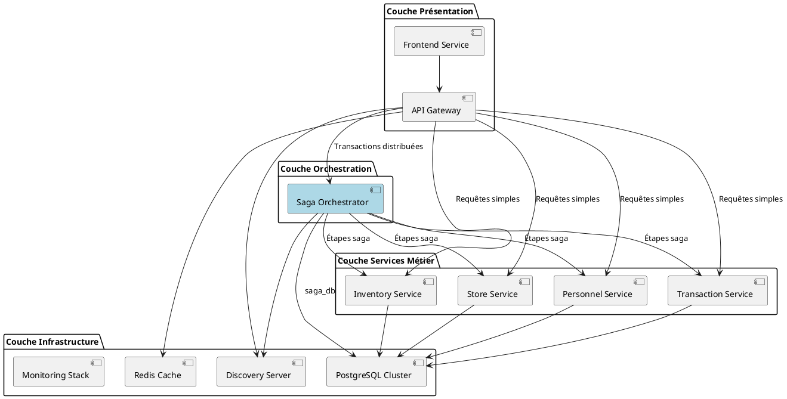
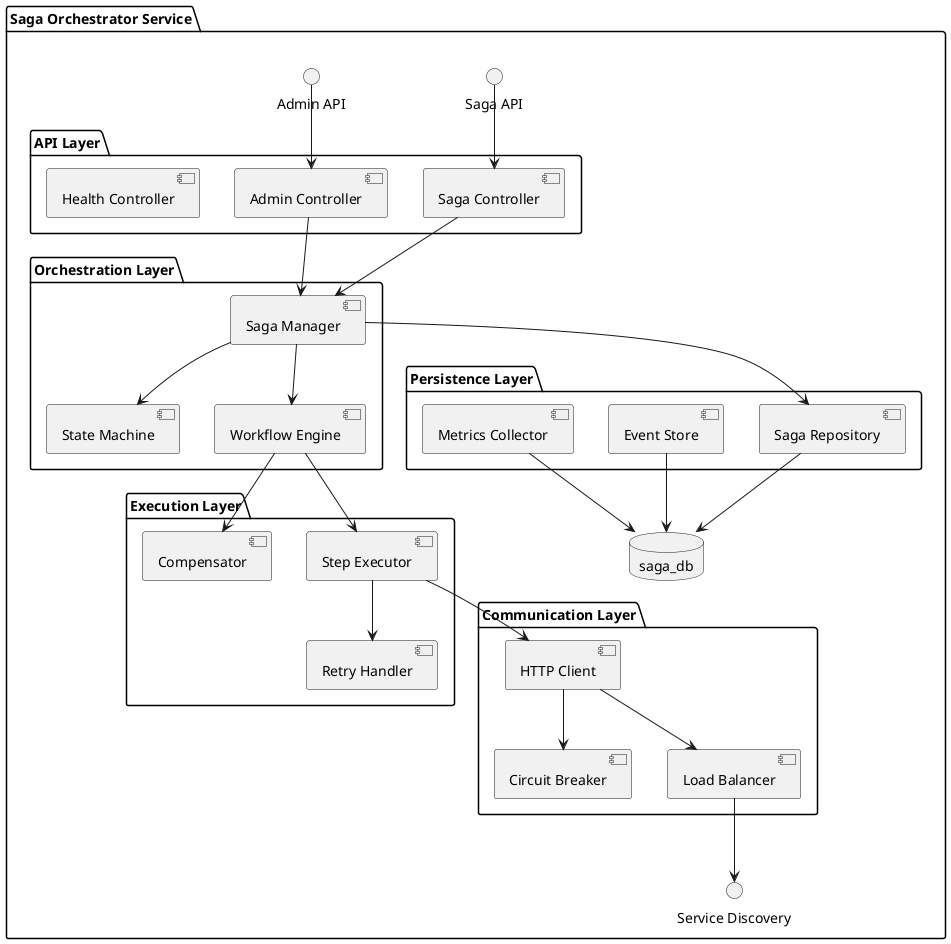
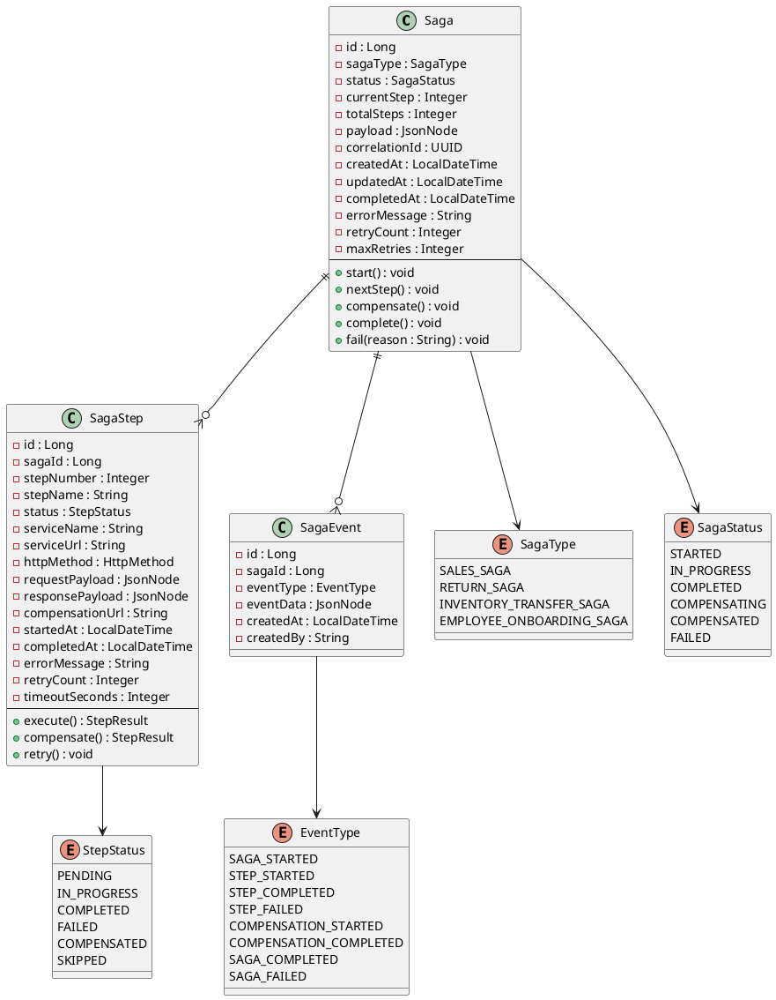
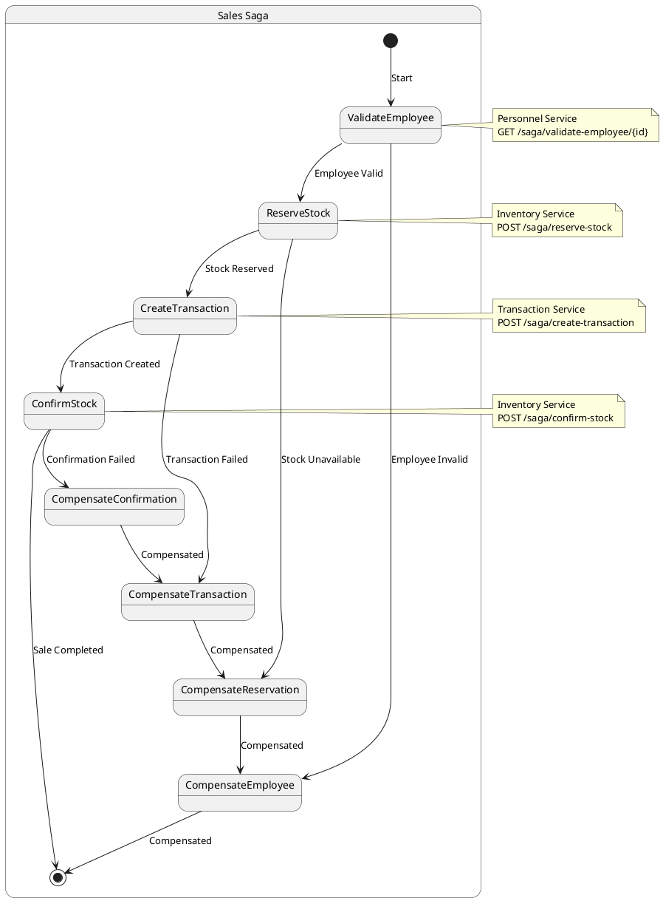
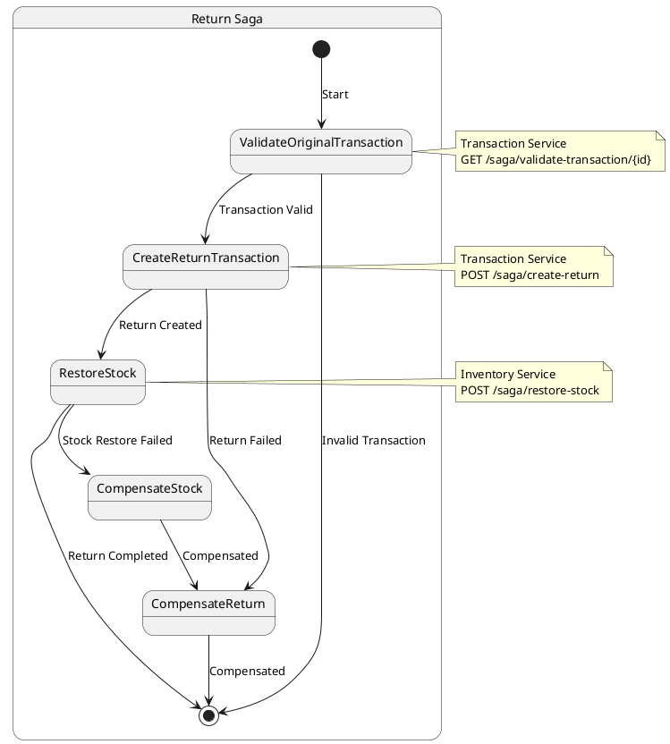
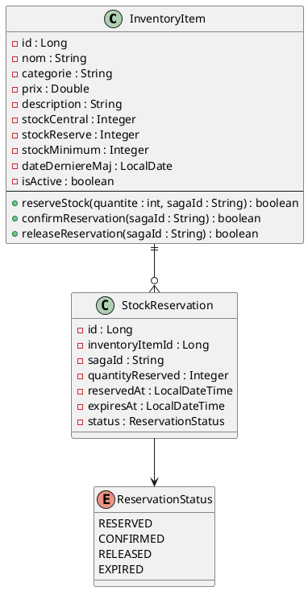
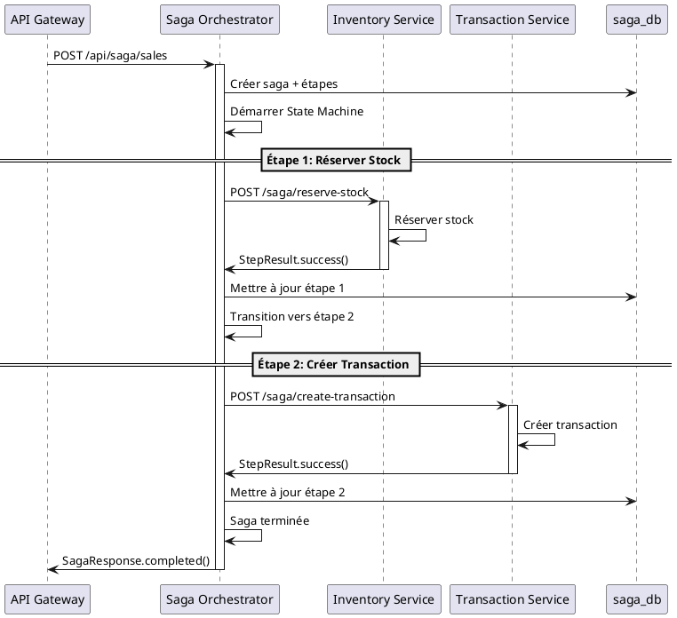
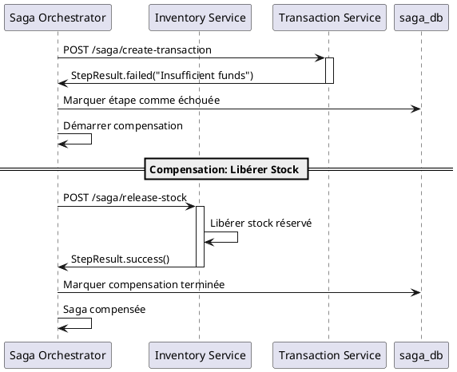

# 5. Vue des blocs de construction - Architecture Saga

## 5.1. Vue d'ensemble de l'architecture avec Saga

### Niveau 1 : Vue générale du système avec orchestration

L'architecture microservices est maintenant enrichie d'un **Saga Orchestrator Service** pour gérer les transactions distribuées.



### Conteneurs mis à jour

| Service | Port | Responsabilité | Base de données | Nouveau |
|---------|------|----------------|-----------------|---------|
| **discovery-server** | 8761 | Service de découverte (Eureka) | - | Non |
| **api-gateway** | 8765 | Routage, sécurité, rate limiting | gateway_db | Non |
| **frontend-service** | 8080 | Interface web utilisateur | - | Non |
| **saga-orchestrator** | 8085 | **Orchestration transactions distribuées** | **saga_db** | **✅ Oui** |
| **inventory-service** | 8081 | Gestion produits et stock | inventory_db | Non |
| **transaction-service** | 8082 | Ventes et retours | transaction_db | Non |
| **store-service** | 8083 | Magasins et localisations | store_db | Non |
| **personnel-service** | 8084 | Employés et authentification | personnel_db | Non |

## 5.2. Niveau 2 : Saga Orchestrator Service (Boîte blanche)

### 5.2.1. Architecture interne du Saga Orchestrator

**Responsabilité** : Orchestration centralisée des transactions distribuées avec gestion des compensations



### 5.2.2. Modèle de domaine Saga



### 5.2.3. Définitions des Sagas

#### Sales Saga (Vente)



#### Return Saga (Retour)



## 5.3. Services métier adaptés pour les Sagas

### 5.3.1. Inventory Service - Endpoints Saga

**Nouveaux endpoints pour l'orchestration :**

```java
@RestController
@RequestMapping("/saga")
public class InventorySagaController {
    
    @PostMapping("/reserve-stock")
    public SagaStepResult reserveStock(@RequestBody ReserveStockRequest request);
    
    @PostMapping("/confirm-stock")
    public SagaStepResult confirmStock(@RequestBody ConfirmStockRequest request);
    
    @PostMapping("/release-stock")
    public SagaStepResult releaseStock(@RequestBody ReleaseStockRequest request);
    
    @PostMapping("/restore-stock")
    public SagaStepResult restoreStock(@RequestBody RestoreStockRequest request);
}
```

**Modèle de données étendu :**



### 5.3.2. Transaction Service - Endpoints Saga

**Nouveaux endpoints pour l'orchestration :**

```java
@RestController
@RequestMapping("/saga")
public class TransactionSagaController {
    
    @PostMapping("/create-transaction")
    public SagaStepResult createTransaction(@RequestBody CreateTransactionRequest request);
    
    @PostMapping("/cancel-transaction")
    public SagaStepResult cancelTransaction(@RequestBody CancelTransactionRequest request);
    
    @PostMapping("/create-return")
    public SagaStepResult createReturn(@RequestBody CreateReturnRequest request);
    
    @GetMapping("/validate-transaction/{id}")
    public SagaStepResult validateTransaction(@PathVariable Long id);
}
```

### 5.3.3. Personnel Service - Endpoints Saga

**Nouveaux endpoints pour l'orchestration :**

```java
@RestController
@RequestMapping("/saga")
public class PersonnelSagaController {
    
    @GetMapping("/validate-employee/{id}")
    public SagaStepResult validateEmployee(@PathVariable Long id);
    
    @PostMapping("/invalidate-session")
    public SagaStepResult invalidateSession(@RequestBody InvalidateSessionRequest request);
}
```

## 5.4. Communication et patterns

### 5.4.1. Pattern de communication Saga



### 5.4.2. Pattern de compensation



## 5.5. Persistance et données

### 5.5.1. Modèle de données saga_db

```sql
-- Schema principal pour les sagas
CREATE SCHEMA saga;

-- Table des sagas avec partitioning
CREATE TABLE saga.sagas (
    id BIGSERIAL PRIMARY KEY,
    saga_type VARCHAR(50) NOT NULL,
    saga_status VARCHAR(20) NOT NULL,
    current_step INTEGER DEFAULT 0,
    total_steps INTEGER NOT NULL,
    payload JSONB NOT NULL,
    correlation_id UUID UNIQUE NOT NULL DEFAULT gen_random_uuid(),
    created_at TIMESTAMP DEFAULT CURRENT_TIMESTAMP,
    updated_at TIMESTAMP DEFAULT CURRENT_TIMESTAMP,
    completed_at TIMESTAMP,
    error_message TEXT,
    retry_count INTEGER DEFAULT 0,
    max_retries INTEGER DEFAULT 3,
    timeout_at TIMESTAMP
) PARTITION BY RANGE (created_at);

-- Partitions mensuelles
CREATE TABLE saga.sagas_2024_01 PARTITION OF saga.sagas
    FOR VALUES FROM ('2024-01-01') TO ('2024-02-01');

-- Table des étapes
CREATE TABLE saga.saga_steps (
    id BIGSERIAL PRIMARY KEY,
    saga_id BIGINT REFERENCES saga.sagas(id) ON DELETE CASCADE,
    step_number INTEGER NOT NULL,
    step_name VARCHAR(100) NOT NULL,
    step_status VARCHAR(20) NOT NULL,
    service_name VARCHAR(50) NOT NULL,
    service_url VARCHAR(200) NOT NULL,
    http_method VARCHAR(10) NOT NULL,
    request_payload JSONB,
    response_payload JSONB,
    compensation_url VARCHAR(200),
    started_at TIMESTAMP,
    completed_at TIMESTAMP,
    error_message TEXT,
    retry_count INTEGER DEFAULT 0,
    timeout_seconds INTEGER DEFAULT 30,
    UNIQUE(saga_id, step_number)
);

-- Table d'événements pour l'audit
CREATE TABLE saga.saga_events (
    id BIGSERIAL PRIMARY KEY,
    saga_id BIGINT REFERENCES saga.sagas(id),
    event_type VARCHAR(50) NOT NULL,
    event_data JSONB NOT NULL,
    created_at TIMESTAMP DEFAULT CURRENT_TIMESTAMP,
    created_by VARCHAR(100) DEFAULT 'system'
);

-- Index pour les performances
CREATE INDEX idx_sagas_status_created ON saga.sagas(saga_status, created_at);
CREATE INDEX idx_sagas_correlation_id ON saga.sagas(correlation_id);
CREATE INDEX idx_saga_steps_saga_id ON saga.saga_steps(saga_id);
CREATE INDEX idx_saga_events_saga_id ON saga.saga_events(saga_id, created_at);
```

### 5.5.2. Distribution des données

```plantuml
@startuml data-distribution-saga
database "saga_db" as SagaDB {
  table "sagas" as SagasTable
  table "saga_steps" as StepsTable  
  table "saga_events" as EventsTable
}

database "inventory_db" as InventoryDB {
  table "inventory_items" as InventoryTable
  table "stock_reservations" as ReservationsTable
}

database "transaction_db" as TransactionDB {
  table "transactions" as TransactionsTable
  table "transaction_items" as TransactionItemsTable
}

[Saga Orchestrator] --> SagaDB
[Inventory Service] --> InventoryDB
[Transaction Service] --> TransactionDB

SagasTable ||--o{ StepsTable
SagasTable ||--o{ EventsTable
InventoryTable ||--o{ ReservationsTable
TransactionsTable ||--o{ TransactionItemsTable
@enduml
```

## 5.6. Monitoring et observabilité

### 5.6.1. Métriques Saga

```java
@Component
public class SagaMetrics {
    
    // Compteurs
    private final Counter sagasStarted;
    private final Counter sagasCompleted;
    private final Counter sagasFailed;
    private final Counter sagasCompensated;
    
    // Timers
    private final Timer sagaDuration;
    private final Timer stepDuration;
    
    // Gauges
    private final Gauge activeSagas;
    private final Gauge pendingSteps;
    
    public SagaMetrics(MeterRegistry registry) {
        this.sagasStarted = Counter.builder("saga.started")
            .tag("type", "all")
            .register(registry);
            
        this.sagaDuration = Timer.builder("saga.duration")
            .register(registry);
            
        this.activeSagas = Gauge.builder("saga.active.count")
            .register(registry, this, SagaMetrics::getActiveSagaCount);
    }
}
```

### 5.6.2. Health Checks

```java
@Component
public class SagaHealthIndicator implements HealthIndicator {
    
    @Override
    public Health health() {
        try {
            long activeSagas = sagaRepository.countByStatus(SagaStatus.IN_PROGRESS);
            long failedSagas = sagaRepository.countByStatusAndCreatedAtAfter(
                SagaStatus.FAILED, 
                LocalDateTime.now().minusHours(1)
            );
            
            if (failedSagas > 10) {
                return Health.down()
                    .withDetail("failed_sagas_last_hour", failedSagas)
                    .build();
            }
            
            return Health.up()
                .withDetail("active_sagas", activeSagas)
                .withDetail("failed_sagas_last_hour", failedSagas)
                .build();
                
        } catch (Exception e) {
            return Health.down(e).build();
        }
    }
}
```

## 5.7. Configuration et déploiement

### 5.7.1. Configuration Docker Compose

```yaml
version: '3.8'
services:
  saga-orchestrator:
    build: ./saga-orchestrator-service
    ports:
      - "8085:8085"
    environment:
      - SPRING_PROFILES_ACTIVE=docker
      - SPRING_DATASOURCE_URL=jdbc:postgresql://postgres:5432/saga_db
      - EUREKA_CLIENT_SERVICE_URL_DEFAULTZONE=http://discovery-server:8761/eureka
    depends_on:
      - postgres
      - discovery-server
    healthcheck:
      test: ["CMD", "curl", "-f", "http://localhost:8085/actuator/health"]
      interval: 30s
      timeout: 10s
      retries: 3
      start_period: 60s
```

### 5.7.2. Configuration des services

```yaml
# saga-orchestrator application.yml
server:
  port: 8085

spring:
  application:
    name: saga-orchestrator-service
  datasource:
    url: jdbc:postgresql://localhost:5432/saga_db
    username: ${DB_USERNAME:saga_user}
    password: ${DB_PASSWORD:saga_password}
  jpa:
    hibernate:
      ddl-auto: validate
    show-sql: false

eureka:
  client:
    service-url:
      defaultZone: http://localhost:8761/eureka

saga:
  orchestrator:
    default-timeout: 30s
    max-retries: 3
    cleanup-after-days: 90
    
management:
  endpoints:
    web:
      exposure:
        include: health,info,metrics,prometheus
  endpoint:
    health:
      show-details: always
```

Cette architecture Saga enrichit significativement notre système microservices en apportant la cohérence transactionnelle distribuée tout en maintenant les avantages de l'architecture découplée.