# 6. Vue d'exécution - Architecture Saga

## 6.1. Scénarios d'exécution avec orchestration Saga

Cette section décrit les nouveaux scénarios d'exécution intégrant le Saga Orchestrator pour les transactions distribuées.

### 6.1.1. Démarrage du système avec Saga Orchestrator

Le démarrage inclut maintenant le Saga Orchestrator dans la séquence de démarrage.

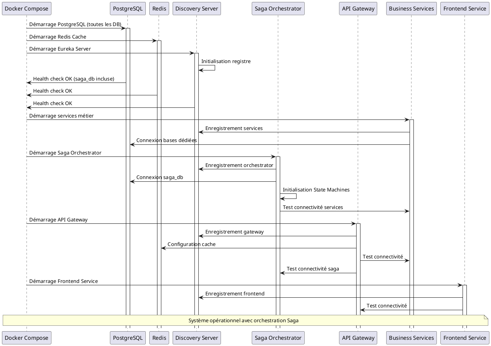

**Ordre de démarrage mis à jour :**
1. **Infrastructure** : PostgreSQL (incluant saga_db) et Redis
2. **Service Discovery** : Eureka Server
3. **Services métier** : Inventory, Transaction, Store, Personnel
4. **Saga Orchestrator** : Orchestration des transactions distribuées
5. **API Gateway** : Routage et sécurité
6. **Frontend Service** : Interface utilisateur

### 6.1.2. Vente avec orchestration Saga (Succès)

Processus complet d'une vente orchestrée par le Saga Orchestrator.

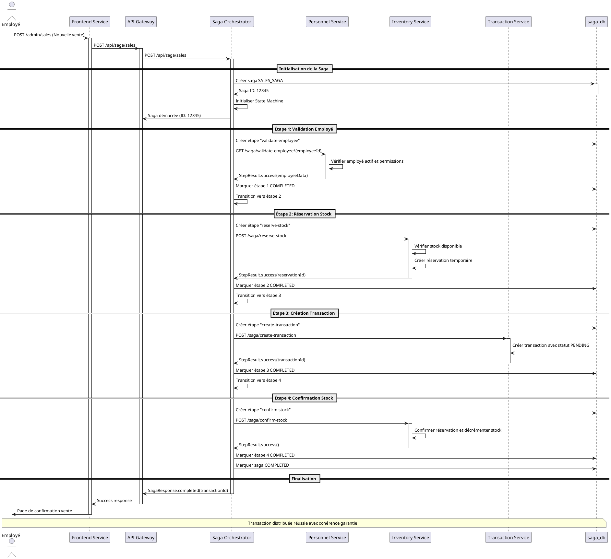

### 6.1.3. Vente avec orchestration Saga (Échec et compensation)

Processus d'une vente qui échoue et déclenche la compensation automatique.

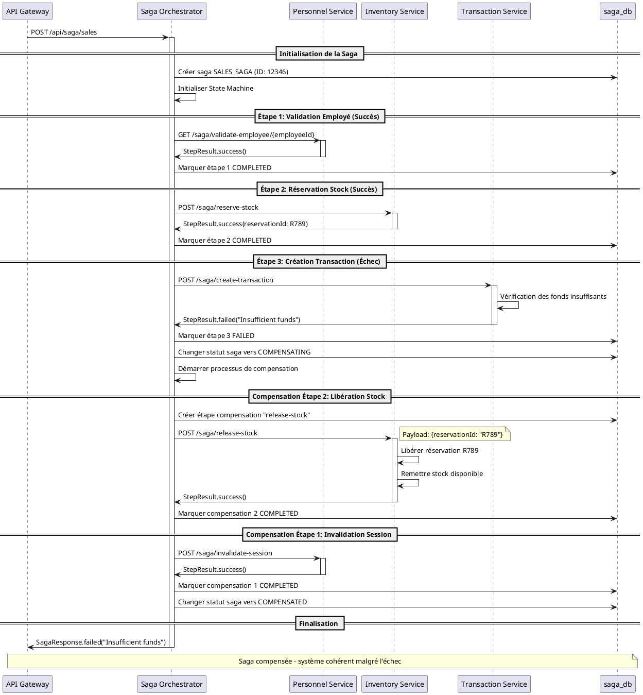

### 6.1.4. Retour de marchandise avec Saga

Processus de retour orchestré par le Saga Orchestrator.

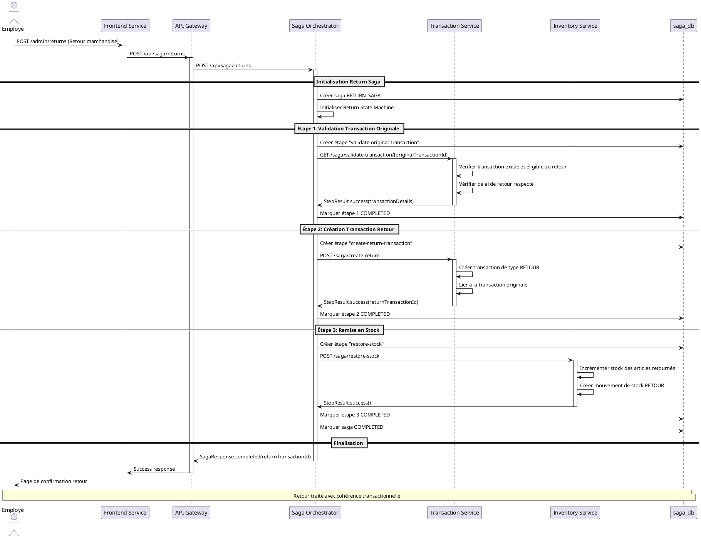

### 6.1.5. Monitoring et observabilité des Sagas

Processus de monitoring en temps réel des sagas en cours.

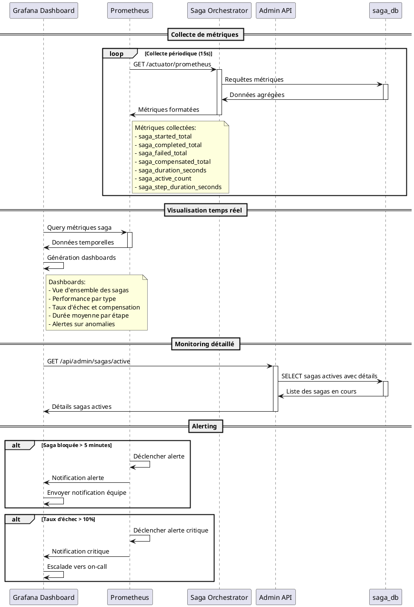

## 6.2. Patterns d'exécution Saga

### 6.2.1. Pattern de retry avec backoff exponentiel

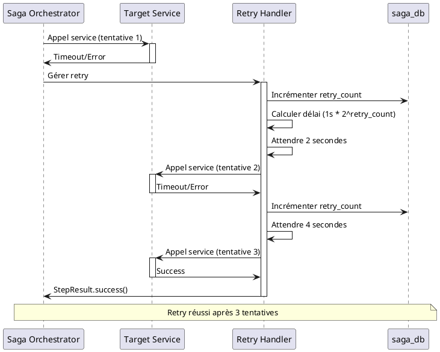

### 6.2.2. Pattern de timeout et circuit breaker

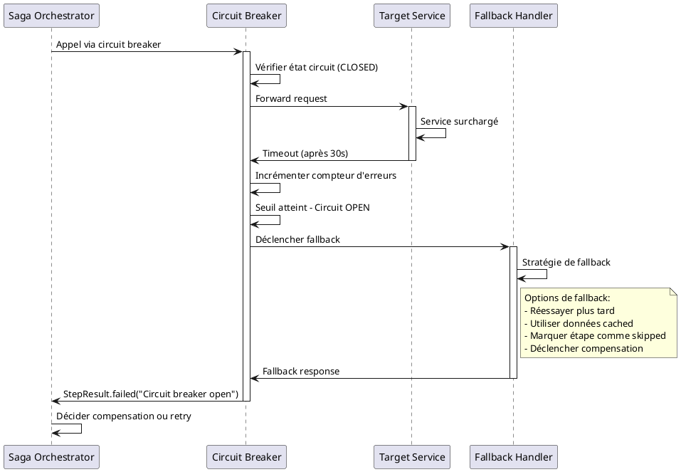

### 6.2.3. Pattern de saga parallèle

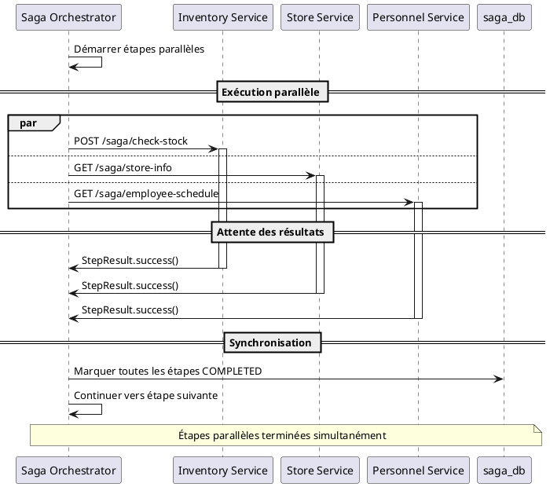

## 6.3. Gestion des erreurs et récupération

### 6.3.1. Récupération après panne de l'orchestrateur

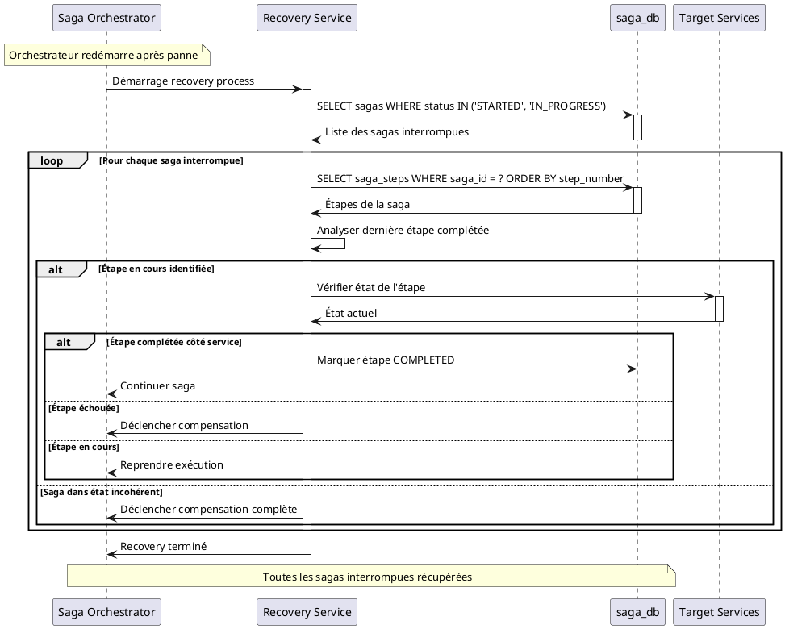

### 6.3.2. Gestion des timeouts de saga

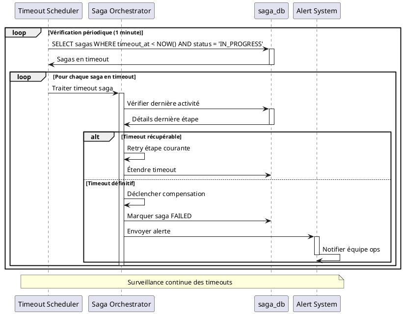

## 6.4. Performance et scalabilité

### 6.4.1. Exécution concurrente de sagas

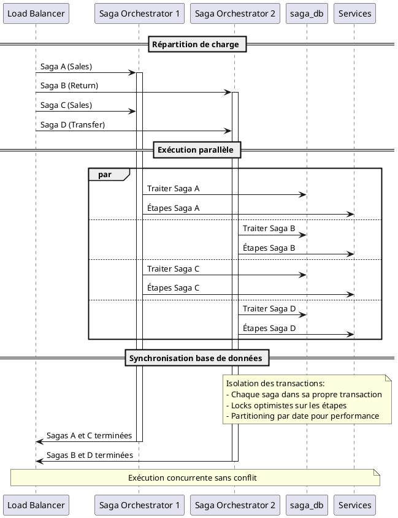

### 6.4.2. Optimisation des performances

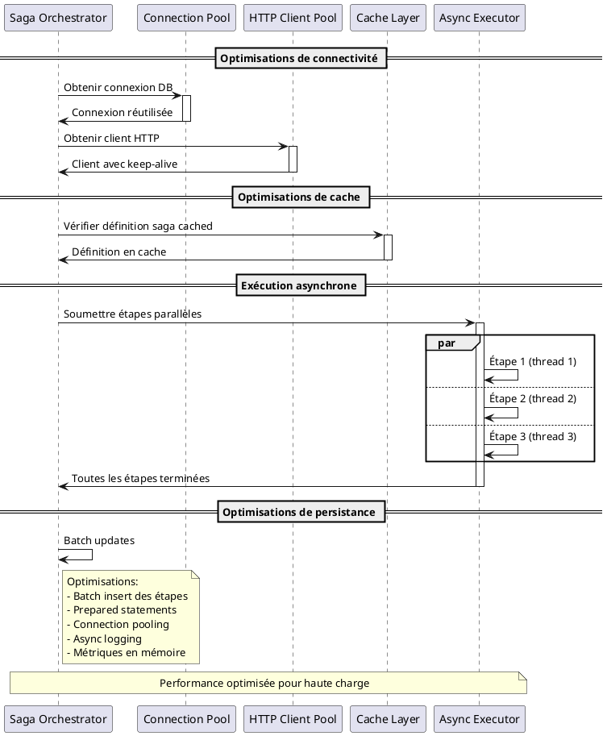

Cette vue d'exécution montre comment l'architecture Saga transforme les interactions système en apportant la cohérence transactionnelle distribuée tout en maintenant les performances et la résilience du système microservices.