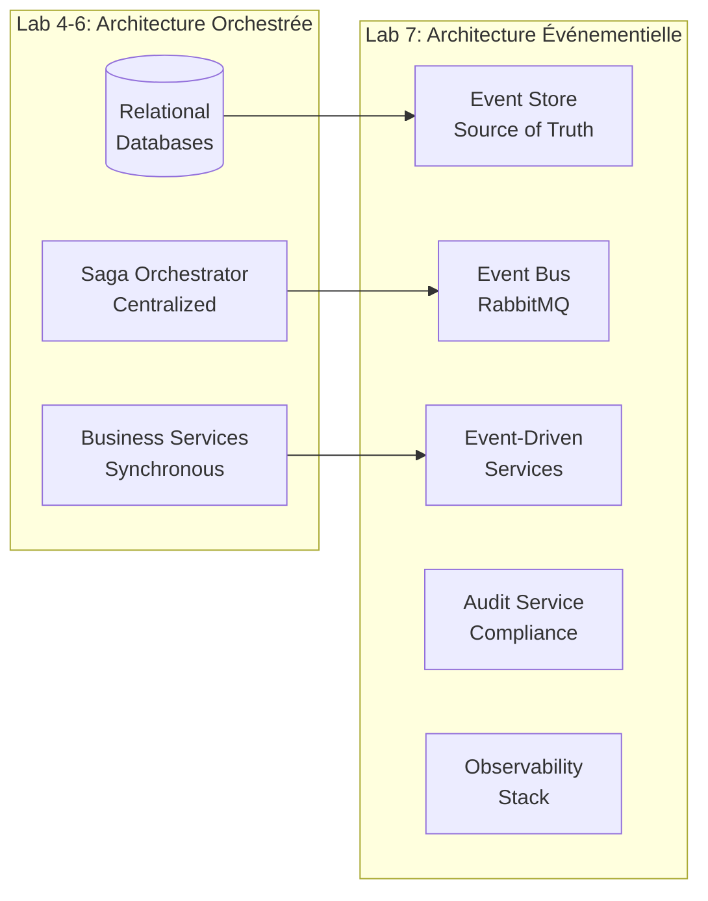

# Table des Matières - Architecture Événementielle (Lab 7)

## Documentation Architecture arc42 - Architecture Événementielle

### Vue d'Ensemble

Cette documentation décrit l'évolution de l'architecture du système de gestion de magasin vers une architecture complètement événementielle, intégrant Event Sourcing, CQRS, des sagas chorégraphiées et une stack d'observabilité complète.

### Structure des Documents

1. **[Introduction et Objectifs](01_Introduction_and_Goals_event_driven.md)**
   - Objectifs du système événementiel
   - Parties prenantes et leurs préoccupations
   - Exigences de qualité principales

2. **[Contraintes d'Architecture](02_Architecture_Constraints.md)**
   - Contraintes techniques et organisationnelles
   - Conventions et standards

3. **[Contexte et Périmètre](03_Context_and_Scope_event_driven.md)**
   - Contexte métier
   - Interfaces externes
   - Diagrammes de contexte

4. **[Stratégie de Solution](04_Solution_Strategy.md)**
   - Approche architecturale événementielle
   - Décisions technologiques principales
   - Stratégies d'implémentation

5. **[Vue des Blocs de Construction](05_Building_Block_View_event_driven.md)**
   - Architecture statique du système
   - Services métier et infrastructure
   - Interfaces et contrats d'événements

6. **[Vue d'Exécution](06_Runtime_View_event_driven.md)**
   - Scénarios d'exécution dynamiques
   - Flux Event Sourcing et CQRS
   - Coordination par sagas chorégraphiées

7. **[Vue de Déploiement](07_Deployment_View_event_driven.md)**
   - Configuration Docker Compose
   - Infrastructure de déploiement
   - Scripts d'automatisation

8. **[Concepts Transversaux](08_Crosscutting_Concepts_event_driven.md)**
   - Patterns événementiels
   - Sécurité et monitoring
   - Gestion des erreurs

9. **[Décisions Architecturales](09_Architecture_Decisions_event_driven.md)**
   - ADR principales
   - Évolution vers Event-Driven
   - Trade-offs et justifications

10. **[Exigences de Qualité](10_Quality_Requirements_event_driven.md)**
    - Scénarios de qualité
    - Métriques et KPIs
    - Tests et validation

11. **[Risques et Dette Technique](11_Risks_Technical_Debt_event_driven.md)**
    - Analyse des risques
    - Complexité événementielle
    - Plans de mitigation

12. **[Glossaire](12_Glossary_event_driven.md)**
    - Terminologie événementielle
    - Concepts techniques
    - Définitions métier

### Architecture Cible

L'architecture événementielle du Lab 7 implémente :

#### Services Métier Event-Driven

- **Transaction Service** : Gestion des transactions avec CQRS
- **Payment Service** : Nouveau service de paiement événementiel
- **Inventory Service** : Réservations de stock via événements
- **Store Service** : Traitement des commandes événementiel

#### Infrastructure Événementielle

- **Event Store Service** : Persistance et replay des événements
- **Audit Service** : Conformité et traçabilité complète
- **RabbitMQ Event Bus** : Bus d'événements avec routing intelligent
- **Saga Orchestrator** : Support hybride orchestration/chorégraphie

#### Observabilité Complète

- **Prometheus** : Collecte de métriques événementielles
- **Grafana** : Dashboards pour monitoring distribué
- **AlertManager** : Alertes proactives sur les flux d'événements
- **Distributed Tracing** : Traçabilité des sagas distribuées

#### Patterns Implémentés

- **Event Sourcing** : Source de vérité basée sur les événements
- **CQRS** : Séparation lecture/écriture avec projections
- **Choreographed Sagas** : Coordination distribuée par événements
- **Compensating Actions** : Gestion des échecs transactionnels
- **Dead Letter Queues** : Traitement robuste des erreurs

### Évolution Architecture

### Bénéfices de l'Architecture Événementielle

1. **Découplage Temporel** : Services indépendants via événements asynchrones
2. **Scalabilité** : Montée en charge horizontale par service
3. **Résilience** : Tolérance aux pannes avec compensation automatique
4. **Auditabilité** : Traçabilité complète via Event Sourcing
5. **Évolutivité** : Ajout de nouveaux services sans impact
6. **Observabilité** : Monitoring distribué et alertes proactives

### Navigation

- **Document Complet** : [Arc42 Événementiel Complet](arc42_full_event_driven.md)
- **ADR Associées** : [../adr/ADR-Lab7/](../adr/ADR-Lab7/)
- **Code Source** : [../../lab7-magasin-api-microservice-saga-event/](../../lab7-magasin-api-microservice-saga-event/)

---
