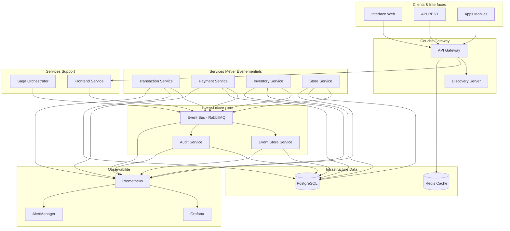

# 1. Introduction et Objectifs - Architecture Événementielle

Ce document décrit l'évolution du système de gestion de magasin vers une **architecture événementielle complète** avec sagas chorégraphiées, implémentée dans le cadre du Laboratoire 7 du cours LOG430.

## 1.1. Évolution Architecturale du Projet

### Phase 1-3 : De Console vers Microservices (Labs 0-5)

- **Lab 0-1** : Application console Java avec base de données PostgreSQL
- **Lab 2-4** : Application web monolithique Spring Boot avec DDD  
- **Lab 5** : Architecture microservices avec 7 services indépendants

### Phase 4 : Sagas Orchestrées (Lab 6)

- **Lab 6** : Implémentation du pattern Saga avec orchestrateur centralisé
- **Problématique** : Point de défaillance unique, couplage fort, scalabilité limitée

### Phase 5 : Architecture Événementielle (Lab 7)

**Transformation complète** vers une architecture événementielle distribuée avec :

- **Event Sourcing** : Persistance immuable de tous les événements métier
- **CQRS** : Séparation des opérations de lecture et d'écriture  
- **Pub/Sub Messaging** : Communication asynchrone via RabbitMQ
- **Sagas Chorégraphiées** : Coordination distribuée sans orchestrateur central
- **Event Store** : Stockage centralisé avec capacités de replay
- **Services d'Audit** : Compliance et traçabilité automatiques
- **Observabilité Avancée** : Monitoring événementiel avec Prometheus/Grafana

## 1.2. Objectifs de l'Architecture Événementielle

### Objectifs Techniques Primaires

1. **Découplage Maximal**
   - Communication uniquement via événements
   - Élimination des dépendances directes inter-services
   - Résilience par isolation des pannes

2. **Traçabilité et Observabilité**
   - Historique complet des événements métier
   - Capacité de replay pour debugging et récupération
   - Monitoring en temps réel des flux événementiels

3. **Scalabilité et Performance**
   - Montée en charge indépendante par service
   - Optimisation séparée des lectures et écritures (CQRS)
   - Traitement asynchrone haute performance

4. **Résilience et Récupération**
   - Absence de point de défaillance unique
   - Mécanismes de compensation distribués
   - Reconstruction d'état à partir des événements

### Objectifs Métier

1. **Compliance et Audit**
   - Audit trail immuable pour réglementations
   - Traçabilité complète des transactions financières
   - Conformité GDPR, PCI-DSS

2. **Agilité Business**
   - Ajout rapide de nouveaux consommateurs d'événements
   - Évolution indépendante des processus métier
   - Analytics temps réel sur les données événementielles

3. **Qualité de Service**
   - SLA garantis par service
   - Monitoring proactif des processus critiques
   - Récupération automatique après incidents

## 1.3. Architecture Événementielle Globale

## 1.4. Services de l'Architecture Événementielle

### Services Métier Étendus

#### Transaction Service (Port 8082)

- **Rôle** : Gestion des transactions de vente avec événements
- **Événements Publiés** : `TransactionCreated`, `TransactionCompleted`, `TransactionCancelled`
- **Événements Consommés** : `PaymentProcessed`, `PaymentFailed`, `PaymentRefunded`, `OrderFulfilled`
- **CQRS** : Séparation command/query avec projections optimisées
- **Saga** : Logique de compensation pour échecs de paiement

#### Payment Service (Port 8084)

- **Rôle** : Traitement des paiements et remboursements
- **Événements Publiés** : `PaymentProcessed`, `PaymentFailed`, `PaymentRefunded`  
- **Événements Consommés** : `TransactionCreated`, `InventoryUnavailable`
- **Gateway** : Simulation d'intégration bancaire
- **Compensation** : Remboursements automatiques

#### Inventory Service (Port 8081)

- **Rôle** : Gestion stock avec réservations événementielles
- **Événements Publiés** : `InventoryReserved`, `InventoryUnavailable`, `InventoryReleased`
- **Événements Consommés** : `PaymentProcessed`
- **Saga** : Réservation/libération de stock
- **Read Models** : Projections pour requêtes optimisées

#### Store Service (Port 8083)

- **Rôle** : Gestion magasins et fulfillment
- **Événements Publiés** : `OrderFulfilled`, `OrderDelivered`
- **Événements Consommés** : `InventoryReserved`
- **Processus** : Préparation et livraison commandes

### Services Infrastructure Événementielle

#### Event Store Service (Port 8087)

- **Rôle** : Persistance et replay des événements
- **Fonctionnalités** :
  - Stockage immuable des événements
  - Contrôle de concurrence optimiste
  - Replay par agrégat, type ou période
  - Reconstruction d'état historique
- **APIs** : REST pour sauvegarde, récupération, replay
- **Base** : PostgreSQL avec schéma optimisé

#### Audit Service (Port 8088)

- **Rôle** : Compliance et audit trail automatique
- **Fonctionnalités** :
  - Consommation de tous événements métier
  - Classification par tags de compliance
  - Logs structurés JSON
  - Rapports de conformité
- **Compliance** : PCI-DSS, GDPR, audit financier
- **Alerting** : Événements critiques temps réel

### Services Support

#### Saga Orchestrator Service (Port 8085)

- **Rôle** : Coexistence avec approche chorégraphiée
- **Utilisation** : Processus complexes nécessitant coordination centralisée
- **Intégration** : Publication d'événements vers Event Bus

#### Frontend Service (Port 8080)  

- **Rôle** : Interface utilisateur avec intégration événementielle
- **Fonctionnalités** :
  - Dashboards temps réel via événements
  - Monitoring des transactions en cours
  - Notifications utilisateur asynchrones

## 1.5. Infrastructure Événementielle

### RabbitMQ - Event Bus

- **Exchange Principal** : `business.events` (topic exchange)
- **Routing Strategy** : `service.eventType` (ex: `payment.processed`)
- **Queues Dédiées** : Par service et type d'événement
- **Dead Letter Queues** : Gestion des échecs et retry
- **Clustering** : Haute disponibilité

### PostgreSQL - Persistence Multi-Tenant

- **Event Store DB** : Stockage des événements avec partitioning
- **Service DBs** : Bases dédiées par service métier
- **Audit DB** : Base séparée pour compliance
- **Optimisations** : Index, partitioning temporel, archivage

### Observabilité Stack

- **Prometheus** : Métriques événementielles et métier
- **Grafana** : Dashboards sagas, event flow, business KPIs
- **AlertManager** : Alertes proactives et escalation
- **Logs Structurés** : JSON avec correlation IDs

## 1.6. Patterns Événementiels Implémentés

### Event Sourcing

- **Principe** : Les événements sont la source de vérité
- **Avantages** : Audit trail, replay, debugging avancé
- **Implementation** : Event Store avec versioning optimiste

### CQRS (Command Query Responsibility Segregation)

- **Commands** : Opérations d'écriture via services métier
- **Queries** : Lectures optimisées via projections
- **Synchronisation** : Événements pour mise à jour projections

### Sagas Chorégraphiées

- **Principe** : Coordination distribuée via événements
- **Avantages** : Découplage, résilience, scalabilité
- **Compensation** : Logique de rollback par service

### Pub/Sub Messaging

- **Pattern** : Publication/Souscription asynchrone
- **Découplage** : Producteurs et consommateurs indépendants
- **Extensibilité** : Ajout facile nouveaux consommateurs

## 1.7. Qualités Architecturales Ciblées

### Scalabilité

- **Horizontale** : Montée en charge par service
- **Événementielle** : Traitement asynchrone haute performance
- **CQRS** : Optimisation séparée lectures/écritures

### Résilience  

- **Fault Tolerance** : Isolation des pannes
- **Recovery** : Replay d'événements pour reconstruction
- **Circuit Breakers** : Protection contre cascades de pannes

### Observabilité

- **Tracing** : Correlation IDs end-to-end
- **Metrics** : Événements, sagas, business KPIs
- **Alerting** : Détection proactive d'anomalies

### Compliance

- **Audit Trail** : Historique immuable complet
- **GDPR** : Traçabilité des données personnelles
- **Financial** : Conformité réglementations financières

Cette architecture événementielle représente l'état de l'art des systèmes distribués modernes, combinant performance, résilience et observabilité pour répondre aux exigences business critiques.
