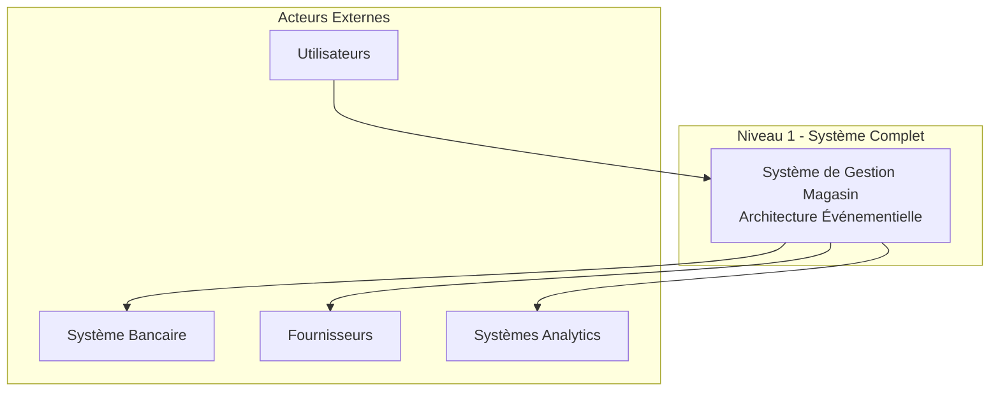
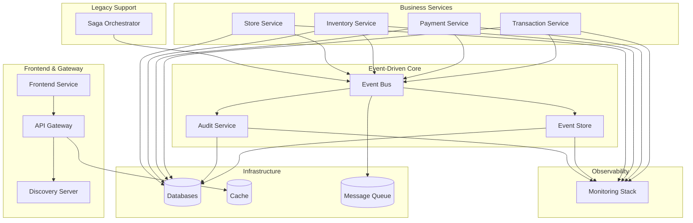
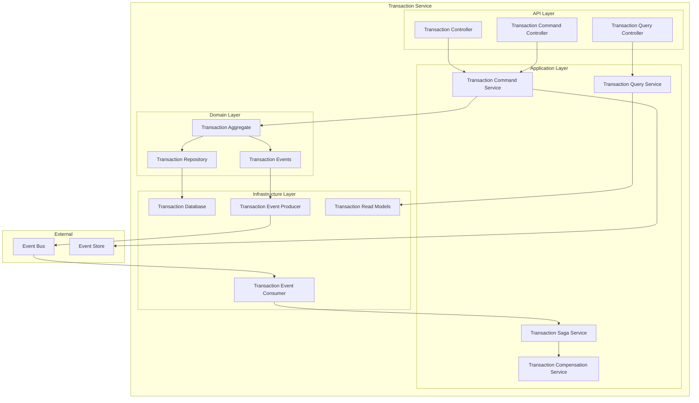
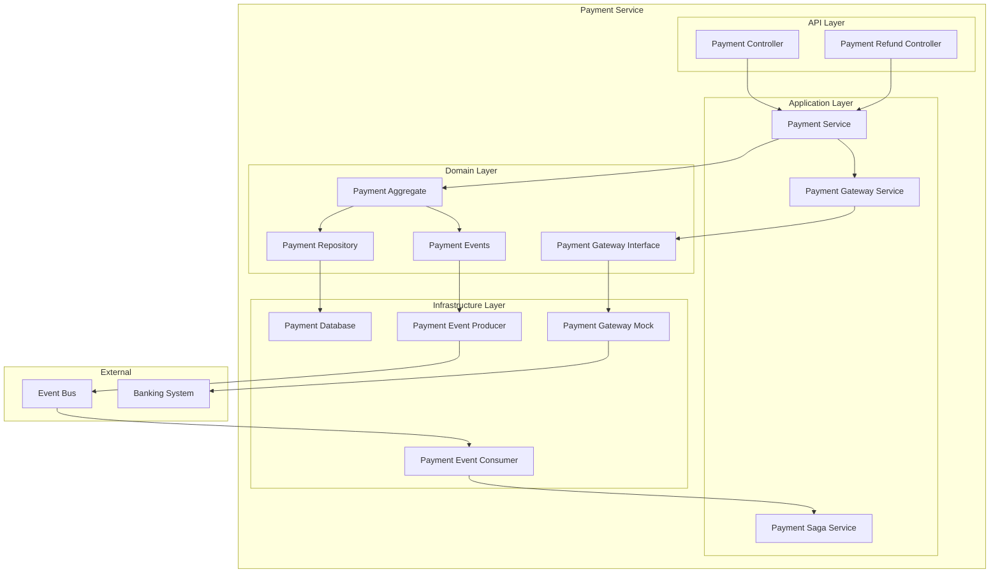
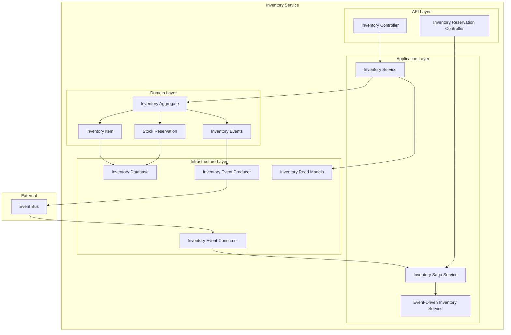
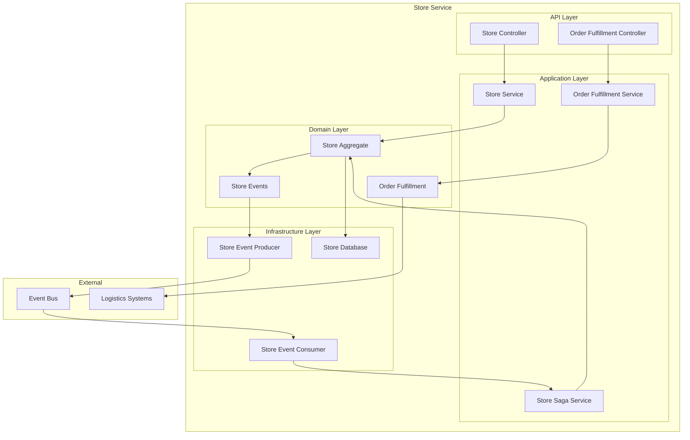
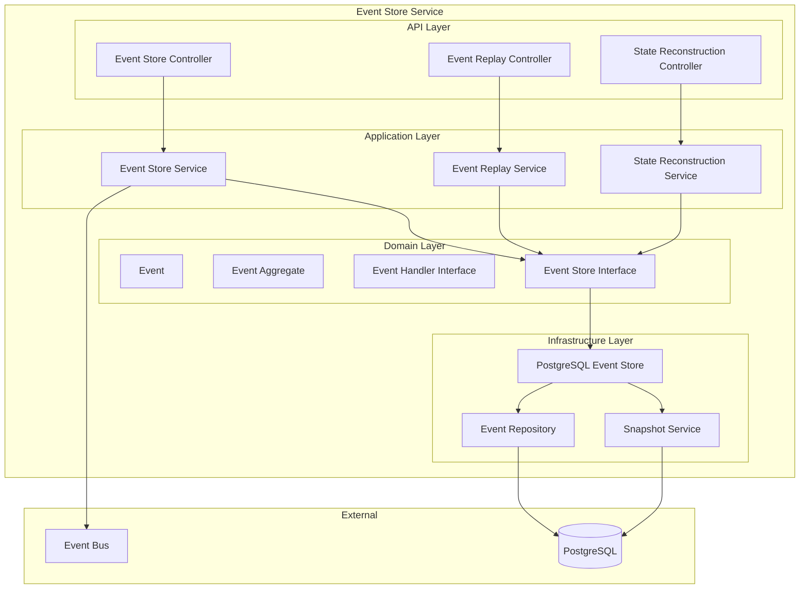
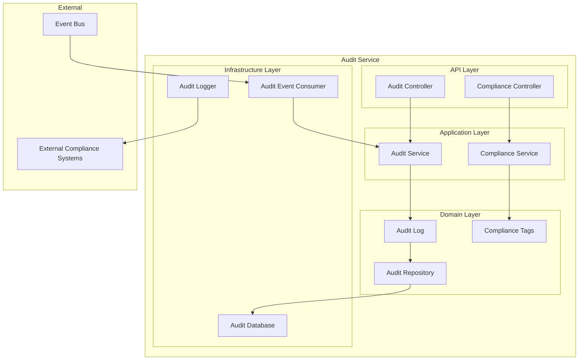
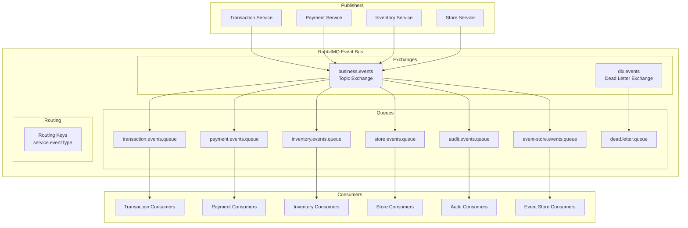

# 5. Vue des Blocs de Construction - Architecture Événementielle

Cette section décrit la structure statique de l'architecture événementielle, ses composants principaux et leurs interfaces.

## 5.1. Vue d'Ensemble du Système



## 5.2. Niveau 1 - Contenants Principaux



## 5.3. Niveau 2 - Services Métier Détaillés

### 5.3.1. Transaction Service (Étendu)



**Responsabilités** :

- **Command Side** : Création, modification, annulation des transactions
- **Query Side** : Consultation optimisée des données transactionnelles
- **Event Publishing** : `TransactionCreated`, `TransactionCompleted`, `TransactionCancelled`
- **Event Consumption** : `PaymentProcessed`, `PaymentFailed`, `PaymentRefunded`, `OrderFulfilled`
- **Saga Coordination** : Logique de compensation pour échecs
- **CQRS** : Séparation lecture/écriture avec projections

### 5.3.2. Payment Service (Nouveau)



**Responsabilités** :

- **Payment Processing** : Traitement des paiements via gateway externe
- **Refund Management** : Gestion des remboursements
- **Event Publishing** : `PaymentProcessed`, `PaymentFailed`, `PaymentRefunded`
- **Event Consumption** : `TransactionCreated`, `InventoryUnavailable`
- **Compensation Logic** : Remboursements automatiques sur échec saga
- **Gateway Integration** : Simulation système bancaire

### 5.3.3. Inventory Service (Étendu)



**Responsabilités** :

- **Stock Management** : Gestion des niveaux de stock
- **Reservation Logic** : Réservation/libération de stock événementielle
- **Event Publishing** : `InventoryReserved`, `InventoryUnavailable`, `InventoryReleased`
- **Event Consumption** : `PaymentProcessed`
- **CQRS Read Models** : Projections optimisées pour requêtes
- **Saga Participation** : Compensation par libération de réservations

### 5.3.4. Store Service (Étendu)



**Responsabilités** :

- **Store Management** : Gestion des informations magasins
- **Order Fulfillment** : Traitement et préparation des commandes
- **Event Publishing** : `OrderFulfilled`, `OrderDelivered`
- **Event Consumption** : `InventoryReserved`
- **Logistics Integration** : Interface avec systèmes de livraison

## 5.4. Niveau 2 - Infrastructure Événementielle

### 5.4.1. Event Store Service



**Responsabilités** :

- **Event Persistence** : Stockage immuable des événements
- **Event Retrieval** : Récupération par agrégat, type, période
- **Event Replay** : Reconstruction d'état historique
- **Concurrency Control** : Gestion optimiste des versions
- **Snapshots** : Optimisation performance par snapshots
- **APIs REST** : Interface pour services métier

### 5.4.2. Audit Service



**Responsabilités** :

- **Comprehensive Audit** : Consommation de tous événements métier
- **Compliance Tagging** : Classification automatique (PCI-DSS, GDPR)
- **Structured Logging** : Logs JSON avec contexte complet
- **Compliance Reporting** : Rapports réglementaires
- **Critical Event Alerting** : Notifications temps réel
- **Long-term Retention** : Archivage conforme

### 5.4.3. Event Bus (RabbitMQ)



**Configuration** :

- **Exchange** : `business.events` (topic exchange)
- **Routing Keys** : Pattern `service.eventType`
- **Queues** : Durables avec TTL configuré
- **Dead Letter Handling** : DLX pour messages échoués
- **Clustering** : Haute disponibilité multi-nœuds

## 5.5. Interfaces et Contrats

### 5.5.1. Event Schema Standard

```json
{
  "eventId": "uuid",
  "eventType": "string",
  "aggregateId": "string", 
  "aggregateType": "string",
  "timestamp": "ISO-8601",
  "version": "integer",
  "correlationId": "uuid",
  "causationId": "uuid",
  "payload": {
    "// Données spécifiques à l'événement"
  },
  "metadata": {
    "userId": "string",
    "serviceName": "string",
    "sourceIp": "string"
  }
}
```

### 5.5.2. APIs REST Principales

#### Event Store Service APIs

```yaml
/api/events:
  POST: # Sauvegarder un événement
    summary: "Persist a domain event"
    requestBody:
      $ref: '#/components/schemas/Event'
    responses:
      201: 
        description: "Event saved successfully"

/api/events/{aggregateId}:
  GET: # Récupérer événements d'un agrégat
    summary: "Get events for aggregate"
    parameters:
      - name: aggregateId
        in: path
        required: true
        schema:
          type: string
      - name: fromVersion
        in: query
        schema:
          type: integer
    responses:
      200:
        description: "Events retrieved"
        content:
          application/json:
            schema:
              type: array
              items:
                $ref: '#/components/schemas/Event'

/api/replay/aggregate/{aggregateId}:
  POST: # Replay événements
    summary: "Replay events for aggregate"
    responses:
      200:
        description: "Replay completed"
        content:
          application/json:
            schema:
              $ref: '#/components/schemas/ReplayResult'
```

#### Audit Service APIs

```yaml
/api/audit/trail/{correlationId}:
  GET: # Récupérer audit trail complet
    summary: "Get complete audit trail"
    parameters:
      - name: correlationId
        in: path
        required: true
        schema:
          type: string
    responses:
      200:
        description: "Audit trail retrieved"

/api/audit/compliance:
  GET: # Récupérer logs de compliance
    summary: "Get compliance logs"
    parameters:
      - name: since
        in: query
        schema:
          type: string
          format: date-time
      - name: tags
        in: query
        schema:
          type: array
          items:
            type: string
    responses:
      200:
        description: "Compliance logs retrieved"
```

### 5.5.3. Event Types Catalog

#### Transaction Events

```typescript
interface TransactionCreated {
  transactionId: string;
  customerId: string;
  storeId: string;
  items: TransactionItem[];
  totalAmount: number;
  currency: string;
  timestamp: Date;
}

interface TransactionCompleted {
  transactionId: string;
  completedAt: Date;
  finalAmount: number;
}

interface TransactionCancelled {
  transactionId: string;
  cancellationReason: string;
  cancelledAt: Date;
}
```

#### Payment Events

```typescript
interface PaymentProcessed {
  paymentId: string;
  transactionId: string;
  customerId: string;
  amount: number;
  paymentMethod: string;
  paymentReference: string;
  processedAt: Date;
}

interface PaymentFailed {
  paymentId: string;
  transactionId: string;
  failureReason: string;
  errorCode: string;
  failedAt: Date;
}

interface PaymentRefunded {
  paymentId: string;
  transactionId: string;
  refundAmount: number;
  refundReason: string;
  refundedAt: Date;
}
```

#### Inventory Events

```typescript
interface InventoryReserved {
  transactionId: string;
  reservations: {
    inventoryItemId: number;
    quantityReserved: number;
    storeId: string;
  }[];
  reservedAt: Date;
}

interface InventoryUnavailable {
  transactionId: string;
  unavailableItems: {
    inventoryItemId: number;
    requestedQuantity: number;
    availableQuantity: number;
    itemName: string;
  }[];
  reason: string;
}

interface InventoryReleased {
  transactionId: string;
  releasedItems: {
    inventoryItemId: number;
    quantityReleased: number;
  }[];
  reason: string;
  releasedAt: Date;
}
```

## 5.6. Patrons de Conception Utilisés

### 5.6.1. Event Sourcing Pattern

- **Event Store** : Source de vérité basée sur les événements
- **Aggregate Root** : Entités produisant des événements
- **Event Handler** : Traitement des événements pour reconstruction d'état

### 5.6.2. CQRS Pattern

- **Command Side** : Services métier pour opérations d'écriture
- **Query Side** : Read models optimisés
- **Projections** : Synchronisation asynchrone via événements

### 5.6.3. Saga Pattern (Chorégraphie)

- **Event-Driven Coordination** : Coordination via événements
- **Compensation Logic** : Logique de rollback par service
- **State Tracking** : Suivi d'état distribué

### 5.6.4. Publisher-Subscriber Pattern

- **Event Publishers** : Services métier publiant des événements
- **Event Subscribers** : Consommateurs spécialisés
- **Message Broker** : RabbitMQ comme médiateur

### 5.6.5. Repository Pattern

- **Event Repository** : Persistance des événements
- **Read Model Repository** : Accès aux projections
- **Audit Repository** : Stockage des logs d'audit

Cette architecture en blocs modulaires permet une évolution indépendante des composants tout en maintenant la cohérence globale du système événementiel.
