# 6. Vue d'Exécution - Architecture Événementielle

Cette section présente les scénarios d'exécution dynamiques de l'architecture événementielle, illustrant comment les services interagissent via les événements pour réaliser les processus métier.

## 6.1. Scénarios Principaux

### 6.1.1. Scénario Nominal - Transaction Complète

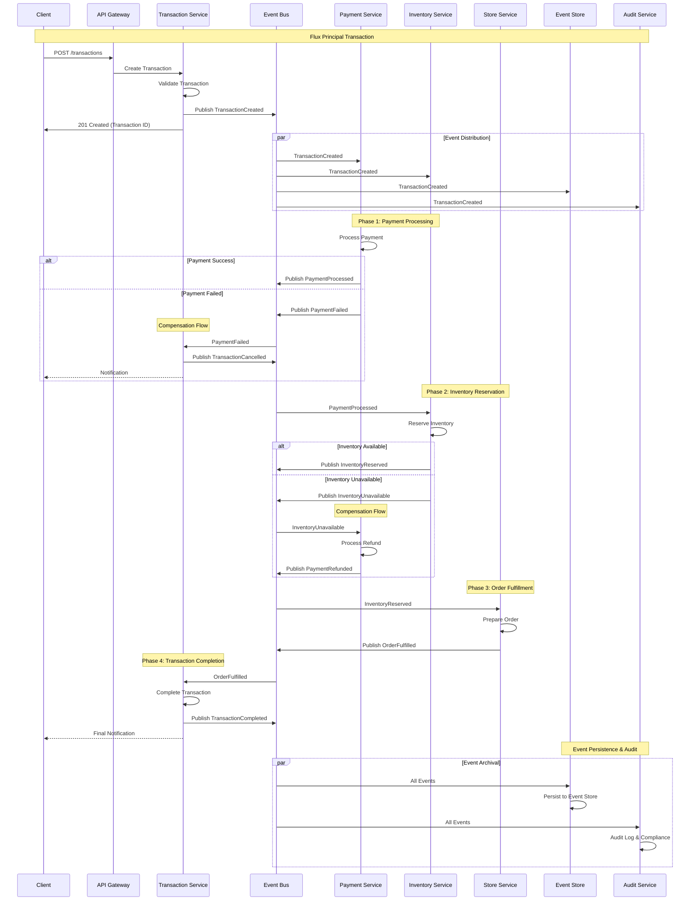
```mermaid
sequenceDiagram
    participant Client
    participant Gateway as API Gateway
    participant TS as Transaction Service
    participant EB as Event Bus
    participant PS as Payment Service
    participant IS as Inventory Service
    participant SS as Store Service
    participant ES as Event Store
    participant AS as Audit Service

    Note over Client, AS: Flux Principal Transaction
    
    Client->>Gateway: POST /transactions
    Gateway->>TS: Create Transaction
    
    TS->>TS: Validate Transaction
    TS->>EB: Publish TransactionCreated
    TS->>Client: 201 Created (Transaction ID)
    
    par Event Distribution
        EB->>PS: TransactionCreated
        EB->>IS: TransactionCreated
        EB->>ES: TransactionCreated
        EB->>AS: TransactionCreated
    end
    
    Note over PS, IS: Phase 1: Payment Processing
    
    PS->>PS: Process Payment
    alt Payment Success
        PS->>EB: Publish PaymentProcessed
    else Payment Failed
        PS->>EB: Publish PaymentFailed
        Note over TS: Compensation Flow
        EB->>TS: PaymentFailed
        TS->>EB: Publish TransactionCancelled
        TS-->>Client: Notification
    end
    
    Note over IS, SS: Phase 2: Inventory Reservation
    
    EB->>IS: PaymentProcessed
    IS->>IS: Reserve Inventory
    alt Inventory Available
        IS->>EB: Publish InventoryReserved
    else Inventory Unavailable
        IS->>EB: Publish InventoryUnavailable
        Note over PS: Compensation Flow
        EB->>PS: InventoryUnavailable
        PS->>PS: Process Refund
        PS->>EB: Publish PaymentRefunded
    end
    
    Note over SS: Phase 3: Order Fulfillment
    
    EB->>SS: InventoryReserved
    SS->>SS: Prepare Order
    SS->>EB: Publish OrderFulfilled
    
    Note over TS: Phase 4: Transaction Completion
    
    EB->>TS: OrderFulfilled
    TS->>TS: Complete Transaction
    TS->>EB: Publish TransactionCompleted
    TS-->>Client: Final Notification
    
    Note over ES, AS: Event Persistence & Audit
    
    par Event Archival
        EB->>ES: All Events
        ES->>ES: Persist to Event Store
        EB->>AS: All Events
        AS->>AS: Audit Log & Compliance
    end
```

**Description du flux** :

1. **Initiation** : Client crée une transaction via API Gateway
2. **Événement Initial** : Transaction Service publie `TransactionCreated`
3. **Orchestration Événementielle** : Chaque service réagit aux événements pertinents
4. **Phases Séquentielles** : Payment → Inventory → Fulfillment → Completion
5. **Compensation Automatique** : Rollback via événements de compensation
6. **Persistance & Audit** : Traçabilité complète des événements

### 6.1.2. Scénario d'Échec - Payment Failed

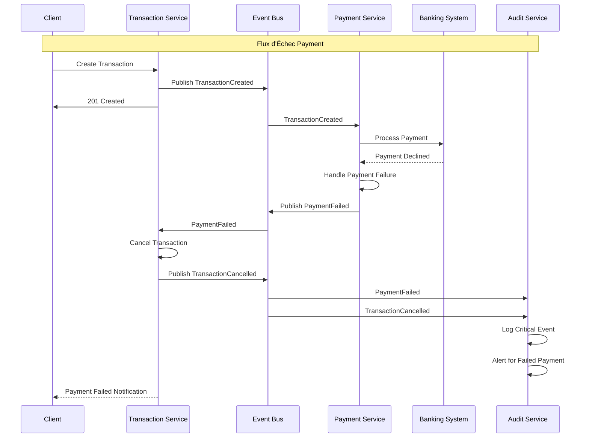
```mermaid
sequenceDiagram
    participant Client
    participant TS as Transaction Service
    participant EB as Event Bus
    participant PS as Payment Service
    participant Bank as Banking System
    participant AS as Audit Service

    Note over Client, AS: Flux d'Échec Payment

    Client->>TS: Create Transaction
    TS->>EB: Publish TransactionCreated
    TS->>Client: 201 Created

    EB->>PS: TransactionCreated
    PS->>Bank: Process Payment
    Bank-->>PS: Payment Declined

    PS->>PS: Handle Payment Failure
    PS->>EB: Publish PaymentFailed
    
    EB->>TS: PaymentFailed
    TS->>TS: Cancel Transaction
    TS->>EB: Publish TransactionCancelled
    
    EB->>AS: PaymentFailed
    EB->>AS: TransactionCancelled
    AS->>AS: Log Critical Event
    AS->>AS: Alert for Failed Payment
    
    TS-->>Client: Payment Failed Notification
```

### 6.1.3. Scénario d'Échec - Inventory Unavailable

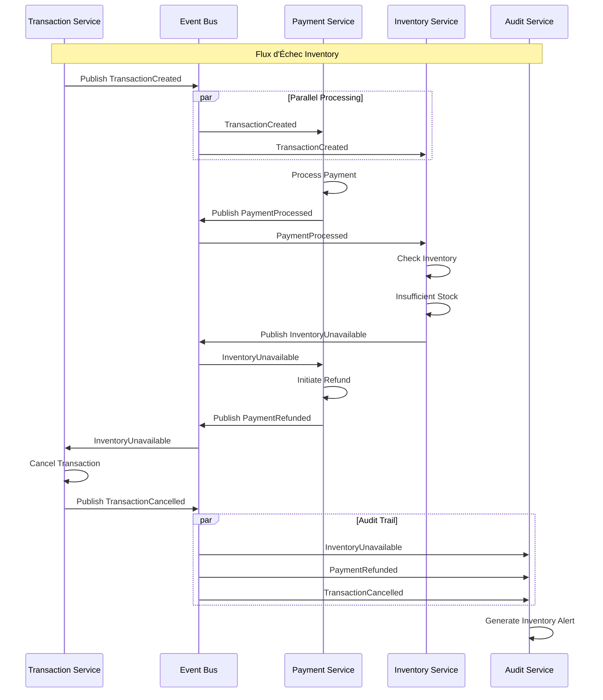
```mermaid
sequenceDiagram
    participant TS as Transaction Service
    participant EB as Event Bus
    participant PS as Payment Service
    participant IS as Inventory Service
    participant AS as Audit Service

    Note over TS, AS: Flux d'Échec Inventory

    TS->>EB: Publish TransactionCreated
    
    par Parallel Processing
        EB->>PS: TransactionCreated
        EB->>IS: TransactionCreated
    end
    
    PS->>PS: Process Payment
    PS->>EB: Publish PaymentProcessed
    
    EB->>IS: PaymentProcessed
    IS->>IS: Check Inventory
    IS->>IS: Insufficient Stock
    IS->>EB: Publish InventoryUnavailable
    
    EB->>PS: InventoryUnavailable
    PS->>PS: Initiate Refund
    PS->>EB: Publish PaymentRefunded
    
    EB->>TS: InventoryUnavailable
    TS->>TS: Cancel Transaction
    TS->>EB: Publish TransactionCancelled
    
    par Audit Trail
        EB->>AS: InventoryUnavailable
        EB->>AS: PaymentRefunded
        EB->>AS: TransactionCancelled
    end
    
    AS->>AS: Generate Inventory Alert
```

## 6.2. Flux Event Sourcing & CQRS

### 6.2.1. Write Model - Event Persistence

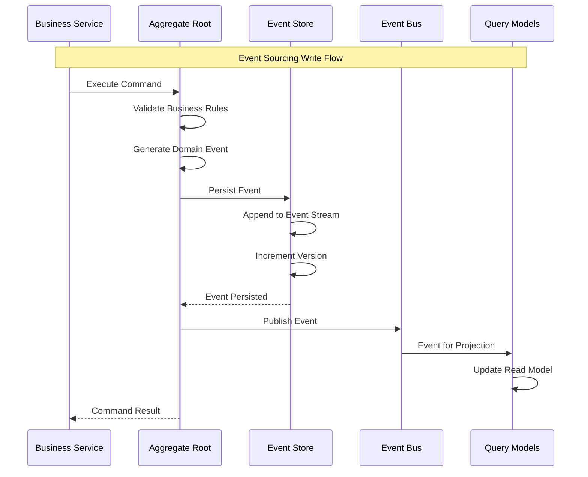
```mermaid
sequenceDiagram
    participant Service as Business Service
    participant Agg as Aggregate Root
    participant Store as Event Store
    participant Bus as Event Bus
    participant Query as Query Models

    Note over Service, Query: Event Sourcing Write Flow

    Service->>Agg: Execute Command
    Agg->>Agg: Validate Business Rules
    Agg->>Agg: Generate Domain Event
    
    Agg->>Store: Persist Event
    Store->>Store: Append to Event Stream
    Store->>Store: Increment Version
    Store-->>Agg: Event Persisted
    
    Agg->>Bus: Publish Event
    Bus->>Query: Event for Projection
    Query->>Query: Update Read Model
    
    Agg-->>Service: Command Result
```

### 6.2.2. Read Model - State Reconstruction

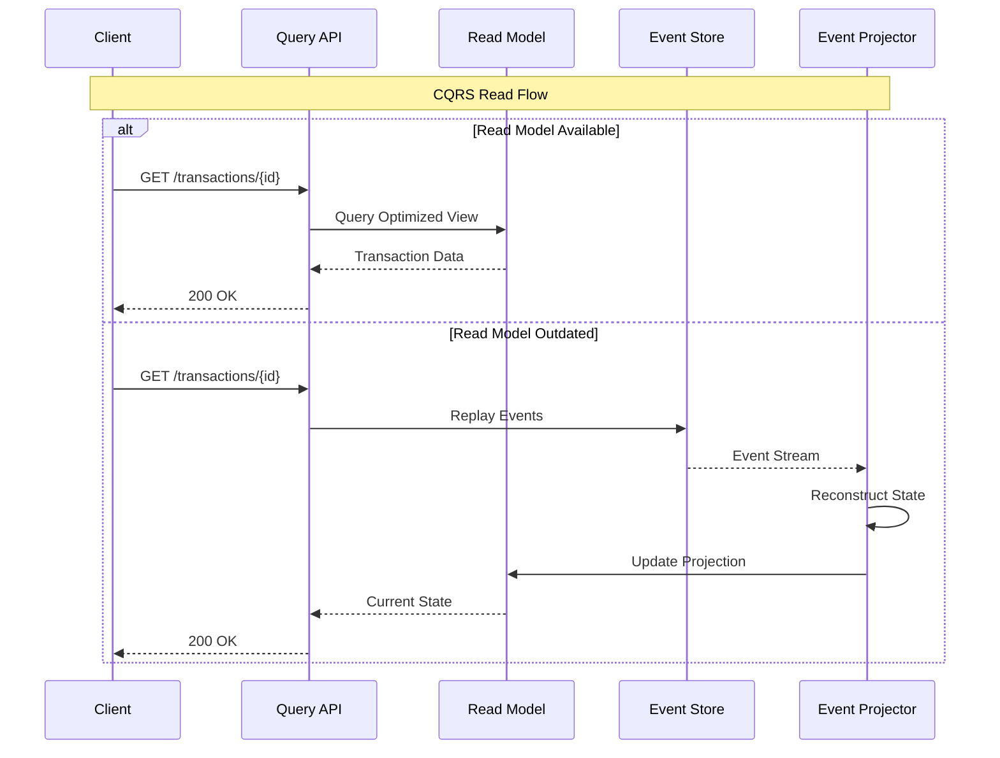
```mermaid
sequenceDiagram
    participant Client
    participant QueryAPI as Query API
    participant ReadModel as Read Model
    participant EventStore as Event Store
    participant Projector as Event Projector

    Note over Client, Projector: CQRS Read Flow

    alt Read Model Available
        Client->>QueryAPI: GET /transactions/{id}
        QueryAPI->>ReadModel: Query Optimized View
        ReadModel-->>QueryAPI: Transaction Data
        QueryAPI-->>Client: 200 OK
    else Read Model Outdated
        Client->>QueryAPI: GET /transactions/{id}
        QueryAPI->>EventStore: Replay Events
        EventStore-->>Projector: Event Stream
        Projector->>Projector: Reconstruct State
        Projector->>ReadModel: Update Projection
        ReadModel-->>QueryAPI: Current State
        QueryAPI-->>Client: 200 OK
    end
```

## 6.3. Saga Choreographed - Coordination Distribuée

### 6.3.1. Transaction Saga - Happy Path

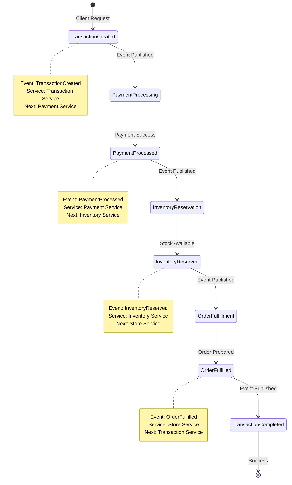
```mermaid
stateDiagram-v2
    [*] --> TransactionCreated : Client Request
    
    TransactionCreated --> PaymentProcessing : Event Published
    PaymentProcessing --> PaymentProcessed : Payment Success
    PaymentProcessed --> InventoryReservation : Event Published
    InventoryReservation --> InventoryReserved : Stock Available
    InventoryReserved --> OrderFulfillment : Event Published
    OrderFulfillment --> OrderFulfilled : Order Prepared
    OrderFulfilled --> TransactionCompleted : Event Published
    TransactionCompleted --> [*] : Success
    
    note right of TransactionCreated
        Event: TransactionCreated
        Service: Transaction Service
        Next: Payment Service
    end note
    
    note right of PaymentProcessed
        Event: PaymentProcessed
        Service: Payment Service
        Next: Inventory Service
    end note
    
    note right of InventoryReserved
        Event: InventoryReserved
        Service: Inventory Service
        Next: Store Service
    end note
    
    note right of OrderFulfilled
        Event: OrderFulfilled
        Service: Store Service
        Next: Transaction Service
    end note
```

### 6.3.2. Transaction Saga - Compensation Path

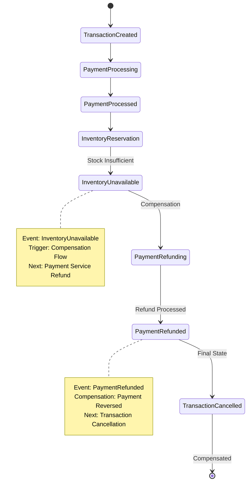
```mermaid
stateDiagram-v2
    [*] --> TransactionCreated
    TransactionCreated --> PaymentProcessing
    PaymentProcessing --> PaymentProcessed
    PaymentProcessed --> InventoryReservation
    InventoryReservation --> InventoryUnavailable : Stock Insufficient
    
    InventoryUnavailable --> PaymentRefunding : Compensation
    PaymentRefunding --> PaymentRefunded : Refund Processed
    PaymentRefunded --> TransactionCancelled : Final State
    TransactionCancelled --> [*] : Compensated
    
    note right of InventoryUnavailable
        Event: InventoryUnavailable
        Trigger: Compensation Flow
        Next: Payment Service Refund
    end note
    
    note right of PaymentRefunded
        Event: PaymentRefunded
        Compensation: Payment Reversed
        Next: Transaction Cancellation
    end note
```

## 6.4. Event Replay & State Reconstruction

### 6.4.1. Aggregate State Reconstruction

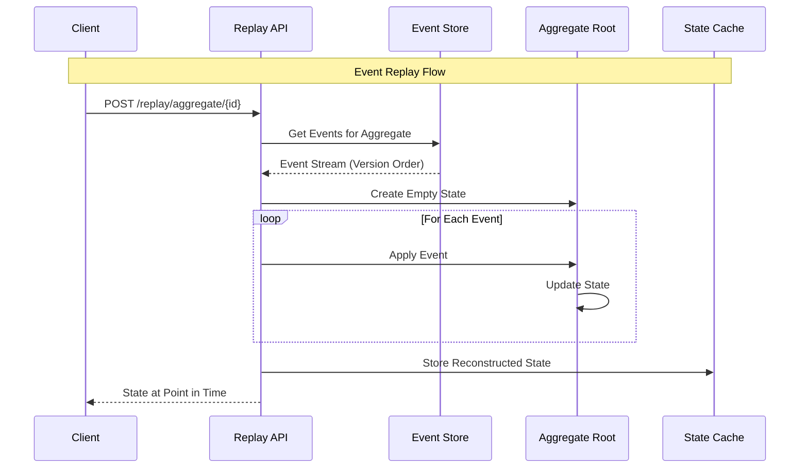
```mermaid
sequenceDiagram
    participant Client
    participant ReplayAPI as Replay API
    participant EventStore as Event Store
    participant Aggregate as Aggregate Root
    participant Cache as State Cache

    Note over Client, Cache: Event Replay Flow

    Client->>ReplayAPI: POST /replay/aggregate/{id}
    ReplayAPI->>EventStore: Get Events for Aggregate
    EventStore-->>ReplayAPI: Event Stream (Version Order)
    
    ReplayAPI->>Aggregate: Create Empty State
    
    loop For Each Event
        ReplayAPI->>Aggregate: Apply Event
        Aggregate->>Aggregate: Update State
    end
    
    ReplayAPI->>Cache: Store Reconstructed State
    ReplayAPI-->>Client: State at Point in Time
```

### 6.4.2. Point-in-Time Query

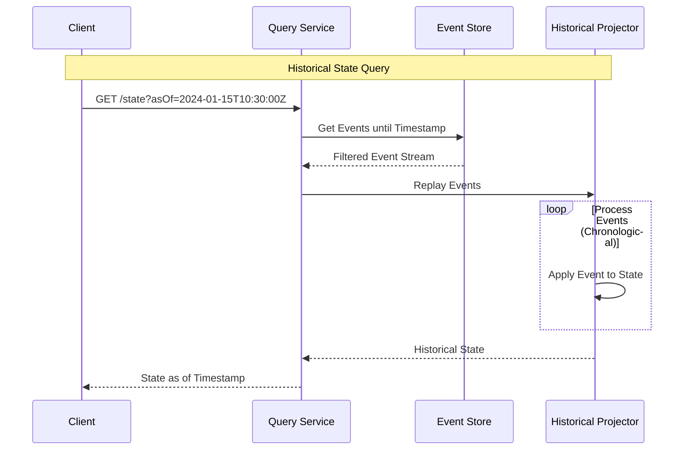
```mermaid
sequenceDiagram
    participant Client
    participant QueryService as Query Service
    participant EventStore as Event Store
    participant Projector as Historical Projector

    Note over Client, Projector: Historical State Query

    Client->>QueryService: GET /state?asOf=2024-01-15T10:30:00Z
    QueryService->>EventStore: Get Events until Timestamp
    EventStore-->>QueryService: Filtered Event Stream
    
    QueryService->>Projector: Replay Events
    
    loop Process Events (Chronological)
        Projector->>Projector: Apply Event to State
    end
    
    Projector-->>QueryService: Historical State
    QueryService-->>Client: State as of Timestamp
```

## 6.5. Monitoring & Observability

### 6.5.1. Event Flow Monitoring

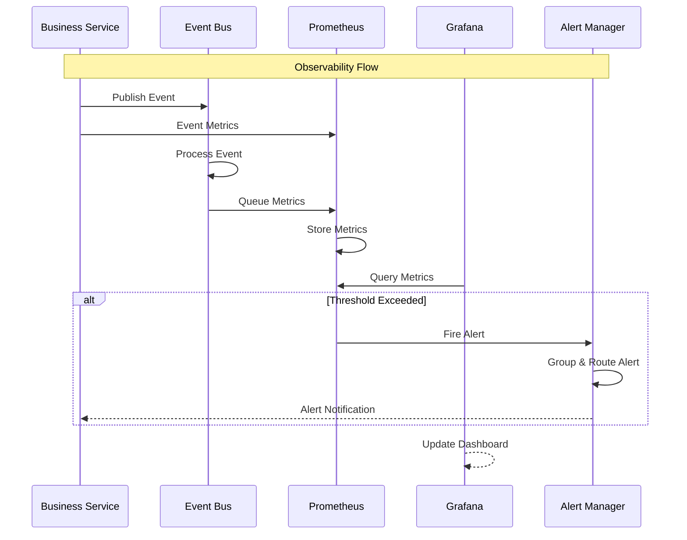
```mermaid
sequenceDiagram
    participant Service as Business Service
    participant EB as Event Bus
    participant Prometheus as Prometheus
    participant Grafana as Grafana
    participant AlertManager as Alert Manager

    Note over Service, AlertManager: Observability Flow

    Service->>EB: Publish Event
    Service->>Prometheus: Event Metrics
    
    EB->>EB: Process Event
    EB->>Prometheus: Queue Metrics
    
    Prometheus->>Prometheus: Store Metrics
    Grafana->>Prometheus: Query Metrics
    
    alt Threshold Exceeded
        Prometheus->>AlertManager: Fire Alert
        AlertManager->>AlertManager: Group & Route Alert
        AlertManager-->>Service: Alert Notification
    end
    
    Grafana-->>Grafana: Update Dashboard
```

### 6.5.2. Distributed Tracing

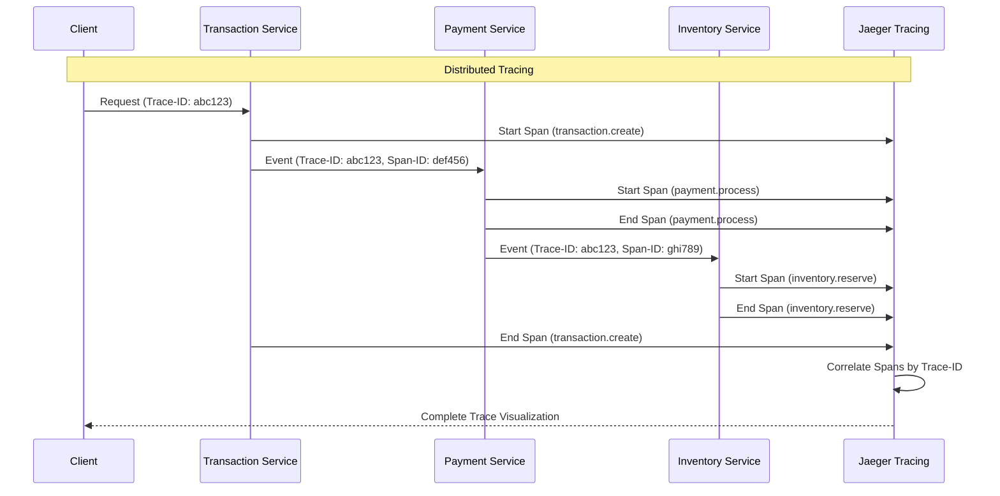
```mermaid
sequenceDiagram
    participant Client
    participant TS as Transaction Service
    participant PS as Payment Service
    participant IS as Inventory Service
    participant Jaeger as Jaeger Tracing

    Note over Client, Jaeger: Distributed Tracing

    Client->>TS: Request (Trace-ID: abc123)
    TS->>Jaeger: Start Span (transaction.create)
    
    TS->>PS: Event (Trace-ID: abc123, Span-ID: def456)
    PS->>Jaeger: Start Span (payment.process)
    PS->>Jaeger: End Span (payment.process)
    
    PS->>IS: Event (Trace-ID: abc123, Span-ID: ghi789)
    IS->>Jaeger: Start Span (inventory.reserve)
    IS->>Jaeger: End Span (inventory.reserve)
    
    TS->>Jaeger: End Span (transaction.create)
    
    Jaeger->>Jaeger: Correlate Spans by Trace-ID
    Jaeger-->>Client: Complete Trace Visualization
```

## 6.6. Error Handling & Dead Letter Processing

### 6.6.1. Dead Letter Queue Processing

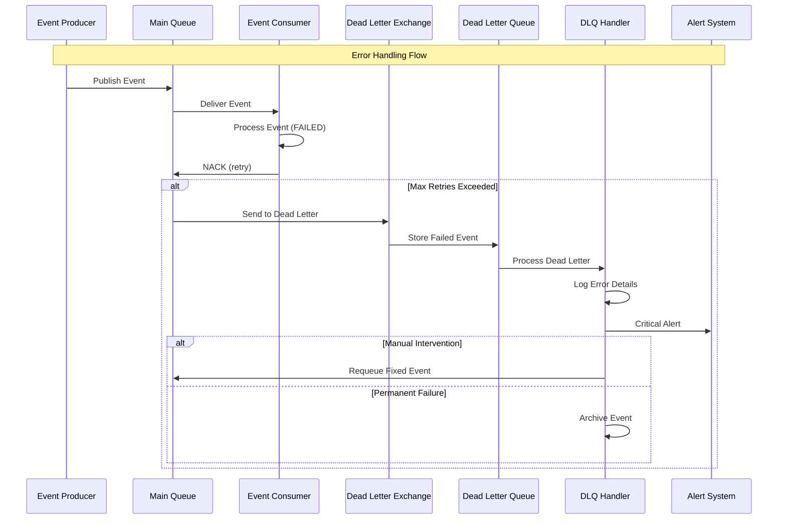
```mermaid
sequenceDiagram
    participant Producer as Event Producer
    participant Queue as Main Queue
    participant Consumer as Event Consumer
    participant DLX as Dead Letter Exchange
    participant DLQ as Dead Letter Queue
    participant Handler as DLQ Handler
    participant Alert as Alert System

    Note over Producer, Alert: Error Handling Flow

    Producer->>Queue: Publish Event
    Queue->>Consumer: Deliver Event
    
    Consumer->>Consumer: Process Event (FAILED)
    Consumer->>Queue: NACK (retry)
    
    alt Max Retries Exceeded
        Queue->>DLX: Send to Dead Letter
        DLX->>DLQ: Store Failed Event
        
        DLQ->>Handler: Process Dead Letter
        Handler->>Handler: Log Error Details
        Handler->>Alert: Critical Alert
        
        alt Manual Intervention
            Handler->>Queue: Requeue Fixed Event
        else Permanent Failure
            Handler->>Handler: Archive Event
        end
    end
```

### 6.6.2. Circuit Breaker Pattern

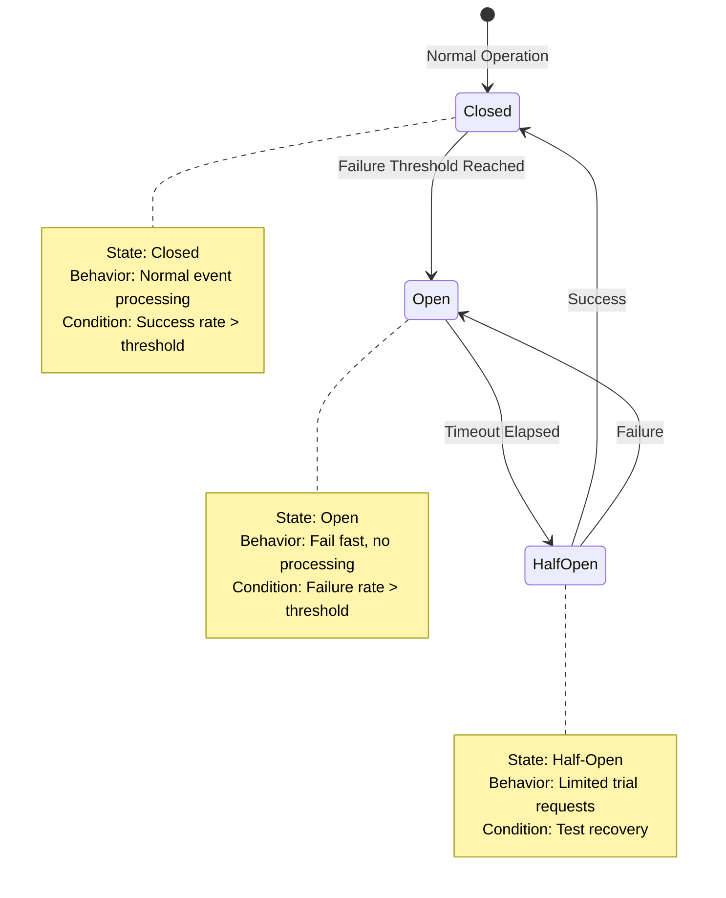
```mermaid
stateDiagram-v2
    [*] --> Closed : Normal Operation
    
    Closed --> Open : Failure Threshold Reached
    Open --> HalfOpen : Timeout Elapsed
    HalfOpen --> Closed : Success
    HalfOpen --> Open : Failure
    
    note right of Closed
        State: Closed
        Behavior: Normal event processing
        Condition: Success rate > threshold
    end note
    
    note right of Open
        State: Open
        Behavior: Fail fast, no processing
        Condition: Failure rate > threshold
    end note
    
    note right of HalfOpen
        State: Half-Open
        Behavior: Limited trial requests
        Condition: Test recovery
    end note
```

## 6.7. Performance Patterns

### 6.7.1. Event Batching

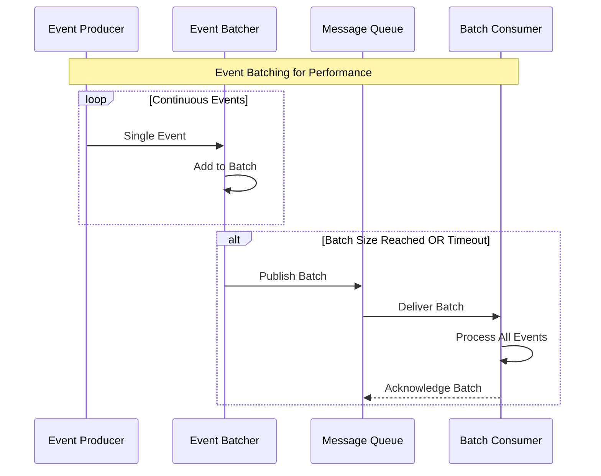
```mermaid
sequenceDiagram
    participant Producer as Event Producer
    participant Batcher as Event Batcher
    participant Queue as Message Queue
    participant Consumer as Batch Consumer

    Note over Producer, Consumer: Event Batching for Performance

    loop Continuous Events
        Producer->>Batcher: Single Event
        Batcher->>Batcher: Add to Batch
    end
    
    alt Batch Size Reached OR Timeout
        Batcher->>Queue: Publish Batch
        Queue->>Consumer: Deliver Batch
        Consumer->>Consumer: Process All Events
        Consumer-->>Queue: Acknowledge Batch
    end
```

### 6.7.2. Event Sourcing Snapshots

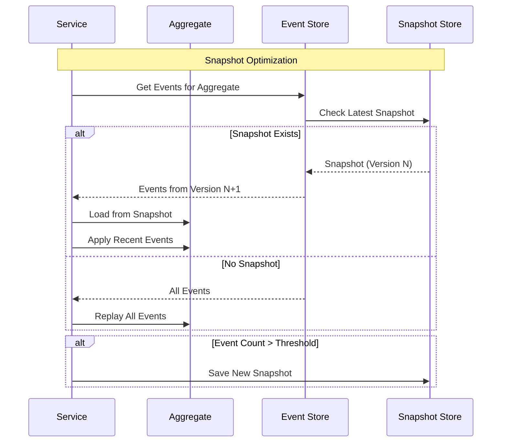
```mermaid
sequenceDiagram
    participant Service as Service
    participant Aggregate as Aggregate
    participant EventStore as Event Store
    participant SnapshotStore as Snapshot Store

    Note over Service, SnapshotStore: Snapshot Optimization

    Service->>EventStore: Get Events for Aggregate
    EventStore->>SnapshotStore: Check Latest Snapshot
    
    alt Snapshot Exists
        SnapshotStore-->>EventStore: Snapshot (Version N)
        EventStore-->>Service: Events from Version N+1
        Service->>Aggregate: Load from Snapshot
        Service->>Aggregate: Apply Recent Events
    else No Snapshot
        EventStore-->>Service: All Events
        Service->>Aggregate: Replay All Events
    end
    
    alt Event Count > Threshold
        Service->>SnapshotStore: Save New Snapshot
    end
```

## 6.8. Scalability Patterns

### 6.8.1. Event Partitioning

```mermaid
graph TB
    subgraph "Event Producers"
        P1[Producer 1]
        P2[Producer 2]
        P3[Producer 3]
    end
    
    subgraph "Partitioned Queues"
        Q1[Queue Partition 1<br/>Customer A-H]
        Q2[Queue Partition 2<br/>Customer I-P]
        Q3[Queue Partition 3<br/>Customer Q-Z]
    end
    
    subgraph "Consumer Groups"
        C1[Consumer Group 1]
        C2[Consumer Group 2]
        C3[Consumer Group 3]
    end
    
    P1 --> Q1
    P1 --> Q2
    P1 --> Q3
    P2 --> Q1
    P2 --> Q2
    P2 --> Q3
    P3 --> Q1
    P3 --> Q2
    P3 --> Q3
    
    Q1 --> C1
    Q2 --> C2
    Q3 --> C3
    
    note1[Hash(customerId) % 3<br/>determines partition]
```

Cette vue d'exécution illustre comment l'architecture événementielle coordonne les processus métier complexes tout en maintenant la résilience, l'observabilité et les performances du système distribué.
