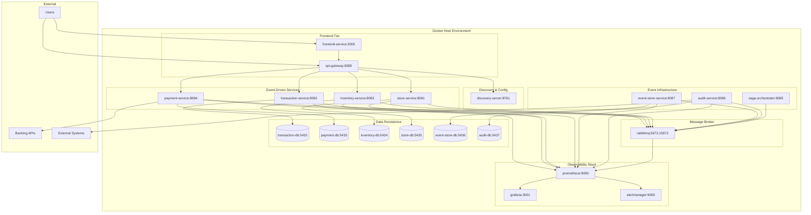

# 7. Vue de Déploiement - Architecture Événementielle

Cette section décrit l'infrastructure et le déploiement de l'architecture événementielle, incluant la topologie des services, la configuration Docker, et les stratégies de déploiement.

## 7.1. Vue d'Ensemble du Déploiement



## 7.2. Configuration Docker Compose

### 7.2.1. Structure Principale

```yaml
# docker-compose.yml
version: '3.8'

services:
  # Frontend & Gateway
  frontend-service:
    build: ./frontend-service
    ports:
      - "3000:3000"
    depends_on:
      - api-gateway
    environment:
      - REACT_APP_API_URL=http://api-gateway:8080
    networks:
      - event-driven-network
    healthcheck:
      test: ["CMD", "curl", "-f", "http://localhost:3000"]
      interval: 30s
      timeout: 10s
      retries: 3
      start_period: 40s

  api-gateway:
    build: ./api-gateway
    ports:
      - "8080:8080"
    depends_on:
      discovery-server:
        condition: service_healthy
    environment:
      - EUREKA_CLIENT_SERVICE_URL_DEFAULTZONE=http://discovery-server:8761/eureka
      - SPRING_PROFILES_ACTIVE=docker
    networks:
      - event-driven-network
    healthcheck:
      test: ["CMD", "curl", "-f", "http://localhost:8080/actuator/health"]
      interval: 30s
      timeout: 10s
      retries: 3
      start_period: 60s

  discovery-server:
    build: ./discovery-server
    ports:
      - "8761:8761"
    environment:
      - SPRING_PROFILES_ACTIVE=docker
    networks:
      - event-driven-network
    healthcheck:
      test: ["CMD", "curl", "-f", "http://localhost:8761/actuator/health"]
      interval: 30s
      timeout: 10s
      retries: 3
      start_period: 40s

  # Event-Driven Business Services
  transaction-service:
    build: ./transaction-service
    ports:
      - "8082:8082"
    depends_on:
      discovery-server:
        condition: service_healthy
      transaction-db:
        condition: service_healthy
      rabbitmq:
        condition: service_healthy
    environment:
      - SPRING_PROFILES_ACTIVE=docker
      - SPRING_DATASOURCE_URL=jdbc:postgresql://transaction-db:5432/transaction_service_db
      - SPRING_DATASOURCE_USERNAME=transaction_user
      - SPRING_DATASOURCE_PASSWORD=transaction_password
      - SPRING_RABBITMQ_HOST=rabbitmq
      - SPRING_RABBITMQ_PORT=5672
      - SPRING_RABBITMQ_USERNAME=guest
      - SPRING_RABBITMQ_PASSWORD=guest
      - EUREKA_CLIENT_SERVICE_URL_DEFAULTZONE=http://discovery-server:8761/eureka
      - EVENT_STORE_URL=http://event-store-service:8087
    networks:
      - event-driven-network
    healthcheck:
      test: ["CMD", "curl", "-f", "http://localhost:8082/actuator/health"]
      interval: 30s
      timeout: 10s
      retries: 3
      start_period: 90s

  payment-service:
    build: ./payment-service
    ports:
      - "8084:8084"
    depends_on:
      discovery-server:
        condition: service_healthy
      payment-db:
        condition: service_healthy
      rabbitmq:
        condition: service_healthy
    environment:
      - SPRING_PROFILES_ACTIVE=docker
      - SPRING_DATASOURCE_URL=jdbc:postgresql://payment-db:5433/payment_service_db
      - SPRING_DATASOURCE_USERNAME=payment_user
      - SPRING_DATASOURCE_PASSWORD=payment_password
      - SPRING_RABBITMQ_HOST=rabbitmq
      - EUREKA_CLIENT_SERVICE_URL_DEFAULTZONE=http://discovery-server:8761/eureka
      - PAYMENT_GATEWAY_MOCK_ENABLED=true
    networks:
      - event-driven-network
    healthcheck:
      test: ["CMD", "curl", "-f", "http://localhost:8084/actuator/health"]
      interval: 30s
      timeout: 10s
      retries: 3
      start_period: 90s

  inventory-service:
    build: ./inventory-service
    ports:
      - "8083:8083"
    depends_on:
      discovery-server:
        condition: service_healthy
      inventory-db:
        condition: service_healthy
      rabbitmq:
        condition: service_healthy
    environment:
      - SPRING_PROFILES_ACTIVE=docker
      - SPRING_DATASOURCE_URL=jdbc:postgresql://inventory-db:5434/inventory_service_db
      - SPRING_DATASOURCE_USERNAME=inventory_user
      - SPRING_DATASOURCE_PASSWORD=inventory_password
      - SPRING_RABBITMQ_HOST=rabbitmq
      - EUREKA_CLIENT_SERVICE_URL_DEFAULTZONE=http://discovery-server:8761/eureka
    networks:
      - event-driven-network
    healthcheck:
      test: ["CMD", "curl", "-f", "http://localhost:8083/actuator/health"]
      interval: 30s
      timeout: 10s
      retries: 3
      start_period: 90s

  store-service:
    build: ./store-service
    ports:
      - "8081:8081"
    depends_on:
      discovery-server:
        condition: service_healthy
      store-db:
        condition: service_healthy
      rabbitmq:
        condition: service_healthy
    environment:
      - SPRING_PROFILES_ACTIVE=docker
      - SPRING_DATASOURCE_URL=jdbc:postgresql://store-db:5435/store_service_db
      - SPRING_DATASOURCE_USERNAME=store_user
      - SPRING_DATASOURCE_PASSWORD=store_password
      - SPRING_RABBITMQ_HOST=rabbitmq
      - EUREKA_CLIENT_SERVICE_URL_DEFAULTZONE=http://discovery-server:8761/eureka
    networks:
      - event-driven-network
    healthcheck:
      test: ["CMD", "curl", "-f", "http://localhost:8081/actuator/health"]
      interval: 30s
      timeout: 10s
      retries: 3
      start_period: 90s

  # Event Infrastructure Services
  event-store-service:
    build: ./event-store-service
    ports:
      - "8087:8087"
    depends_on:
      discovery-server:
        condition: service_healthy
      event-store-db:
        condition: service_healthy
      rabbitmq:
        condition: service_healthy
    environment:
      - SPRING_PROFILES_ACTIVE=docker
      - SPRING_DATASOURCE_URL=jdbc:postgresql://event-store-db:5436/event_store_db
      - SPRING_DATASOURCE_USERNAME=event_store_user
      - SPRING_DATASOURCE_PASSWORD=event_store_password
      - SPRING_RABBITMQ_HOST=rabbitmq
      - EUREKA_CLIENT_SERVICE_URL_DEFAULTZONE=http://discovery-server:8761/eureka
    networks:
      - event-driven-network
    healthcheck:
      test: ["CMD", "curl", "-f", "http://localhost:8087/actuator/health"]
      interval: 30s
      timeout: 10s
      retries: 3
      start_period: 90s

  audit-service:
    build: ./audit-service
    ports:
      - "8086:8086"
    depends_on:
      discovery-server:
        condition: service_healthy
      audit-db:
        condition: service_healthy
      rabbitmq:
        condition: service_healthy
    environment:
      - SPRING_PROFILES_ACTIVE=docker
      - SPRING_DATASOURCE_URL=jdbc:postgresql://audit-db:5437/audit_service_db
      - SPRING_DATASOURCE_USERNAME=audit_user
      - SPRING_DATASOURCE_PASSWORD=audit_password
      - SPRING_RABBITMQ_HOST=rabbitmq
      - EUREKA_CLIENT_SERVICE_URL_DEFAULTZONE=http://discovery-server:8761/eureka
      - AUDIT_COMPLIANCE_TAGS=PCI-DSS,GDPR,SOX
    networks:
      - event-driven-network
    healthcheck:
      test: ["CMD", "curl", "-f", "http://localhost:8086/actuator/health"]
      interval: 30s
      timeout: 10s
      retries: 3
      start_period: 90s

  saga-orchestrator-service:
    build: ./saga-orchestrator-service
    ports:
      - "8085:8085"
    depends_on:
      discovery-server:
        condition: service_healthy
      rabbitmq:
        condition: service_healthy
    environment:
      - SPRING_PROFILES_ACTIVE=docker
      - SPRING_RABBITMQ_HOST=rabbitmq
      - EUREKA_CLIENT_SERVICE_URL_DEFAULTZONE=http://discovery-server:8761/eureka
      - SAGA_MODE=CHOREOGRAPHED
    networks:
      - event-driven-network
    healthcheck:
      test: ["CMD", "curl", "-f", "http://localhost:8085/actuator/health"]
      interval: 30s
      timeout: 10s
      retries: 3
      start_period: 90s
```

### 7.2.2. Message Broker Configuration

```yaml
  # Message Broker
  rabbitmq:
    image: rabbitmq:3.12-management
    ports:
      - "5672:5672"   # AMQP port
      - "15672:15672" # Management UI
    environment:
      - RABBITMQ_DEFAULT_USER=guest
      - RABBITMQ_DEFAULT_PASS=guest
      - RABBITMQ_SERVER_ADDITIONAL_ERL_ARGS=-rabbit log_levels [{connection,error},{default,error}]
    volumes:
      - rabbitmq_data:/var/lib/rabbitmq
      - ./rabbitmq/rabbitmq.conf:/etc/rabbitmq/rabbitmq.conf:ro
      - ./rabbitmq/definitions.json:/etc/rabbitmq/definitions.json:ro
    networks:
      - event-driven-network
    healthcheck:
      test: rabbitmq-diagnostics -q ping
      interval: 30s
      timeout: 30s
      retries: 3
      start_period: 60s
```

### 7.2.3. Database Persistence Layer

```yaml
  # Database Services
  transaction-db:
    image: postgres:15-alpine
    ports:
      - "5432:5432"
    environment:
      - POSTGRES_DB=transaction_service_db
      - POSTGRES_USER=transaction_user
      - POSTGRES_PASSWORD=transaction_password
    volumes:
      - transaction_db_data:/var/lib/postgresql/data
      - ./init-db.sql:/docker-entrypoint-initdb.d/init.sql:ro
    networks:
      - event-driven-network
    healthcheck:
      test: ["CMD-SHELL", "pg_isready -U transaction_user -d transaction_service_db"]
      interval: 10s
      timeout: 5s
      retries: 5
      start_period: 30s

  payment-db:
    image: postgres:15-alpine
    ports:
      - "5433:5432"
    environment:
      - POSTGRES_DB=payment_service_db
      - POSTGRES_USER=payment_user
      - POSTGRES_PASSWORD=payment_password
    volumes:
      - payment_db_data:/var/lib/postgresql/data
    networks:
      - event-driven-network
    healthcheck:
      test: ["CMD-SHELL", "pg_isready -U payment_user -d payment_service_db"]
      interval: 10s
      timeout: 5s
      retries: 5
      start_period: 30s

  inventory-db:
    image: postgres:15-alpine
    ports:
      - "5434:5432"
    environment:
      - POSTGRES_DB=inventory_service_db
      - POSTGRES_USER=inventory_user
      - POSTGRES_PASSWORD=inventory_password
    volumes:
      - inventory_db_data:/var/lib/postgresql/data
    networks:
      - event-driven-network
    healthcheck:
      test: ["CMD-SHELL", "pg_isready -U inventory_user -d inventory_service_db"]
      interval: 10s
      timeout: 5s
      retries: 5
      start_period: 30s

  store-db:
    image: postgres:15-alpine
    ports:
      - "5435:5432"
    environment:
      - POSTGRES_DB=store_service_db
      - POSTGRES_USER=store_user
      - POSTGRES_PASSWORD=store_password
    volumes:
      - store_db_data:/var/lib/postgresql/data
    networks:
      - event-driven-network
    healthcheck:
      test: ["CMD-SHELL", "pg_isready -U store_user -d store_service_db"]
      interval: 10s
      timeout: 5s
      retries: 5
      start_period: 30s

  event-store-db:
    image: postgres:15-alpine
    ports:
      - "5436:5432"
    environment:
      - POSTGRES_DB=event_store_db
      - POSTGRES_USER=event_store_user
      - POSTGRES_PASSWORD=event_store_password
    volumes:
      - event_store_db_data:/var/lib/postgresql/data
      - ./event-store-schema.sql:/docker-entrypoint-initdb.d/schema.sql:ro
    networks:
      - event-driven-network
    healthcheck:
      test: ["CMD-SHELL", "pg_isready -U event_store_user -d event_store_db"]
      interval: 10s
      timeout: 5s
      retries: 5
      start_period: 30s

  audit-db:
    image: postgres:15-alpine
    ports:
      - "5437:5432"
    environment:
      - POSTGRES_DB=audit_service_db
      - POSTGRES_USER=audit_user
      - POSTGRES_PASSWORD=audit_password
    volumes:
      - audit_db_data:/var/lib/postgresql/data
    networks:
      - event-driven-network
    healthcheck:
      test: ["CMD-SHELL", "pg_isready -U audit_user -d audit_service_db"]
      interval: 10s
      timeout: 5s
      retries: 5
      start_period: 30s
```

### 7.2.4. Observability Stack

```yaml
  # Monitoring & Observability
  prometheus:
    image: prom/prometheus:v2.48.0
    ports:
      - "9090:9090"
    volumes:
      - ./prometheus.yml:/etc/prometheus/prometheus.yml:ro
      - ./alert_rules.yml:/etc/prometheus/alert_rules.yml:ro
      - ./event-driven-alerting-rules.yml:/etc/prometheus/event-driven-alerting-rules.yml:ro
      - ./saga-orchestrator-alerting-rules.yml:/etc/prometheus/saga-orchestrator-alerting-rules.yml:ro
      - prometheus_data:/prometheus
    command:
      - '--config.file=/etc/prometheus/prometheus.yml'
      - '--storage.tsdb.path=/prometheus'
      - '--web.console.libraries=/etc/prometheus/console_libraries'
      - '--web.console.templates=/etc/prometheus/consoles'
      - '--storage.tsdb.retention.time=200h'
      - '--web.enable-lifecycle'
      - '--web.enable-admin-api'
    networks:
      - event-driven-network
    healthcheck:
      test: ["CMD", "wget", "--no-verbose", "--tries=1", "--spider", "http://localhost:9090/-/healthy"]
      interval: 30s
      timeout: 10s
      retries: 3
      start_period: 40s

  grafana:
    image: grafana/grafana:10.2.0
    ports:
      - "3001:3000"
    environment:
      - GF_SECURITY_ADMIN_USER=admin
      - GF_SECURITY_ADMIN_PASSWORD=admin
      - GF_USERS_ALLOW_SIGN_UP=false
    volumes:
      - grafana_data:/var/lib/grafana
      - ./grafana/provisioning:/etc/grafana/provisioning:ro
      - ./grafana/dashboards:/var/lib/grafana/dashboards:ro
    depends_on:
      - prometheus
    networks:
      - event-driven-network
    healthcheck:
      test: ["CMD-SHELL", "curl -f localhost:3000/api/health"]
      interval: 30s
      timeout: 10s
      retries: 3
      start_period: 40s

  alertmanager:
    image: prom/alertmanager:v0.26.0
    ports:
      - "9093:9093"
    volumes:
      - ./alertmanager/alertmanager.yml:/etc/alertmanager/alertmanager.yml:ro
      - alertmanager_data:/alertmanager
    command:
      - '--config.file=/etc/alertmanager/alertmanager.yml'
      - '--storage.path=/alertmanager'
      - '--web.external-url=http://localhost:9093'
    networks:
      - event-driven-network
    healthcheck:
      test: ["CMD", "wget", "--no-verbose", "--tries=1", "--spider", "http://localhost:9093/-/healthy"]
      interval: 30s
      timeout: 10s
      retries: 3
      start_period: 40s

# Networks & Volumes
networks:
  event-driven-network:
    driver: bridge
    ipam:
      config:
        - subnet: 172.20.0.0/16

volumes:
  transaction_db_data:
  payment_db_data:
  inventory_db_data:
  store_db_data:
  event_store_db_data:
  audit_db_data:
  rabbitmq_data:
  prometheus_data:
  grafana_data:
  alertmanager_data:
```

## 7.3. Configuration RabbitMQ

### 7.3.1. Configuration Broker

```yaml
# rabbitmq/rabbitmq.conf
listeners.tcp.default = 5672
management.tcp.port = 15672

# Event-driven configuration
queue_index_embed_msgs_below = 4096
vm_memory_high_watermark.relative = 0.6
disk_free_limit.relative = 2.0

# Clustering and HA
cluster_formation.peer_discovery_backend = classic_config
cluster_formation.classic_config.nodes.1 = rabbit@rabbitmq

# Logging
log.file.level = error
log.console = true
log.console.level = error

# SSL/TLS (disabled for development)
ssl_options.verify = verify_peer
ssl_options.fail_if_no_peer_cert = false
```

### 7.3.2. Définitions des Queues

```json
{
  "exchanges": [
    {
      "name": "business.events",
      "type": "topic",
      "durable": true,
      "auto_delete": false,
      "internal": false,
      "arguments": {}
    },
    {
      "name": "dlx.events",
      "type": "direct",
      "durable": true,
      "auto_delete": false,
      "internal": false,
      "arguments": {}
    }
  ],
  "queues": [
    {
      "name": "transaction.events.queue",
      "durable": true,
      "auto_delete": false,
      "arguments": {
        "x-dead-letter-exchange": "dlx.events",
        "x-dead-letter-routing-key": "transaction.dead",
        "x-message-ttl": 3600000
      }
    },
    {
      "name": "payment.events.queue",
      "durable": true,
      "auto_delete": false,
      "arguments": {
        "x-dead-letter-exchange": "dlx.events",
        "x-dead-letter-routing-key": "payment.dead",
        "x-message-ttl": 3600000
      }
    },
    {
      "name": "inventory.events.queue",
      "durable": true,
      "auto_delete": false,
      "arguments": {
        "x-dead-letter-exchange": "dlx.events",
        "x-dead-letter-routing-key": "inventory.dead",
        "x-message-ttl": 3600000
      }
    },
    {
      "name": "store.events.queue",
      "durable": true,
      "auto_delete": false,
      "arguments": {
        "x-dead-letter-exchange": "dlx.events",
        "x-dead-letter-routing-key": "store.dead",
        "x-message-ttl": 3600000
      }
    },
    {
      "name": "audit.events.queue",
      "durable": true,
      "auto_delete": false,
      "arguments": {
        "x-message-ttl": 86400000
      }
    },
    {
      "name": "event-store.events.queue",
      "durable": true,
      "auto_delete": false,
      "arguments": {
        "x-message-ttl": 86400000
      }
    },
    {
      "name": "dead.letter.queue",
      "durable": true,
      "auto_delete": false,
      "arguments": {}
    }
  ],
  "bindings": [
    {
      "source": "business.events",
      "destination": "transaction.events.queue",
      "destination_type": "queue",
      "routing_key": "transaction.*"
    },
    {
      "source": "business.events",
      "destination": "payment.events.queue",
      "destination_type": "queue",
      "routing_key": "payment.*"
    },
    {
      "source": "business.events",
      "destination": "inventory.events.queue",
      "destination_type": "queue",
      "routing_key": "inventory.*"
    },
    {
      "source": "business.events",
      "destination": "store.events.queue",
      "destination_type": "queue",
      "routing_key": "store.*"
    },
    {
      "source": "business.events",
      "destination": "audit.events.queue",
      "destination_type": "queue",
      "routing_key": "*.*"
    },
    {
      "source": "business.events",
      "destination": "event-store.events.queue",
      "destination_type": "queue",
      "routing_key": "*.*"
    },
    {
      "source": "dlx.events",
      "destination": "dead.letter.queue",
      "destination_type": "queue",
      "routing_key": "*.dead"
    }
  ]
}
```

## 7.4. Scripts de Déploiement

### 7.4.1. Script de Construction

```cmd
@echo off
REM build-all.cmd - Construction complète du système

echo ========================================
echo Construction Architecture Événementielle
echo ========================================

echo Construction des services métier...
cd transaction-service
call mvn clean package -DskipTests
cd ..

cd payment-service
call mvn clean package -DskipTests
cd ..

cd inventory-service
call mvn clean package -DskipTests
cd ..

cd store-service
call mvn clean package -DskipTests
cd ..

echo Construction des services d'infrastructure événementielle...
cd event-store-service
call mvn clean package -DskipTests
cd ..

cd audit-service
call mvn clean package -DskipTests
cd ..

cd saga-orchestrator-service
call mvn clean package -DskipTests
cd ..

echo Construction des services communs...
cd api-gateway
call mvn clean package -DskipTests
cd ..

cd discovery-server
call mvn clean package -DskipTests
cd ..

cd frontend-service
call npm install
call npm run build
cd ..

echo Construction des images Docker...
docker-compose build --no-cache

echo ========================================
echo Construction terminée avec succès!
echo ========================================
```

### 7.4.2. Script de Démarrage

```cmd
@echo off
REM start-system.cmd - Démarrage du système complet

echo ========================================
echo Démarrage Architecture Événementielle
echo ========================================

echo Nettoyage des containers existants...
docker-compose down -v

echo Démarrage de l'infrastructure de base...
docker-compose up -d discovery-server
timeout /t 30

echo Démarrage des bases de données...
docker-compose up -d transaction-db payment-db inventory-db store-db event-store-db audit-db
timeout /t 20

echo Démarrage du message broker...
docker-compose up -d rabbitmq
timeout /t 30

echo Configuration RabbitMQ...
call setup-rabbitmq.cmd

echo Démarrage des services d'infrastructure événementielle...
docker-compose up -d event-store-service audit-service
timeout /t 30

echo Démarrage des services métier...
docker-compose up -d transaction-service payment-service inventory-service store-service
timeout /t 30

echo Démarrage du saga orchestrator...
docker-compose up -d saga-orchestrator-service
timeout /t 15

echo Démarrage de l'API Gateway et Frontend...
docker-compose up -d api-gateway frontend-service
timeout /t 20

echo Démarrage de la stack d'observabilité...
docker-compose up -d prometheus grafana alertmanager
call setup-monitoring.cmd

echo ========================================
echo Système démarré avec succès!
echo ========================================
echo Frontend: http://localhost:3000
echo API Gateway: http://localhost:8080
echo RabbitMQ Management: http://localhost:15672
echo Prometheus: http://localhost:9090
echo Grafana: http://localhost:3001
echo ========================================
```

### 7.4.3. Script de Configuration RabbitMQ

```cmd
@echo off
REM setup-rabbitmq.cmd - Configuration RabbitMQ

echo Configuration des exchanges et queues RabbitMQ...

REM Attendre que RabbitMQ soit prêt
:wait_rabbitmq
timeout /t 5 /nobreak > nul
curl -s http://localhost:15672/api/overview -u guest:guest > nul 2>&1
if errorlevel 1 (
    echo RabbitMQ en cours de démarrage...
    goto wait_rabbitmq
)

echo RabbitMQ est prêt, configuration des définitions...

REM Appliquer les définitions
curl -X POST -u guest:guest -H "content-type:application/json" ^
     -d @rabbitmq/definitions.json ^
     http://localhost:15672/api/definitions

echo Configuration RabbitMQ terminée.
```

### 7.4.4. Script de Test d'Observabilité

```cmd
@echo off
REM test-observability.cmd - Test de la stack d'observabilité

echo ========================================
echo Test de l'Observabilité
echo ========================================

echo Test de connectivité Prometheus...
curl -s http://localhost:9090/-/healthy
if errorlevel 1 (
    echo ERREUR: Prometheus non accessible
    exit /b 1
)
echo Prometheus OK

echo Test de connectivité Grafana...
curl -s http://localhost:3001/api/health
if errorlevel 1 (
    echo ERREUR: Grafana non accessible
    exit /b 1
)
echo Grafana OK

echo Test de connectivité AlertManager...
curl -s http://localhost:9093/-/healthy
if errorlevel 1 (
    echo ERREUR: AlertManager non accessible
    exit /b 1
)
echo AlertManager OK

echo Test des métriques des services...
curl -s http://localhost:8082/actuator/prometheus | findstr "http_requests_total" > nul
if errorlevel 1 (
    echo ERREUR: Métriques Transaction Service non disponibles
    exit /b 1
)
echo Métriques Transaction Service OK

curl -s http://localhost:8084/actuator/prometheus | findstr "payment_processed_total" > nul
if errorlevel 1 (
    echo ERREUR: Métriques Payment Service non disponibles
    exit /b 1
)
echo Métriques Payment Service OK

echo ========================================
echo Tous les tests d'observabilité passés!
echo ========================================
```

## 7.5. Configuration des Healthchecks

### 7.5.1. Service Health Checks

```yaml
# Exemple pour transaction-service
healthcheck:
  test: |
    curl -f http://localhost:8082/actuator/health || exit 1
    curl -f http://localhost:8082/actuator/health/readiness || exit 1
    curl -f http://localhost:8082/actuator/health/liveness || exit 1
  interval: 30s
  timeout: 10s
  retries: 3
  start_period: 90s
```

### 7.5.2. Database Health Checks

```yaml
# PostgreSQL health check
healthcheck:
  test: |
    pg_isready -U ${POSTGRES_USER} -d ${POSTGRES_DB} || exit 1
    psql -U ${POSTGRES_USER} -d ${POSTGRES_DB} -c "SELECT 1;" || exit 1
  interval: 10s
  timeout: 5s
  retries: 5
  start_period: 30s
```

### 7.5.3. RabbitMQ Health Check

```yaml
# RabbitMQ comprehensive health check
healthcheck:
  test: |
    rabbitmq-diagnostics -q ping || exit 1
    rabbitmq-diagnostics -q check_running || exit 1
    rabbitmq-diagnostics -q check_local_alarms || exit 1
    curl -f http://localhost:15672/api/overview -u guest:guest || exit 1
  interval: 30s
  timeout: 30s
  retries: 3
  start_period: 60s
```

## 7.6. Configuration Réseau

### 7.6.1. Réseau Docker

```yaml
networks:
  event-driven-network:
    driver: bridge
    ipam:
      driver: default
      config:
        - subnet: 172.20.0.0/16
          gateway: 172.20.0.1
    driver_opts:
      com.docker.network.bridge.name: "event-driven-br"
      com.docker.network.driver.mtu: "1500"
```

### 7.6.2. Port Mapping

| Service | Container Port | Host Port | Protocol | Description |
|---------|----------------|-----------|----------|-------------|
| frontend-service | 3000 | 3000 | HTTP | Interface utilisateur React |
| api-gateway | 8080 | 8080 | HTTP | Point d'entrée API REST |
| discovery-server | 8761 | 8761 | HTTP | Service Discovery Eureka |
| transaction-service | 8082 | 8082 | HTTP | API Transactions |
| payment-service | 8084 | 8084 | HTTP | API Payments |
| inventory-service | 8083 | 8083 | HTTP | API Inventory |
| store-service | 8081 | 8081 | HTTP | API Store |
| event-store-service | 8087 | 8087 | HTTP | API Event Store |
| audit-service | 8086 | 8086 | HTTP | API Audit |
| saga-orchestrator | 8085 | 8085 | HTTP | API Saga |
| rabbitmq | 5672 | 5672 | AMQP | Message Broker |
| rabbitmq-mgmt | 15672 | 15672 | HTTP | RabbitMQ Management |
| prometheus | 9090 | 9090 | HTTP | Métriques & Alertes |
| grafana | 3000 | 3001 | HTTP | Dashboards |
| alertmanager | 9093 | 9093 | HTTP | Gestion des Alertes |
| transaction-db | 5432 | 5432 | PostgreSQL | Base Transaction |
| payment-db | 5432 | 5433 | PostgreSQL | Base Payment |
| inventory-db | 5432 | 5434 | PostgreSQL | Base Inventory |
| store-db | 5432 | 5435 | PostgreSQL | Base Store |
| event-store-db | 5432 | 5436 | PostgreSQL | Base Event Store |
| audit-db | 5432 | 5437 | PostgreSQL | Base Audit |

## 7.7. Volumes et Persistance

### 7.7.1. Stratégie de Persistance

```yaml
volumes:
  # Bases de données - Persistance critique
  transaction_db_data:
    driver: local
    driver_opts:
      type: none
      o: bind
      device: ./data/transaction_db
  
  payment_db_data:
    driver: local
    driver_opts:
      type: none
      o: bind
      device: ./data/payment_db
      
  event_store_db_data:
    driver: local
    driver_opts:
      type: none
      o: bind
      device: ./data/event_store_db
      
  audit_db_data:
    driver: local
    driver_opts:
      type: none
      o: bind
      device: ./data/audit_db

  # Message Broker - Persistance des messages
  rabbitmq_data:
    driver: local
    driver_opts:
      type: none
      o: bind
      device: ./data/rabbitmq

  # Observabilité - Métriques historiques
  prometheus_data:
    driver: local
    driver_opts:
      type: none
      o: bind
      device: ./data/prometheus
      
  grafana_data:
    driver: local
    driver_opts:
      type: none
      o: bind
      device: ./data/grafana
```

## 7.8. Sécurité du Déploiement

### 7.8.1. Configuration SSL/TLS

```yaml
# Configuration HTTPS pour production
api-gateway:
  environment:
    - SERVER_SSL_ENABLED=true
    - SERVER_SSL_KEY_STORE=/ssl/keystore.p12
    - SERVER_SSL_KEY_STORE_PASSWORD=${SSL_KEYSTORE_PASSWORD}
    - SERVER_SSL_KEY_STORE_TYPE=PKCS12
  volumes:
    - ./ssl:/ssl:ro
```

### 7.8.2. Secrets Management

```yaml
# Utilisation de Docker Secrets
secrets:
  db_password:
    file: ./secrets/db_password.txt
  rabbitmq_password:
    file: ./secrets/rabbitmq_password.txt
  ssl_keystore_password:
    file: ./secrets/ssl_keystore_password.txt

services:
  transaction-service:
    secrets:
      - db_password
    environment:
      - SPRING_DATASOURCE_PASSWORD_FILE=/run/secrets/db_password
```

Cette configuration de déploiement assure une architecture événementielle robuste, scalable et observable, adaptée aux environnements de développement et facilement adaptable pour la production.
