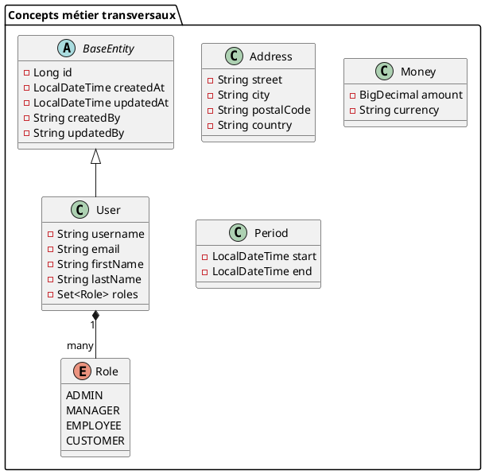
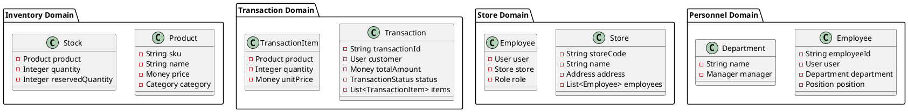
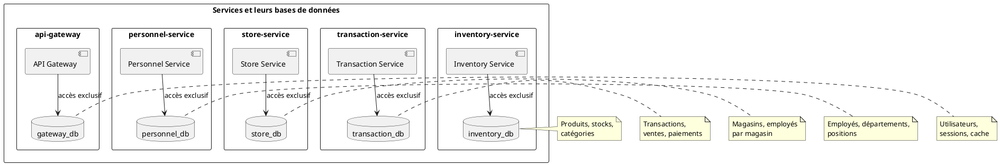
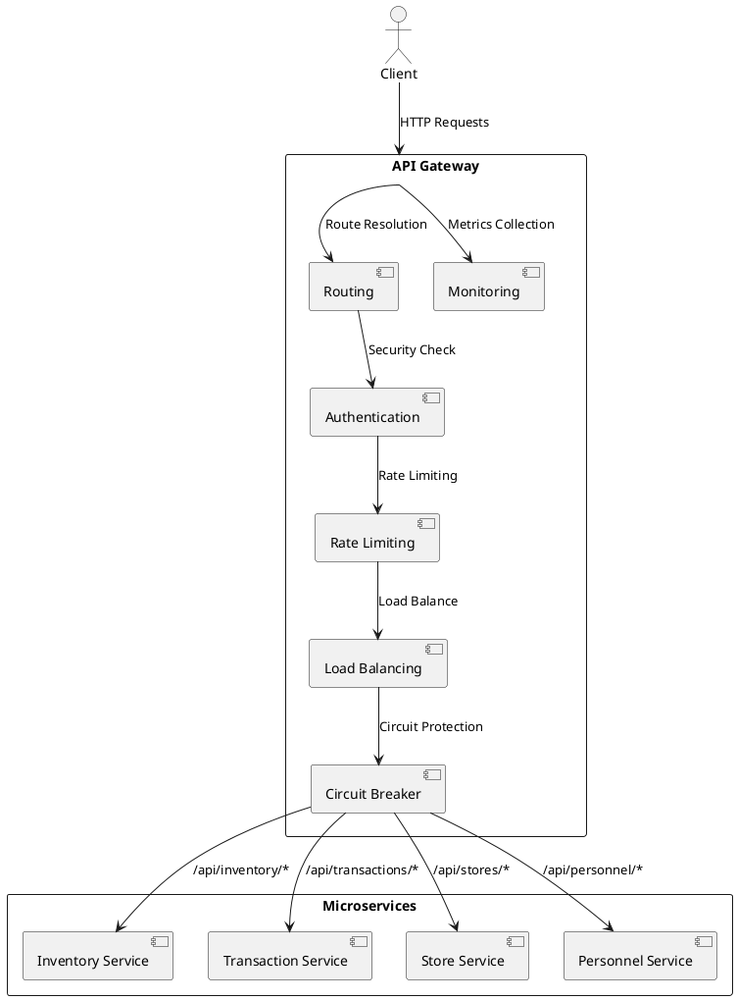
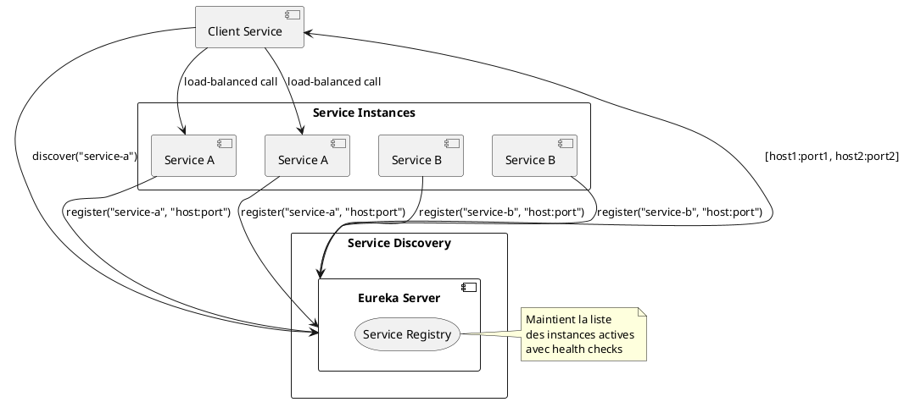
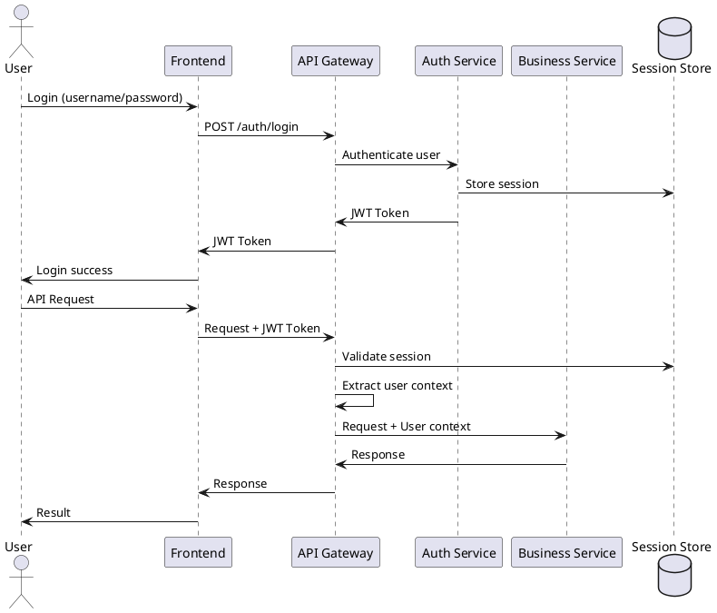

# 8. Concepts transversaux

## 8.1. Concepts de domaine

### 8.1.1. Modèle de domaine partagé

**Entités métier communes :**



### 8.1.2. Agrégats par domaine



## 8.2. Patterns architecturaux

### 8.2.1. Pattern Database per Service

**Principe :**
Chaque microservice dispose de sa propre base de données pour garantir l'isolation des données et l'autonomie.



**Avantages :**
- **Isolation forte** : Pas de couplage entre les données
- **Évolution indépendante** : Schémas de données autonomes
- **Performance** : Optimisation par service
- **Résilience** : Panne isolée par service

### 8.2.2. Pattern API Gateway

**Responsabilités centralisées :**



### 8.2.3. Pattern Service Discovery

**Architecture Eureka :**



## 8.3. Patterns de communication

### 8.3.1. Communication synchrone

**RestTemplate et WebClient :**

```java
// Configuration RestTemplate avec load balancing
@Bean
@LoadBalanced
public RestTemplate restTemplate() {
    return new RestTemplate();
}

// Appel inter-services
@Service
public class TransactionService {
    
    @Autowired
    private RestTemplate restTemplate;
    
    public Product getProduct(String productId) {
        return restTemplate.getForObject(
            "http://inventory-service/api/products/{id}", 
            Product.class, 
            productId
        );
    }
}
```

### 8.3.2. Gestion des erreurs

**Circuit Breaker Pattern :**

```java
@Component
public class InventoryServiceClient {
    
    @CircuitBreaker(name = "inventory-service", fallbackMethod = "fallbackProduct")
    @Retry(name = "inventory-service")
    @TimeLimiter(name = "inventory-service")
    public CompletableFuture<Product> getProduct(String productId) {
        return CompletableFuture.supplyAsync(() -> 
            restTemplate.getForObject(
                "http://inventory-service/api/products/{id}", 
                Product.class, 
                productId
            )
        );
    }
    
    public CompletableFuture<Product> fallbackProduct(String productId, Exception ex) {
        Product fallback = new Product();
        fallback.setName("Produit temporairement indisponible");
        return CompletableFuture.completedFuture(fallback);
    }
}
```

### 8.3.3. Timeout et Retry

**Configuration Resilience4j :**

```yaml
resilience4j:
  circuitbreaker:
    instances:
      inventory-service:
        registerHealthIndicator: true
        slidingWindowSize: 10
        minimumNumberOfCalls: 5
        permittedNumberOfCallsInHalfOpenState: 3
        waitDurationInOpenState: 5s
        failureRateThreshold: 50
        
  retry:
    instances:
      inventory-service:
        maxAttempts: 3
        waitDuration: 1s
        exponentialBackoffMultiplier: 2
        
  timelimiter:
    instances:
      inventory-service:
        timeoutDuration: 3s
```

## 8.4. Sécurité transversale

### 8.4.1. Authentification et autorisation

**JWT Token Flow :**



### 8.4.2. Configuration de sécurité

**Security Filter Chain :**

```java
@Configuration
@EnableWebSecurity
public class SecurityConfig {
    
    @Bean
    public SecurityFilterChain filterChain(HttpSecurity http) throws Exception {
        http
            .csrf().disable()
            .authorizeHttpRequests(authz -> authz
                .requestMatchers("/auth/**", "/actuator/health").permitAll()
                .requestMatchers("/api/admin/**").hasRole("ADMIN")
                .requestMatchers("/api/manager/**").hasAnyRole("ADMIN", "MANAGER")
                .anyRequest().authenticated()
            )
            .oauth2ResourceServer(oauth2 -> oauth2
                .jwt(jwt -> jwt
                    .jwtAuthenticationConverter(jwtAuthenticationConverter())
                )
            );
        return http.build();
    }
}
```

## 8.5. Monitoring et observabilité

### 8.5.1. Logging structuré

**Configuration Logback :**

```xml
<!-- logback-spring.xml -->
<configuration>
    <springProfile name="docker">
        <appender name="STDOUT" class="ch.qos.logback.core.ConsoleAppender">
            <encoder class="net.logstash.logback.encoder.LogstashEncoder">
                <includeContext>true</includeContext>
                <includeMdc>true</includeMdc>
                <customFields>{"service":"${spring.application.name}"}</customFields>
            </encoder>
        </appender>
        
        <logger name="com.magasin" level="DEBUG"/>
        <logger name="org.springframework.web" level="DEBUG"/>
        
        <root level="INFO">
            <appender-ref ref="STDOUT"/>
        </root>
    </springProfile>
</configuration>
```

### 8.5.2. Métriques applicatives

**Micrometer Integration :**

```java
@Component
public class BusinessMetrics {
    
    private final Counter transactionCounter;
    private final Timer transactionTimer;
    private final Gauge activeUsers;
    
    public BusinessMetrics(MeterRegistry meterRegistry) {
        this.transactionCounter = Counter.builder("transactions.total")
            .description("Total number of transactions")
            .tag("service", "transaction-service")
            .register(meterRegistry);
            
        this.transactionTimer = Timer.builder("transactions.duration")
            .description("Transaction processing time")
            .register(meterRegistry);
            
        this.activeUsers = Gauge.builder("users.active")
            .description("Number of active users")
            .register(meterRegistry, this, BusinessMetrics::getActiveUserCount);
    }
    
    @EventListener
    public void handleTransactionCompleted(TransactionCompletedEvent event) {
        transactionCounter.increment(
            Tags.of("status", event.getStatus().toString())
        );
    }
}
```

### 8.5.3. Tracing distribué

**Correlation ID :**

```java
@Component
public class CorrelationInterceptor implements HandlerInterceptor {
    
    private static final String CORRELATION_ID_HEADER = "X-Correlation-ID";
    
    @Override
    public boolean preHandle(HttpServletRequest request, 
                           HttpServletResponse response, 
                           Object handler) {
        
        String correlationId = request.getHeader(CORRELATION_ID_HEADER);
        if (correlationId == null) {
            correlationId = UUID.randomUUID().toString();
        }
        
        MDC.put("correlationId", correlationId);
        response.setHeader(CORRELATION_ID_HEADER, correlationId);
        
        return true;
    }
    
    @Override
    public void afterCompletion(HttpServletRequest request, 
                              HttpServletResponse response, 
                              Object handler, Exception ex) {
        MDC.clear();
    }
}
```

## 8.6. Configuration et gestion

### 8.6.1. Configuration externalisée

**Application Properties :**

```yaml
# application-docker.yml
spring:
  application:
    name: ${SERVICE_NAME:unknown-service}
  
  datasource:
    url: ${POSTGRES_URL:jdbc:postgresql://localhost:5432/default_db}
    username: ${POSTGRES_USER:magasin}
    password: ${POSTGRES_PASSWORD:password}
    
  data:
    redis:
      host: ${REDIS_HOST:localhost}
      port: ${REDIS_PORT:6379}
      
eureka:
  client:
    service-url:
      defaultZone: ${EUREKA_CLIENT_SERVICE_URL_DEFAULTZONE:http://localhost:8761/eureka/}
  instance:
    prefer-ip-address: true
    ip-address: ${HOSTNAME:localhost}
    
management:
  endpoints:
    web:
      exposure:
        include: health,info,prometheus,metrics
  endpoint:
    health:
      show-details: always
  metrics:
    export:
      prometheus:
        enabled: true
```

### 8.6.2. Health Checks

**Custom Health Indicators :**

```java
@Component
public class DatabaseHealthIndicator implements HealthIndicator {
    
    @Autowired
    private DataSource dataSource;
    
    @Override
    public Health health() {
        try (Connection connection = dataSource.getConnection()) {
            if (connection.isValid(1)) {
                return Health.up()
                    .withDetail("database", "PostgreSQL")
                    .withDetail("status", "Connection successful")
                    .build();
            }
        } catch (SQLException e) {
            return Health.down()
                .withDetail("database", "PostgreSQL")
                .withDetail("error", e.getMessage())
                .build();
        }
        
        return Health.down()
            .withDetail("database", "PostgreSQL")
            .withDetail("error", "Invalid connection")
            .build();
    }
}
```

## 8.7. Patterns de données

### 8.7.1. Data Transfer Objects (DTO)

**Pattern de transformation :**

```java
// Domain Entity
@Entity
public class Product {
    private Long id;
    private String sku;
    private String name;
    private BigDecimal price;
    // ... autres champs internes
}

// Public DTO
public class ProductDto {
    private String sku;
    private String name;
    private String formattedPrice;
    private String availability;
}

// Mapper
@Component
public class ProductMapper {
    
    public ProductDto toDto(Product product, Stock stock) {
        ProductDto dto = new ProductDto();
        dto.setSku(product.getSku());
        dto.setName(product.getName());
        dto.setFormattedPrice(formatPrice(product.getPrice()));
        dto.setAvailability(determineAvailability(stock));
        return dto;
    }
    
    private String formatPrice(BigDecimal price) {
        return NumberFormat.getCurrencyInstance(Locale.FRANCE).format(price);
    }
    
    private String determineAvailability(Stock stock) {
        return stock.getQuantity() > 0 ? "En stock" : "Rupture de stock";
    }
}
```

### 8.7.2. Event Sourcing (préparation)

**Structure pour événements futurs :**

```java
// Event base
public abstract class DomainEvent {
    private final String eventId;
    private final LocalDateTime occurredAt;
    private final String aggregateId;
    
    protected DomainEvent(String aggregateId) {
        this.eventId = UUID.randomUUID().toString();
        this.occurredAt = LocalDateTime.now();
        this.aggregateId = aggregateId;
    }
}

// Événements métier
public class ProductCreatedEvent extends DomainEvent {
    private final String sku;
    private final String name;
    private final BigDecimal price;
}

public class TransactionCompletedEvent extends DomainEvent {
    private final String transactionId;
    private final BigDecimal amount;
    private final List<String> productSkus;
}
```

## 8.8. Exception handling

### 8.8.1. Gestion globale des exceptions

**Global Exception Handler :**

```java
@RestControllerAdvice
public class GlobalExceptionHandler {
    
    private static final Logger logger = LoggerFactory.getLogger(GlobalExceptionHandler.class);
    
    @ExceptionHandler(ResourceNotFoundException.class)
    @ResponseStatus(HttpStatus.NOT_FOUND)
    public ErrorResponse handleResourceNotFound(ResourceNotFoundException ex) {
        logger.warn("Resource not found: {}", ex.getMessage());
        return new ErrorResponse(
            "RESOURCE_NOT_FOUND",
            ex.getMessage(),
            Instant.now()
        );
    }
    
    @ExceptionHandler(ValidationException.class)
    @ResponseStatus(HttpStatus.BAD_REQUEST)
    public ErrorResponse handleValidation(ValidationException ex) {
        logger.warn("Validation error: {}", ex.getMessage());
        return new ErrorResponse(
            "VALIDATION_ERROR",
            ex.getMessage(),
            Instant.now()
        );
    }
    
    @ExceptionHandler(ServiceUnavailableException.class)
    @ResponseStatus(HttpStatus.SERVICE_UNAVAILABLE)
    public ErrorResponse handleServiceUnavailable(ServiceUnavailableException ex) {
        logger.error("Service unavailable: {}", ex.getMessage(), ex);
        return new ErrorResponse(
            "SERVICE_UNAVAILABLE",
            "Service temporairement indisponible",
            Instant.now()
        );
    }
    
    @ExceptionHandler(Exception.class)
    @ResponseStatus(HttpStatus.INTERNAL_SERVER_ERROR)
    public ErrorResponse handleGeneral(Exception ex) {
        logger.error("Unexpected error: {}", ex.getMessage(), ex);
        return new ErrorResponse(
            "INTERNAL_ERROR",
            "Une erreur inattendue s'est produite",
            Instant.now()
        );
    }
}

public class ErrorResponse {
    private String code;
    private String message;
    private Instant timestamp;
    // constructeurs, getters, setters
}
```

### 8.8.2. Circuit Breaker Fallbacks

**Fallback Methods :**

```java
@Service
public class ProductService {
    
    @CircuitBreaker(name = "inventory-service", fallbackMethod = "getProductFallback")
    public Product getProduct(String productId) {
        return inventoryServiceClient.getProduct(productId);
    }
    
    public Product getProductFallback(String productId, Exception ex) {
        logger.warn("Fallback triggered for product {}: {}", productId, ex.getMessage());
        
        Product fallbackProduct = new Product();
        fallbackProduct.setId(productId);
        fallbackProduct.setName("Produit temporairement indisponible");
        fallbackProduct.setAvailable(false);
        
        return fallbackProduct;
    }
    
    @CircuitBreaker(name = "inventory-service", fallbackMethod = "getProductsFallback")
    public List<Product> getProducts() {
        return inventoryServiceClient.getProducts();
    }
    
    public List<Product> getProductsFallback(Exception ex) {
        logger.warn("Products list fallback triggered: {}", ex.getMessage());
        return Collections.emptyList();
    }
}
```

Ces concepts transversaux assurent la cohérence, la robustesse et la maintenabilité de l'architecture microservices en fournissant des solutions standardisées aux problématiques communes à tous les services.
