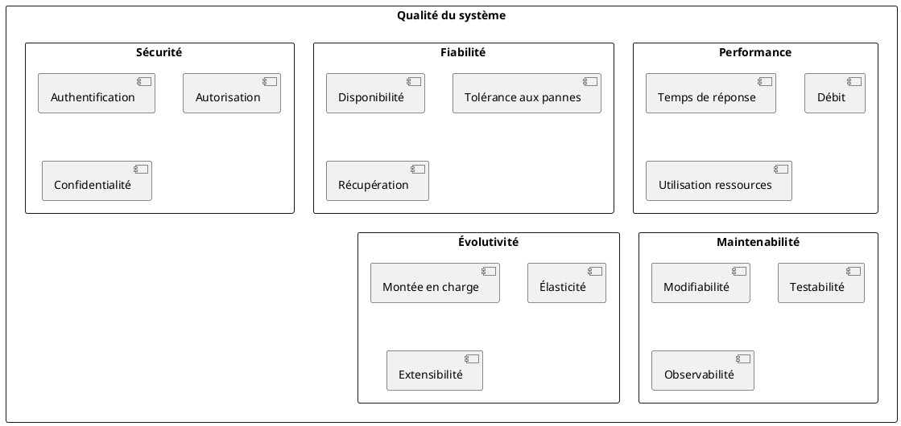
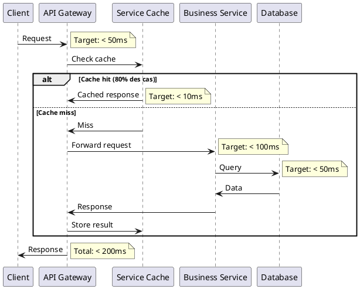
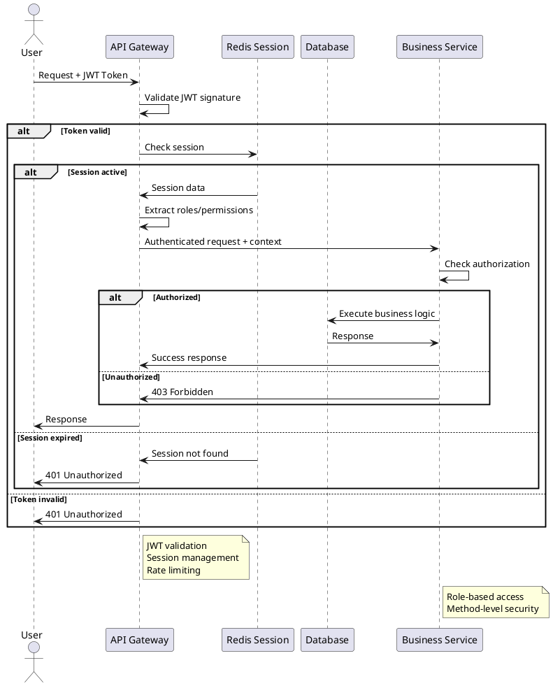
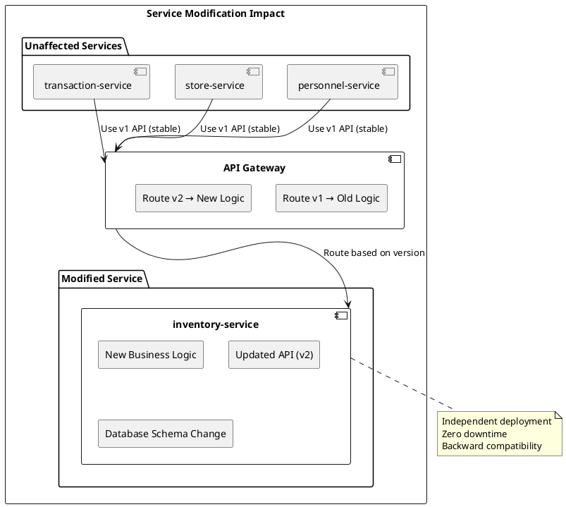
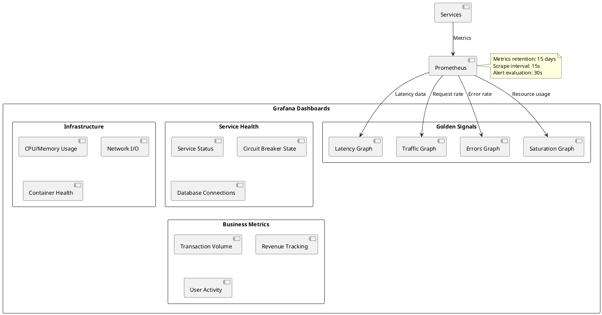
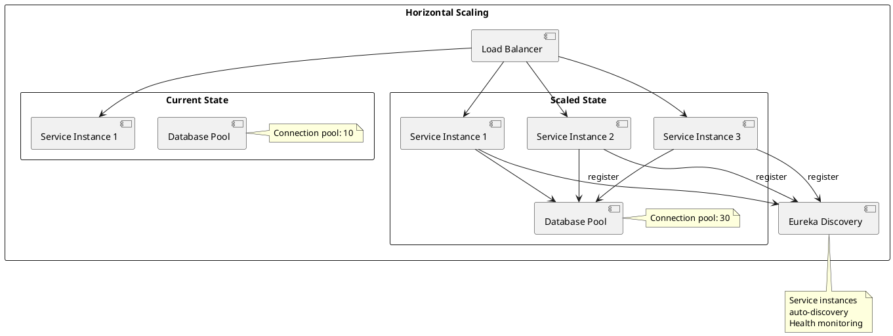
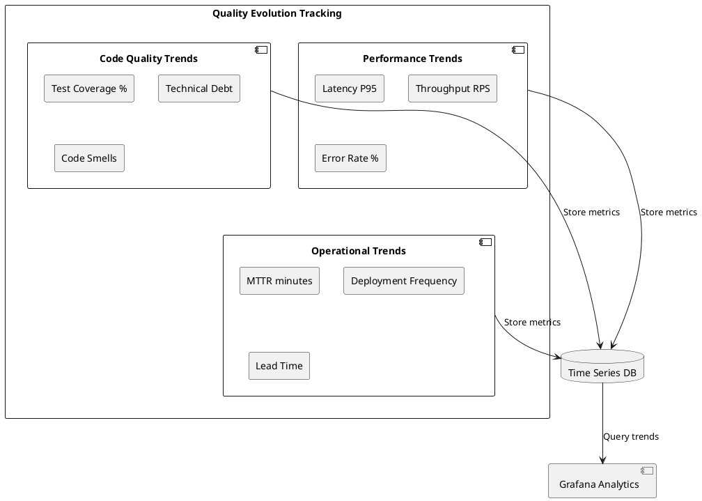

# 10. Exigences de qualité

## 10.1. Aperçu des exigences qualité

Cette section définit les attributs de qualité critiques pour l'architecture microservices et les mesures concrètes pour les atteindre.

### 10.1.1. Arbre de qualité



## 10.2. Scénarios de qualité

### 10.2.1. Performance

#### Scénario P1 : Temps de réponse des APIs

**Source :** Utilisateur frontend
**Stimulus :** Requête API REST
**Environnement :** Conditions normales (charge < 80%)
**Artefact :** Services métier (inventory, transaction, store, personnel)
**Réponse :** Temps de réponse ≤ 200ms (95e percentile)
**Mesure :** Monitoring Prometheus + alertes

**Architecture de support :**



**Mesures de performance :**

```yaml
# Configuration monitoring
management:
  metrics:
    distribution:
      percentiles:
        http.server.requests: 0.5, 0.8, 0.9, 0.95, 0.99
      percentiles-histogram:
        http.server.requests: true
      sla:
        http.server.requests: 50ms, 100ms, 200ms, 500ms
```

#### Scénario P2 : Débit transactionnel

**Source :** Charge utilisateur pic
**Stimulus :** 1000 requêtes simultanées
**Environnement :** Pic de charge (Black Friday)
**Artefact :** transaction-service
**Réponse :** Maintenir 500 RPS avec dégradation gracieuse
**Mesure :** Métriques Grafana temps réel

**Configuration de performance :**

```yaml
# Application properties pour haute charge
server:
  tomcat:
    threads:
      max: 200
      min-spare: 10
    connection-timeout: 20000ms
    max-connections: 10000
    
spring:
  datasource:
    hikari:
      maximum-pool-size: 20
      minimum-idle: 5
      connection-timeout: 30000
      idle-timeout: 600000
      
  data:
    redis:
      lettuce:
        pool:
          max-active: 20
          max-wait: -1ms
```

### 10.2.2. Fiabilité

#### Scénario F1 : Haute disponibilité

**Source :** Panne infrastructure
**Stimulus :** Indisponibilité d'un service
**Environnement :** Production 24/7
**Artefact :** Architecture microservices complète
**Réponse :** Disponibilité ≥ 99.9% (8h46min downtime/an max)
**Mesure :** SLA monitoring et alertes

**Patterns de résilience :**

```plantuml
@startuml resilience-patterns
rectangle "Resilience Stack" {
  
  component "Circuit Breaker" as CB {
    state CLOSED
    state OPEN  
    state HALF_OPEN
    
    CLOSED --> OPEN : Failure rate > 50%
    OPEN --> HALF_OPEN : After 60s
    HALF_OPEN --> CLOSED : 3 success calls
    HALF_OPEN --> OPEN : Any failure
  }
  
  component "Health Checks" as HC {
    rectangle "Database Health"
    rectangle "Service Health"
    rectangle "Downstream Health"
  }
  
  component "Fallback Mechanisms" as FB {
    rectangle "Cached Responses"
    rectangle "Default Values"
    rectangle "Graceful Degradation"
  }
}

CB --> HC : Monitor health
HC --> FB : Trigger fallback
@enduml
```

**Configuration Resilience4j :**

```yaml
resilience4j:
  circuitbreaker:
    configs:
      default:
        registerHealthIndicator: true
        slidingWindowSize: 10
        minimumNumberOfCalls: 5
        permittedNumberOfCallsInHalfOpenState: 3
        waitDurationInOpenState: 60s
        failureRateThreshold: 50
        eventConsumerBufferSize: 10
        
  retry:
    configs:
      default:
        maxAttempts: 3
        waitDuration: 1s
        exponentialBackoffMultiplier: 2
        enableRandomizedWait: true
        randomizedWaitFactor: 0.5
        
  timelimiter:
    configs:
      default:
        timeoutDuration: 3s
        cancelRunningFuture: true
```

#### Scénario F2 : Récupération automatique

**Source :** Surcharge temporaire
**Stimulus :** CPU > 90% pendant 5 minutes
**Environnement :** Pic de charge imprévu
**Artefact :** Services business critiques
**Réponse :** Récupération automatique en < 2 minutes
**Mesure :** MTTR (Mean Time To Recovery)

### 10.2.3. Sécurité

#### Scénario S1 : Authentification sécurisée

**Source :** Utilisateur malveillant
**Stimulus :** Tentative d'accès non autorisé
**Environnement :** Production Internet
**Artefact :** API Gateway + Services
**Réponse :** Rejet de l'accès en < 100ms
**Mesure :** Logs de sécurité + alertes

**Architecture de sécurité :**



**Configuration sécuritaire :**

```java
@PreAuthorize("hasRole('ADMIN') or (hasRole('MANAGER') and @storeService.isUserAuthorized(#storeId, authentication.name))")
@GetMapping("/stores/{storeId}/transactions")
public List<TransactionDto> getStoreTransactions(@PathVariable String storeId) {
    return transactionService.getTransactionsByStore(storeId);
}
```

#### Scénario S2 : Protection contre les attaques

**Source :** Attaquant externe
**Stimulus :** Attaque DDoS ou brute force
**Environnement :** Production Internet
**Artefact :** API Gateway
**Réponse :** Rate limiting + blocage automatique
**Mesure :** Tentatives bloquées/minute

**Rate Limiting Configuration :**

```yaml
spring:
  cloud:
    gateway:
      routes:
        - id: api-route
          uri: lb://api-service
          predicates:
            - Path=/api/**
          filters:
            - name: RequestRateLimiter
              args:
                redis-rate-limiter.replenishRate: 10
                redis-rate-limiter.burstCapacity: 20
                redis-rate-limiter.requestedTokens: 1
                key-resolver: "#{@userKeyResolver}"
```

### 10.2.4. Maintenabilité

#### Scénario M1 : Modification d'un service

**Source :** Développeur
**Stimulus :** Changement de logique métier
**Environnement :** Développement local
**Artefact :** Un microservice spécifique
**Réponse :** Modification isolée sans impact sur autres services
**Mesure :** Temps de développement + tests

**Isolation des changements :**



#### Scénario M2 : Observabilité des problèmes

**Source :** Équipe support
**Stimulus :** Incident de production
**Environnement :** Production sous charge
**Artefact :** Stack de monitoring
**Réponse :** Identification du problème en < 5 minutes
**Mesure :** MTTD (Mean Time To Detection)

**Dashboard de monitoring :**



### 10.2.5. Évolutivité

#### Scénario E1 : Montée en charge

**Source :** Croissance business
**Stimulus :** Charge multipliée par 5
**Environnement :** Production peak time
**Artefact :** Services critiques (inventory, transaction)
**Réponse :** Scale horizontal automatique
**Mesure :** Auto-scaling metrics

**Scaling Strategy :**



**Configuration Auto-scaling (préparatif Kubernetes) :**

```yaml
# HorizontalPodAutoscaler
apiVersion: autoscaling/v2
kind: HorizontalPodAutoscaler
metadata:
  name: inventory-service-hpa
spec:
  scaleTargetRef:
    apiVersion: apps/v1
    kind: Deployment
    name: inventory-service
  minReplicas: 2
  maxReplicas: 10
  metrics:
  - type: Resource
    resource:
      name: cpu
      target:
        type: Utilization
        averageUtilization: 70
  - type: Resource
    resource:
      name: memory
      target:
        type: Utilization
        averageUtilization: 80
```

## 10.3. Métriques et SLA

### 10.3.1. Service Level Objectives (SLO)

| Métrique | Objectif | Seuil d'alerte | Mesure |
|----------|----------|----------------|--------|
| **Disponibilité** | 99.9% | < 99.5% | Uptime monitoring |
| **Latence (95e percentile)** | < 200ms | > 300ms | Response time |
| **Taux d'erreur** | < 1% | > 2% | HTTP 5xx rate |
| **Débit** | 500 RPS | < 400 RPS | Requests/second |
| **MTTR** | < 5 min | > 10 min | Incident resolution |
| **CPU Usage** | < 70% | > 85% | Resource monitoring |
| **Memory Usage** | < 80% | > 90% | Memory consumption |
| **Database Response** | < 50ms | > 100ms | Query execution time |

### 10.3.2. Alerting Rules

```yaml
# prometheus/alert_rules.yml
groups:
- name: microservices.rules
  rules:
  
  # High latency alert
  - alert: HighLatency
    expr: histogram_quantile(0.95, rate(http_request_duration_seconds_bucket[5m])) > 0.2
    for: 2m
    labels:
      severity: warning
    annotations:
      summary: "High latency detected on {{ $labels.service }}"
      description: "95th percentile latency is {{ $value }}s"
      
  # High error rate alert  
  - alert: HighErrorRate
    expr: rate(http_requests_total{status=~"5.."}[5m]) / rate(http_requests_total[5m]) > 0.01
    for: 1m
    labels:
      severity: critical
    annotations:
      summary: "High error rate on {{ $labels.service }}"
      description: "Error rate is {{ $value | humanizePercentage }}"
      
  # Service down alert
  - alert: ServiceDown
    expr: up == 0
    for: 30s
    labels:
      severity: critical
    annotations:
      summary: "Service {{ $labels.instance }} is down"
      description: "Service has been down for more than 30 seconds"
      
  # Database connection alert
  - alert: DatabaseConnectionsHigh
    expr: hikaricp_connections_active / hikaricp_connections_max > 0.8
    for: 2m
    labels:
      severity: warning
    annotations:
      summary: "Database connection pool utilization high"
      description: "Connection pool is {{ $value | humanizePercentage }} full"
```

### 10.3.3. Performance Baselines

**Configuration des tests de performance :**

```java
@SpringBootTest
@AutoConfigureTestDatabase(replace = AutoConfigureTestDatabase.Replace.NONE)
@Testcontainers
class PerformanceTest {
    
    @Container
    static PostgreSQLContainer<?> postgres = new PostgreSQLContainer<>("postgres:14")
            .withDatabaseName("testdb")
            .withUsername("test")
            .withPassword("test");
    
    @Autowired
    private TestRestTemplate restTemplate;
    
    @Test
    @Timeout(value = 200, unit = TimeUnit.MILLISECONDS)
    void shouldRespondWithin200ms() {
        // Test single request latency
        long start = System.currentTimeMillis();
        ResponseEntity<ProductDto[]> response = restTemplate.getForEntity("/api/products", ProductDto[].class);
        long duration = System.currentTimeMillis() - start;
        
        assertThat(response.getStatusCode()).isEqualTo(HttpStatus.OK);
        assertThat(duration).isLessThan(200);
    }
    
    @Test
    void shouldHandleConcurrentRequests() throws InterruptedException {
        // Test throughput under load
        int numberOfThreads = 50;
        int requestsPerThread = 10;
        ExecutorService executor = Executors.newFixedThreadPool(numberOfThreads);
        CountDownLatch latch = new CountDownLatch(numberOfThreads);
        AtomicInteger successCount = new AtomicInteger(0);
        
        for (int i = 0; i < numberOfThreads; i++) {
            executor.submit(() -> {
                try {
                    for (int j = 0; j < requestsPerThread; j++) {
                        ResponseEntity<ProductDto[]> response = restTemplate.getForEntity("/api/products", ProductDto[].class);
                        if (response.getStatusCode() == HttpStatus.OK) {
                            successCount.incrementAndGet();
                        }
                    }
                } finally {
                    latch.countDown();
                }
            });
        }
        
        assertThat(latch.await(30, TimeUnit.SECONDS)).isTrue();
        assertThat(successCount.get()).isGreaterThanOrEqualTo(numberOfThreads * requestsPerThread * 0.95); // 95% success rate
    }
}
```

## 10.4. Stratégies de test qualité

### 10.4.1. Tests de performance

**Configuration JMeter/Locust :**

```python
# locustfile.py pour tests de charge
from locust import HttpUser, task, between

class MicroservicesUser(HttpUser):
    wait_time = between(1, 3)
    
    def on_start(self):
        # Login and get JWT token
        response = self.client.post("/auth/login", json={
            "username": "testuser",
            "password": "password"
        })
        self.token = response.json()["token"]
        self.headers = {"Authorization": f"Bearer {self.token}"}
    
    @task(3)
    def get_products(self):
        self.client.get("/api/products", headers=self.headers)
    
    @task(2)
    def get_stores(self):
        self.client.get("/api/stores", headers=self.headers)
    
    @task(1)
    def create_transaction(self):
        self.client.post("/api/transactions", 
                        headers=self.headers,
                        json={
                            "customerId": "customer1",
                            "items": [
                                {"productId": "prod1", "quantity": 1}
                            ]
                        })
```

### 10.4.2. Tests de résilience

**Chaos Engineering :**

```java
@Component
public class ChaosMonkey {
    
    private final Random random = new Random();
    
    @EventListener
    @Async
    public void simulateLatency(RequestEvent event) {
        if (isChaosEnabled() && random.nextDouble() < 0.1) { // 10% chance
            try {
                Thread.sleep(random.nextInt(1000)); // 0-1s delay
            } catch (InterruptedException e) {
                Thread.currentThread().interrupt();
            }
        }
    }
    
    @EventListener
    public void simulateErrors(RequestEvent event) {
        if (isChaosEnabled() && random.nextDouble() < 0.05) { // 5% chance
            throw new ServiceUnavailableException("Chaos monkey strikes!");
        }
    }
    
    private boolean isChaosEnabled() {
        return "true".equals(System.getProperty("chaos.enabled", "false"));
    }
}
```

### 10.4.3. Tests de sécurité

**Tests d'autorisation :**

```java
@Test
@WithMockUser(roles = "USER")
void shouldDenyAccessToAdminEndpoint() {
    mockMvc.perform(get("/api/admin/users"))
           .andExpect(status().isForbidden());
}

@Test
@WithMockUser(roles = "ADMIN")
void shouldAllowAccessToAdminEndpoint() {
    mockMvc.perform(get("/api/admin/users"))
           .andExpect(status().isOk());
}

@Test
void shouldRejectInvalidJwtToken() {
    mockMvc.perform(get("/api/products")
                   .header("Authorization", "Bearer invalid.jwt.token"))
           .andExpect(status().isUnauthorized());
}
```

## 10.5. Monitoring continu de la qualité

### 10.5.1. Dashboards qualité

**Tableau de bord Golden Signals :**

```json
{
  "dashboard": {
    "title": "Microservices Quality Dashboard",
    "panels": [
      {
        "title": "Latency (95th percentile)",
        "targets": [
          {
            "expr": "histogram_quantile(0.95, rate(http_request_duration_seconds_bucket[5m]))",
            "legendFormat": "{{ service }}"
          }
        ],
        "thresholds": [
          {"value": 0.2, "color": "yellow"},
          {"value": 0.5, "color": "red"}
        ]
      },
      {
        "title": "Error Rate",
        "targets": [
          {
            "expr": "rate(http_requests_total{status=~\"5..\"}[5m]) / rate(http_requests_total[5m])",
            "legendFormat": "{{ service }}"
          }
        ],
        "thresholds": [
          {"value": 0.01, "color": "yellow"},
          {"value": 0.05, "color": "red"}
        ]
      }
    ]
  }
}
```

### 10.5.2. Continuous Quality Gates

**Configuration SonarQube Quality Gates :**

```yaml
# sonar-project.properties
sonar.projectKey=lab5-microservices
sonar.projectName=Lab5 Microservices
sonar.projectVersion=1.0

# Coverage requirements
sonar.coverage.jacoco.xmlReportPaths=target/site/jacoco/jacoco.xml
sonar.coverage.exclusions=**/*Config.java,**/*Application.java

# Quality gate thresholds
sonar.qualitygate.wait=true
```

**Quality Gate Rules :**

- **Coverage** : > 80%
- **Duplication** : < 3%
- **Maintainability Rating** : A
- **Reliability Rating** : A
- **Security Rating** : A
- **Technical Debt** : < 5%

## 10.6. Amélioration continue

### 10.6.1. Métriques de tendance

**Suivi de l'évolution qualité :**



### 10.6.2. Reviews et améliorations

**Processus d'amélioration :**

1. **Weekly Quality Review** : Analyse des métriques et SLO
2. **Monthly Architecture Review** : Évaluation des patterns et décisions
3. **Quarterly Performance Review** : Tests de charge et optimisations
4. **Annual Security Review** : Audit sécurité et mise à jour

**Actions d'amélioration typiques :**

- **Performance** : Optimisation requêtes, cache tuning, indexation
- **Fiabilité** : Amélioration health checks, tuning circuit breakers
- **Sécurité** : Mise à jour dépendances, renforcement authentification
- **Maintenabilité** : Refactoring code, amélioration tests, documentation

Cette approche structurée de la qualité garantit que les exigences non-fonctionnelles sont continuellement mesurées et améliorées dans l'architecture microservices.
