# 11. Risques et dette technique

## 11.1. Évaluation des risques

### 11.1.1. Matrice des risques

```plantuml
@startuml risk-matrix
rectangle "Matrice de risques" {
  
  rectangle "Impact Élevé" as HighImpact {
    rectangle "Prob. Faible" as R1 {
      note : R1: Panne totale\nPostgreSQL
    }
    rectangle "Prob. Moyenne" as R2 {
      note : R2: Cohérence\ndonnées distribuées
    }
    rectangle "Prob. Élevée" as R3 {
      note : R3: Complexité\nopérationnelle
    }
  }
  
  rectangle "Impact Moyen" as MediumImpact {
    rectangle "Prob. Faible" as R4 {
      note : R4: Vulnérabilité\nsécurité majeure
    }
    rectangle "Prob. Moyenne" as R5 {
      note : R5: Performance\ndégradée
    }
    rectangle "Prob. Élevée" as R6 {
      note : R6: Dette technique\naccumulée
    }
  }
  
  rectangle "Impact Faible" as LowImpact {
    rectangle "Prob. Faible" as R7 {
      note : R7: Obsolescence\ntechnologique
    }
    rectangle "Prob. Moyenne" as R8 {
      note : R8: Problèmes\nmonitoring
    }
    rectangle "Prob. Élevée" as R9 {
      note : R9: Erreurs de\nconfiguration
    }
  }
}

R1 --> R2
R2 --> R3
R4 --> R5  
R5 --> R6
R7 --> R8
R8 --> R9

note bottom : Légende:\nRouge = Critique\nOrange = Majeur\nJaune = Mineur
@enduml
```



## 11.2. Risques techniques majeurs

### 11.2.1. R1 - Panne totale PostgreSQL

**Description :** Indisponibilité complète du cluster PostgreSQL
**Probabilité :** Faible (5%)
**Impact :** Critique - Arrêt complet des services
**Délai de détection :** < 1 minute
**Temps de récupération estimé :** 15-30 minutes

**Mesures de mitigation :**


**Plan de récupération :**

```bash
# 1. Détection automatique de panne
# Health check failure triggers alert

# 2. Failover automatique vers replica
docker-compose exec postgres-replica pg_promote

# 3. Reconfiguration des services
# Update connection strings to replica
export POSTGRES_HOST=postgres-replica

# 4. Redémarrage des services
docker-compose restart api-gateway inventory-service transaction-service

# 5. Restauration du master
# Restore from backup or rebuild as new replica
```

### 11.2.2. R2 - Cohérence des données distribuées

**Description :** Inconsistances dans les données cross-services
**Probabilité :** Moyenne (25%)
**Impact :** Élevé - Données métier corrompues
**Exemples :** Stock négatif, transactions orphelines

**Scénarios problématiques :**

```plantuml
@startuml data-consistency-issues
participant "Transaction Service" as TS
participant "Inventory Service" as IS
participant "Store Service" as SS
database "transaction_db" as TDB
database "inventory_db" as IDB

TS -> IS : Reserve stock (Product A, Qty: 5)
IS -> IDB : UPDATE stock SET reserved = reserved + 5
IDB -> IS : Success
IS -> TS : Stock reserved

TS -> TDB : INSERT transaction
note right : NETWORK FAILURE HERE
TDB -> TS : Timeout

TS -> TS : Rollback transaction
note right : But stock remains reserved!\nConsistency violation

rect rgb(255,200,200)
note over IDB : Stock incorrectly reserved
note over TDB : No transaction record
note over TS : Inconsistent state
end
@enduml
```

**Mesures de mitigation :**

```java
// Pattern Saga pour la cohérence éventuelle
@Service
@Transactional
public class TransactionSagaOrchestrator {
    
    public void processTransaction(TransactionRequest request) {
        SagaTransaction saga = sagaManager.begin("transaction-" + UUID.randomUUID());
        
        try {
            // Step 1: Reserve inventory
            ReservationResult reservation = inventoryService.reserveStock(request.getItems());
            saga.addCompensation(() -> inventoryService.releaseStock(reservation.getReservationId()));
            
            // Step 2: Validate store
            StoreValidation storeValidation = storeService.validateStore(request.getStoreId());
            saga.addCompensation(() -> storeService.releaseValidation(storeValidation.getValidationId()));
            
            // Step 3: Create transaction
            Transaction transaction = transactionService.createTransaction(request);
            saga.addCompensation(() -> transactionService.cancelTransaction(transaction.getId()));
            
            // Step 4: Confirm all operations
            inventoryService.confirmReservation(reservation.getReservationId());
            storeService.confirmValidation(storeValidation.getValidationId());
            transactionService.confirmTransaction(transaction.getId());
            
            saga.complete();
            
        } catch (Exception e) {
            saga.compensate(); // Execute all compensation actions
            throw new TransactionProcessingException("Transaction failed", e);
        }
    }
}
```

### 11.2.3. R3 - Complexité opérationnelle

**Description :** Difficulté de gestion d'une architecture distribuée
**Probabilité :** Élevée (70%)
**Impact :** Élevé - Productivité réduite, erreurs humaines
**Manifestations :** Déploiements complexes, debugging difficile

**Complexités identifiées :**

```plantuml
@startuml operational-complexity
rectangle "Complexité opérationnelle" {
  
  rectangle "Déploiement" {
    component "7 Services" as Services
    component "2 Bases données" as DBs
    component "Cache Redis" as Cache
    component "Monitoring Stack" as Monitor
    
    note right of Services : Ordre de démarrage\nDépendances\nVersioning
  }
  
  rectangle "Monitoring" {
    component "Logs distribuées" as Logs
    component "Métriques multiples" as Metrics
    component "Traces cross-service" as Traces
    
    note right of Logs : Corrélation difficile\nVolume important
  }
  
  rectangle "Debugging" {
    component "Erreurs distribuées" as Errors
    component "Timeouts cascades" as Timeouts
    component "Data inconsistency" as DataInc
    
    note right of Errors : Root cause analysis\ncomplexe
  }
}

Services --> Logs : Generate logs
DBs --> Metrics : Performance metrics
Cache --> Traces : Access patterns
Monitor --> Errors : Error aggregation
@enduml
```



**Solutions d'automatisation :**

```yaml
# docker-compose-ops.yml - Gestion opérationnelle simplifiée
version: '3.8'

services:
  # Healthcheck pour tous les services
  inventory-service:
    healthcheck:
      test: ["CMD", "curl", "-f", "http://localhost:8081/actuator/health"]
      interval: 30s
      timeout: 10s
      retries: 3
      start_period: 60s
    depends_on:
      postgres:
        condition: service_healthy
      discovery-server:
        condition: service_healthy
        
  # Scripts d'automatisation
  ops-helper:
    image: alpine/curl
    volumes:
      - ./scripts:/scripts
    command: /scripts/health-check-all.sh
```

```bash
#!/bin/bash
# scripts/health-check-all.sh - Vérification automatique
services=("discovery-server:8761" "api-gateway:8765" "inventory-service:8081" 
          "transaction-service:8082" "store-service:8083" "personnel-service:8084")

for service in "${services[@]}"; do
    name=$(echo $service | cut -d: -f1)
    port=$(echo $service | cut -d: -f2)
    
    echo "Checking $name..."
    if curl -f -s "http://$name:$port/actuator/health" > /dev/null; then
        echo "✅ $name is healthy"
    else
        echo "❌ $name is unhealthy"
        exit 1
    fi
done
echo "All services are healthy!"
```

## 11.3. Dette technique

### 11.3.1. Analyse de la dette actuelle

**Catégorisation de la dette :**

```plantuml
@startuml technical-debt
rectangle "Dette Technique" {
  
  rectangle "Code Debt" as CodeDebt {
    component "Code duplications" as Dup
    component "Long methods" as LongMethods
    component "Complex classes" as Complex
    component "Missing tests" as NoTests
    
    note right of Dup : 15% duplication\ndans les DTOs
    note right of NoTests : Couverture: 65%\nCible: 80%
  }
  
  rectangle "Design Debt" as DesignDebt {
    component "Tight coupling" as Coupling
    component "Missing abstractions" as NoAbs
    component "Inconsistent patterns" as Patterns
    
    note right of Coupling : Services partagent\nquelques entités
  }
  
  rectangle "Infrastructure Debt" as InfraDebt {
    component "Manual deployment" as Manual
    component "Missing automation" as NoAuto
    component "Configuration drift" as ConfigDrift
    
    note right of Manual : Pas de CI/CD\nDéploiement manuel
  }
  
  rectangle "Documentation Debt" as DocDebt {
    component "Outdated docs" as OldDocs
    component "Missing runbooks" as NoRunbooks
    component "Incomplete APIs" as IncompleteAPI
  }
}

CodeDebt --> DesignDebt : "Code quality\nimpacts design"
DesignDebt --> InfraDebt : "Design complexity\nimpacts ops"
InfraDebt --> DocDebt : "Complex infrastructure\nneeds documentation"
@enduml
```



### 11.3.2. Dette de code

**Problèmes identifiés :**

```java
// DETTE: Code dupliqué dans les mappers
// Fichier: inventory-service/ProductMapper.java
public class ProductMapper {
    public ProductDto toDto(Product product) {
        ProductDto dto = new ProductDto();
        dto.setId(product.getId());
        dto.setSku(product.getSku());
        dto.setName(product.getName());
        dto.setPrice(product.getPrice());
        // TODO: Factoriser cette logique commune
        dto.setFormattedPrice(NumberFormat.getCurrencyInstance(Locale.FRANCE).format(product.getPrice()));
        return dto;
    }
}

// Fichier: transaction-service/TransactionItemMapper.java  
public class TransactionItemMapper {
    public TransactionItemDto toDto(TransactionItem item) {
        TransactionItemDto dto = new TransactionItemDto();
        dto.setProductSku(item.getProduct().getSku());
        dto.setProductName(item.getProduct().getName());
        dto.setUnitPrice(item.getUnitPrice());
        // MÊME CODE DUPLIQUÉ
        dto.setFormattedPrice(NumberFormat.getCurrencyInstance(Locale.FRANCE).format(item.getUnitPrice()));
        return dto;
    }
}
```

**Plan de remboursement :**

```java
// SOLUTION: Utilitaire partagé pour le formatage
@Component
public class PriceFormatter {
    
    private static final NumberFormat FRENCH_CURRENCY = 
        NumberFormat.getCurrencyInstance(Locale.FRANCE);
    
    public String formatPrice(BigDecimal price) {
        return FRENCH_CURRENCY.format(price);
    }
    
    public String formatPrice(double price) {
        return FRENCH_CURRENCY.format(price);
    }
}

// Usage dans les mappers
@Component
public class ProductMapper {
    
    @Autowired
    private PriceFormatter priceFormatter;
    
    public ProductDto toDto(Product product) {
        ProductDto dto = new ProductDto();
        dto.setId(product.getId());
        dto.setSku(product.getSku());
        dto.setName(product.getName());
        dto.setPrice(product.getPrice());
        dto.setFormattedPrice(priceFormatter.formatPrice(product.getPrice()));
        return dto;
    }
}
```

### 11.3.3. Dette d'infrastructure

**Problèmes actuels :**

| Domaine | Problème | Impact | Effort |
|---------|----------|--------|--------|
| **CI/CD** | Pas de pipeline automatisé | Élevé | 2 semaines |
| **Secrets** | Mots de passe en dur | Critique | 1 semaine |
| **Monitoring** | Alertes basiques uniquement | Moyen | 1 semaine |
| **Backup** | Sauvegarde manuelle | Élevé | 3 jours |
| **SSL/TLS** | Communication non chiffrée | Critique | 1 semaine |
| **Load Balancing** | Pas de répartition de charge | Moyen | 1 semaine |

**Plan de modernisation infrastructure :**

```yaml
# .github/workflows/ci-cd.yml - Pipeline CI/CD
name: Microservices CI/CD

on:
  push:
    branches: [main, develop]
  pull_request:
    branches: [main]

jobs:
  test:
    runs-on: ubuntu-latest
    services:
      postgres:
        image: postgres:14
        env:
          POSTGRES_PASSWORD: postgres
        options: >-
          --health-cmd pg_isready
          --health-interval 10s
          --health-timeout 5s
          --health-retries 5
          
  build:
    needs: test
    runs-on: ubuntu-latest
    steps:
      - uses: actions/checkout@v3
      - uses: actions/setup-java@v3
        with:
          java-version: '21'
          distribution: 'temurin'
          
      - name: Build services
        run: ./build-all.cmd
        
      - name: Build Docker images
        run: |
          docker-compose build
          
      - name: Push to registry
        if: github.ref == 'refs/heads/main'
        run: |
          docker-compose push

  deploy:
    needs: build
    runs-on: ubuntu-latest
    if: github.ref == 'refs/heads/main'
    steps:
      - name: Deploy to staging
        run: |
          docker-compose -f docker-compose.staging.yml up -d
          
      - name: Health check
        run: ./scripts/health-check-all.sh
        
      - name: Deploy to production
        if: success()
        run: |
          docker-compose -f docker-compose.prod.yml up -d
```

### 11.3.4. Dette de sécurité

**Vulnérabilités identifiées :**

```java
// PROBLÈME: Mot de passe en dur
@Configuration
public class DatabaseConfig {
    
    @Bean
    public DataSource dataSource() {
        HikariConfig config = new HikariConfig();
        config.setJdbcUrl("jdbc:postgresql://postgres:5432/inventory_db");
        config.setUsername("magasin");
        config.setPassword("password"); // VULNÉRABILITÉ: Mot de passe en dur
        return new HikariDataSource(config);
    }
}
```

**Correction avec gestionnaire de secrets :**

```java
// SOLUTION: Utilisation de variables d'environnement sécurisées
@Configuration
public class DatabaseConfig {
    
    @Value("${spring.datasource.url}")
    private String jdbcUrl;
    
    @Value("${spring.datasource.username}")
    private String username;
    
    @Value("${spring.datasource.password}")
    private String password;
    
    @Bean
    public DataSource dataSource() {
        HikariConfig config = new HikariConfig();
        config.setJdbcUrl(jdbcUrl);
        config.setUsername(username);
        config.setPassword(password);
        return new HikariDataSource(config);
    }
}
```

```yaml
# docker-compose.secrets.yml - Gestion sécurisée
version: '3.8'

services:
  inventory-service:
    environment:
      - SPRING_DATASOURCE_PASSWORD_FILE=/run/secrets/db_password
    secrets:
      - db_password
      
secrets:
  db_password:
    file: ./secrets/db_password.txt
```

## 11.4. Risques business

### 11.4.1. R4 - Évolution des besoins métier

**Description :** Requirements métier changeants
**Probabilité :** Élevée (80%)
**Impact :** Moyen - Réarchitecture partielle nécessaire

**Changements anticipés :**


**Stratégie d'adaptation :**

```java
// Design flexible pour l'évolution
@RestController
@RequestMapping("/api/v1/transactions")
public class TransactionController {
    
    // API extensible avec versioning
    @PostMapping
    public ResponseEntity<TransactionResponse> createTransaction(
            @RequestBody TransactionRequest request,
            @RequestHeader(value = "Accept-Version", defaultValue = "1.0") String apiVersion,
            @RequestHeader(value = "Tenant-ID", required = false) String tenantId) {
        
        // Gestion multi-tenant préparée
        TransactionContext context = TransactionContext.builder()
            .apiVersion(apiVersion)
            .tenantId(tenantId)
            .build();
            
        return transactionService.processTransaction(request, context);
    }
}
```

### 11.4.2. R5 - Compétitivité technologique

**Description :** Risque d'obsolescence face à la concurrence
**Probabilité :** Moyenne (40%)
**Impact :** Élevé - Perte de compétitivité

**Technologies émergentes à surveiller :**

| Technologie | Maturité | Impact potentiel | Timeline adoption |
|-------------|----------|------------------|-------------------|
| **Serverless** | Mature | Réduction coûts | 12-18 mois |
| **GraphQL** | Mature | API flexibility | 6-12 mois |
| **Event Streaming** | Mature | Real-time data | 6-12 mois |
| **Service Mesh** | En cours | Network management | 18-24 mois |
| **WebAssembly** | Émergente | Performance | 24+ mois |

## 11.5. Plan de gestion des risques

### 11.5.1. Monitoring et détection

**Dashboard de risques :**

```yaml
# prometheus/risk_rules.yml
groups:
- name: risk-monitoring.rules
  rules:
  
  # Détection inconsistance données
  - alert: DataInconsistencyDetected
    expr: |
      (
        (sum(inventory_stock_total) by (product_sku)) 
        != 
        (sum(transaction_items_quantity) by (product_sku))
      ) and on() hour() > 1
    for: 5m
    labels:
      severity: critical
      risk: data-consistency
    annotations:
      summary: "Data inconsistency detected for product {{ $labels.product_sku }}"
      
  # Détection dette technique
  - alert: TechnicalDebtIncreasing
    expr: sonarqube_technical_debt_ratio > 5
    for: 1h
    labels:
      severity: warning
      risk: technical-debt
    annotations:
      summary: "Technical debt ratio exceeded threshold"
      
  # Détection complexité opérationnelle
  - alert: OperationalComplexityHigh
    expr: |
      (
        count(up == 0) +
        count(rate(http_requests_total{status=~"5.."}[5m]) > 0.05) +
        count(histogram_quantile(0.95, rate(http_request_duration_seconds_bucket[5m])) > 0.5)
      ) > 3
    for: 10m
    labels:
      severity: critical
      risk: operational-complexity
    annotations:
      summary: "High operational complexity detected"
```

### 11.5.2. Processus de gestion

**Comité de risques hebdomadaire :**

```plantuml
@startuml risk-management-process
rectangle "Processus gestion risques" {
  
  rectangle "Détection" as Detection {
    component "Monitoring automatique" as AutoMon
    component "Reviews équipe" as TeamReview
    component "Audits sécurité" as SecAudit
  }
  
  rectangle "Évaluation" as Assessment {
    component "Impact analysis" as Impact
    component "Probability assessment" as Prob
    component "Risk scoring" as Scoring
  }
  
  rectangle "Mitigation" as Mitigation {
    component "Action planning" as Planning
    component "Resource allocation" as Resources
    component "Timeline definition" as Timeline
  }
  
  rectangle "Suivi" as Tracking {
    component "Progress monitoring" as Progress
    component "Effectiveness review" as Effectiveness
    component "Risk re-assessment" as Reassess
  }
}

Detection --> Assessment : "Weekly risk review"
Assessment --> Mitigation : "Risk prioritization"
Mitigation --> Tracking : "Action execution"
Tracking --> Detection : "Continuous monitoring"
@enduml
```



### 11.5.3. Plans de contingence

**Plan B - Architecture fallback :**

```yaml
# docker-compose.fallback.yml - Configuration de secours
version: '3.8'

services:
  # Service monolithique de secours
  fallback-service:
    image: legacy-monolith:latest
    ports:
      - "8090:8080"
    environment:
      - SPRING_PROFILES_ACTIVE=fallback
    depends_on:
      - postgres-backup
      
  # Base de données de secours
  postgres-backup:
    image: postgres:14
    volumes:
      - fallback_data:/var/lib/postgresql/data
    environment:
      - POSTGRES_DB=fallback_db
      
  # Proxy de basculement
  fallback-proxy:
    image: nginx:alpine
    ports:
      - "80:80"
    volumes:
      - ./nginx-fallback.conf:/etc/nginx/nginx.conf
    depends_on:
      - fallback-service
```

**Procédure de basculement d'urgence :**

```bash
#!/bin/bash
# emergency-fallback.sh

echo "🚨 EMERGENCY FALLBACK ACTIVATION 🚨"

# 1. Backup current data
echo "Backing up current data..."
docker-compose exec postgres pg_dump -U magasin -d inventory_db > backup-$(date +%Y%m%d_%H%M%S).sql

# 2. Stop microservices
echo "Stopping microservices..."
docker-compose down

# 3. Start fallback mode
echo "Starting fallback monolith..."
docker-compose -f docker-compose.fallback.yml up -d

# 4. Health check
echo "Checking fallback health..."
sleep 30
curl -f http://localhost:8090/actuator/health || {
    echo "❌ Fallback failed to start"
    exit 1
}

echo "✅ Fallback mode activated successfully"
echo "Access application at: http://localhost:8090"
echo "Monitoring dashboard: http://localhost:8090/admin"
```

## 11.6. Remboursement de la dette

### 11.6.1. Priorisation de la dette

**Matrice effort/impact :**

```plantuml
@startuml debt-prioritization
rectangle "Priorisation Dette Technique" {
  
  rectangle "Impact Élevé" {
    rectangle "Effort Faible" as QuickWins {
      note : ✅ Quick Wins\n- Fix security secrets\n- Add missing tests\n- Update documentation
    }
    rectangle "Effort Élevé" as MajorProjects {
      note : 🎯 Major Projects\n- Implement CI/CD\n- Add event sourcing\n- Performance optimization
    }
  }
  
  rectangle "Impact Faible" {
    rectangle "Effort Faible" as FillIns {
      note : 📝 Fill-ins\n- Code cleanup\n- Refactor small methods\n- Update dependencies
    }
    rectangle "Effort Élevé" as QuestionMarks {
      note : ❓ Question Marks\n- Complete rewrite\n- Technology migration\n- Architecture change
    }
  }
}

QuickWins --> MajorProjects : "After quick wins"
FillIns --> QuickWins : "When time permits"
@enduml
```



### 11.6.2. Roadmap de remboursement

**Plan trimestriel :**

| Trimestre | Objectifs | Livrables | Métrique succès |
|-----------|-----------|-----------|-----------------|
| **Q1 2024** | Security & CI/CD | Pipeline automatisé, secrets sécurisés | 0 vulnérabilité critique |
| **Q2 2024** | Quality & Testing | Couverture 80%, tests automatisés | Code coverage > 80% |
| **Q3 2024** | Performance & Monitoring | Optimisations, observabilité avancée | Latence P95 < 100ms |
| **Q4 2024** | Architecture & Resilience | Event sourcing, patterns avancés | MTTR < 2 minutes |

### 11.6.3. Metrics de suivi

**KPIs de la dette technique :**

```yaml
# Métriques à suivre mensuellement
technical_debt_metrics:
  code_quality:
    duplication_percentage: 
      target: < 3%
      current: 15%
    test_coverage:
      target: > 80%
      current: 65%
    cyclomatic_complexity:
      target: < 10
      current: 15
      
  infrastructure:
    deployment_automation:
      target: 100%
      current: 0%
    secret_management:
      target: 100%
      current: 20%
    monitoring_coverage:
      target: 100%
      current: 70%
      
  performance:
    mean_response_time:
      target: < 100ms
      current: 250ms
    error_rate:
      target: < 0.1%
      current: 1.2%
```

Cette approche structurée de gestion des risques et de la dette technique permet de maintenir la qualité et la viabilité de l'architecture microservices sur le long terme.
