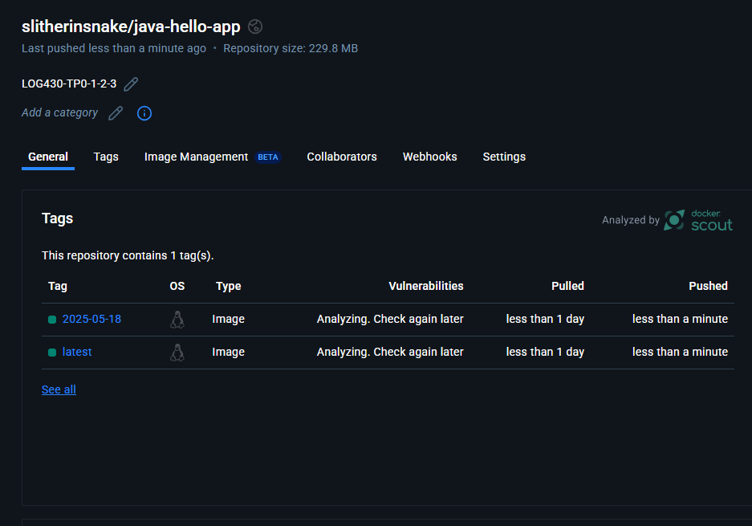

# Lab 0-1-2-Application Java Hello World
## Description de l'application
Mon application Java est un simple projet qui à pour but de montrer le message "Hello, World!" dans la console. Elle constitue la base de mon projet pour les futurs laboratoire 1 et 2. Docker sera utiliser et la réalisation de tests unitaires automatisés et l’intégration continue (CI/CD) sera fait dans l'application. L'objectif est de démontrer la mise en place d'un environnement de développement automatisé, reproductible et bien structuré.
## Objectifs du projet
- Créer mon application Java simple avec des tests unitaires.
- Structurer le projet en MVC (Modèle - Vue - Contrôleur).
- Conteneuriser l'application avec Docker.
- Automatiser les étapes de build, test et vérification avec une pipeline CI/CD sur GitHub Actions.
- Orchestration avec Docker Compose pour simplifier le démarrage des containers
## Instructions d'exécution et de build
### 1. Prérequis 
- Avoir JDK21 (Java Development Kit) d'installé sur la machine.
- Avoir Docker d'installé sur la machine pour la conteneurisation.
- Avoir Docker Compose
- Avoir Maven
### 2. Cloner le dépot
- Cloner le projet sur la machine virtuelle:
```git clone https://github.com/Username/projetGit```
- Accéder le projet sur la machine virtuelle:
```cd "projetGit"```
### 3. Instructions pour Docker et Docker Compose
- Conteneurisation avec Docker de l’application
  - Construire l'image à partir du Dockerfile dans java-hello-world/:
```docker build -t java-hello-app ./java-hello-world```
  -  Lancer le conteneur en mode console:
```docker run --rm java-hello-app```
  - Lancer le conteneur avec accès web sur le port 8080:
```docker run --rm -p 8080:8080 java-hello-app```
### 4. Instructions pour Docker Compose
- Orchestration avec Docker Compose
  - Installer Docker Compose (si ce n’est pas déjà fait)
```sudo apt install docker-compose```
  - Construire l'image via Docker Compose
```docker-compose build```
  - Lancer l'application
```docker-compose up```
  - Lancer l'application en arrière-plan (mode détaché)
```docker-compose up -d```
  - Afficher les logs du conteneur
```docker-compose logs -f```
## 5.Structuration du projet (Architecture MVC)
```
TPO-LOG430/
├── .github/
│   └── workflows/
│       ├── ci.yml
│       └── docker-login.yml
├── .vscode/
│   ├── launch.json
│   ├── settings.json
│   └── task.json
├── java-hello-world/
│   ├── pom.xml
│   ├── Dockerfile
│   └── src/
│       ├── main/
│       │   └── java/
│       │       └── com/
│       │           └── log430/
│       │               └── tp0/
│       │                   ├── controller/
│       │                   │   └── HelloController.java
│       │                   ├── model/
│       │                   │   └── HelloMovel.java
│       │                   ├── server/
│       │                   │   └── HelloServer.java
│       │                   ├── view/
│       │                   │   └── HelloView.java
│       │                   └── HelloApp.java
│       └── test/
│           └── java/
│               └── com/
│                   └── log430/
│                       └── tp0/
│                           ├── controller/
│                           │   └── HelloControllerTest.java
│                           ├── server/
│                           │   └── HelloServerTest.java
│                           ├── view/
│                           │   └── HelloViewTest.java
│                           └── HelloWorldTest.java
├── docker-compose.yml
├── .gitignore
└── README.md
```
## 6. Structuration du projet (Architecture MVC)
Une pipeline GitHub Actions est définie dans .github/workflows/ci.yml. Elle s’exécute automatiquement à chaque push ou pull_request sur la branche main et comprend :
- Lint:
  - Analyse statique du code pour détecter les erreurs de style ou de structure.
  - Permet d’unifier l’apparence du code, d’en améliorer la lisibilité et la maintenabilité.
- Tests unitaires:
  - Vérifie automatiquement les fonctionnalités principales de l’application.
  - En cas d’échec, la pipeline s’interrompt immédiatement.
- Build:
  - Construit l’image Docker si le lint et les tests passent sans erreur.
- Publication sur Docker Hub:
  - L’image est automatiquement poussée vers Docker Hub au format docker.io/username/nom-image:tag.
  - Deux tags sont utilisés : latest et la date du jour (YYYY-MM-DD).

Les identifiants Docker Hub sont stockés de façon sécurisée avec les secrets GitHub DOCKERHUB_USERNAME et DOCKERHUB_TOKEN.

## 7. Justification des choix techniques
- Langage de programmation : J'ai choisi Java, car j'ai une forte base en Java et souhaite la profiner d'avante. De plus, elle est compatible avec Maven et Docker.
- Outil de build :  J'ai choisi Maven à la place de Gradle, car j'ai souvent utiliser Maven dans mes stages et expériences passés ce qui ma permis de constater que c'était un gestionnaire de projet et de dépendances fiable et efficace pour Java.
- Platform de conteneurisation : J'ai choisi Docker, car je l'avais un peu utiliser au Cégep et je souhaitais pouvoir en apprendre d'avantage sur Docker. Docker est un conteneurisation assurant portabilité et reproductibilité.
- Docker Compose : J'ai pris docker compose, pour l'orchestration simple pour exécution en local.
- Outil de pipeline : J'ai choisi GitHub Actions comme outil CI/CD pour intégré ma validation automatisée, car je l'avais utiliser auparavant et donc j'avais déjà un début de connaissance.
- Structuration du projet : J'ai choisi le pattern MVC, car c'est elle que je suis le plus familier avec et préfère le plus. Elle permet une séparation claire des responsabilités, facilitant les tests et la maintenance.

## 8. Preuve d’exécution CI/CD
L'image généré sur DockerHub: 

Le pipeline: 

Elle sera dans le dossier de remise ou sinon voir en ligne ici : https://github.com/SlitherinSnake/tp0-1-2-log430/actions/runs/15091998205 Il est nécessaire d'accepter mon invitation à mon répo, car il est privé. 

# To run docker-file 

docker compose up --build

## To run locally

mvn spring-boot:run
